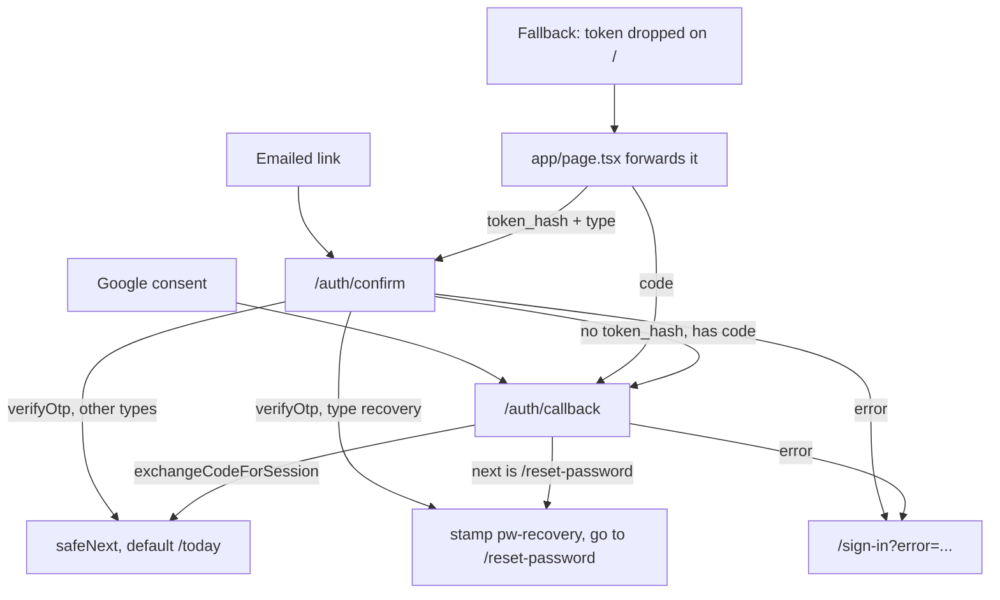

# Accounts, auth and onboarding

One Supabase auth user is one `accounts` row is one tenant: the primary key is shared, a database trigger creates the row, and a cascading foreign key deletes it. Sessions ride on cookies that middleware refreshes on every request that carries one. Emailed links verify a token hash on the server so they work in whichever browser opens the mail. Onboarding has no stored "done" flag — it is recomputed from the data each time the dashboard loads.

This document covers how an owner gets into the app and what stands between sign-up and the dashboard. Row-level security and the deletion cascade itself belong to [the data model](./data-model.md) and [Privacy and GDPR](./privacy-and-gdpr.md).

## One auth user is one account

`accounts.id` is not generated. It is the `auth.users.id` of the person who signed up, tied together by two objects created in `drizzle/migrations/0003_pts_signup_trigger.sql`:

- A foreign key from `accounts.id` to `auth.users.id` with `ON DELETE CASCADE`. Account deletion works by deleting the auth user and letting the cascade take out every tenant row underneath.
- An `AFTER INSERT` trigger on `auth.users` running `public.handle_new_user()`, which mirrors the new user into `accounts`.

The function is `SECURITY DEFINER` so that it can write `public` tables from inside GoTrue's own transaction, where the calling role has no write privileges of its own. It seeds the row with the email, timezone `Europe/Berlin` and 90-day retention, and it also inserts three starter services so a new account is never left with an empty catalogue. Its current definition lives in `drizzle/migrations/0031_rename_pts_to_accounts.sql` — later migrations replace the function wholesale, so that is the one to read.

Because the trigger runs inside GoTrue's own insert, application code never creates an account row. Every server action resolves the account id straight from `supabase.auth.getUser()` and uses it as the tenant key.

## Sign-up and sign-in

Both forms are React `useActionState` forms over a server action that validates with zod and returns field errors rather than throwing.

`signUp` (`app/(auth)/sign-up/actions.ts`) requires a valid email and a password of at least 8 characters, then calls `supabase.auth.signUp` with `emailRedirectTo` pointing at `/auth/confirm`. Where a project has email confirmations disabled, `signUp` returns a live session that the server client has already written to the cookie jar, so the action sends the new owner straight to `/onboarding`; otherwise it lands on `/sign-in?confirm=1` with a "check your mail" hint. An error mentioning an existing account is mapped to a taken-email message; anything else gets a generic failure, so the response never confirms which emails are registered.

`signIn` (`app/(auth)/sign-in/actions.ts`) calls `signInWithPassword` and redirects to `/today`. Every failure renders the same message, for the same reason.

Google sign-in is a client-side call. `GoogleSignInButton` runs `signInWithOAuth` from the browser client with `redirectTo` set to this origin's `/auth/callback`, which keeps the flow on PKCE: the code verifier is a cookie in the browser that started the flow, and the same browser finishes it.

`requestPasswordReset` (`app/(auth)/forgot-password/actions.ts`) always reports success, whether or not the address exists. When GoTrue refuses the send — a `redirect_to` outside the allowlist, or the hourly email cap — the action logs `auth.reset_email_failed` so an operator can see what the owner cannot be told.

## Emailed links land on a token hash

Recovery and signup-confirmation mail point at `/auth/confirm`, not `/auth/callback`. The reason is mechanical: `verifyOtp` consumes a token hash minted by GoTrue and needs nothing from the browser that requested the mail, so the link still works when it is opened in a mail app's webview, on a phone, or on another machine. A PKCE `code` cannot do that, because its verifier only exists in the requesting browser.

Both templates in `supabase/templates/` build their own link from `{{ .SiteURL }}` and `{{ .TokenHash }}` rather than using `{{ .ConfirmationURL }}`, and hardcode the `type`. The `redirect_to` that `lib/auth/email-links.ts` supplies is therefore ignored for those two mails — but it still has to agree with the project's Site URL, because GoTrue silently falls back to Site URL when `redirect_to` is missing from the allowlist.

`/auth/confirm` verifies the `type` it was given against a narrow alias table (`app/auth/confirm/route.ts`):

| `type` in the link | Verified as    | Why                                       |
| ------------------ | -------------- | ----------------------------------------- |
| `recovery`         | `recovery`     | password recovery                         |
| `signup`           | `signup`       | email confirmation                        |
| `email`            | `signup`       | what older confirmation mail already says |
| `email_change`     | `email_change` | address change                            |

GoTrue resolves several `type` values against the same token column, so the parameter cannot be trusted to describe what a token is. The table is deliberately narrowed until no token verifies under more than one entry, which is what lets the recovery branch key off the requested type: rewriting `type=recovery` to something else fails verification instead of trading a reset link for a full session that skips the recovery gate. The shipped confirmation template uses `type=signup` for the same reason.

Two compatibility paths remain. A link that arrives at `/auth/confirm` with a `code` and no `token_hash` is forwarded to `/auth/callback`, so mail already sitting in an inbox keeps working. And `app/page.tsx` forwards a stray `code` or `token_hash` dropped on `/` to the route that can redeem it — a `code` is assumed to be recovery, because Google OAuth asks for this origin's `/auth/callback` and never falls back to Site URL.

After a successful recovery verification the route redirects to `/reset-password` derived from the _verified link type_, not from `next`. A hosted template retyped by hand can lose its `&next=`, which would otherwise land the owner on `/today` with a live session, a ten-minute cookie ticking away and no in-app way to set a password.

## The password-recovery gate

`updateUser({ password })` changes the password of whatever session is active. On its own that means any signed-in tab could silently overwrite the account password with no re-authentication, which on a shared device is the wrong outcome. `lib/auth/recovery.ts` closes that with a short-lived marker cookie.

| Property   | Value                                                                                                 |
| ---------- | ----------------------------------------------------------------------------------------------------- |
| Name       | `pw-recovery`                                                                                         |
| Value      | `user:<auth user id>`                                                                                 |
| Lifetime   | 600 seconds                                                                                           |
| Flags      | `httpOnly`, `sameSite=lax`, `secure` in production                                                    |
| Written by | `/auth/confirm` after verifying a `recovery` token, `/auth/callback` when `next` is `/reset-password` |
| Cleared by | a successful password change, and by sign-out                                                         |

The cookie carries a user id rather than being a bare flag. A flag would survive a sign-out: one person could click a reset link, abandon the form and sign out, and a second person signing in on that device inside the ten-minute window would find the gate already open — and `updateUser` would change _their_ password. Both `/reset-password` and the `resetPassword` action check `hasRecoveryMarker(user.id)`, so the marker must have been minted for the signed-in user. The page runs the same check as the action so a leftover marker shows the sign-in screen rather than a form that fails on submit. The marker survives a failed update, so a rejected password can be retried. `app/(auth)/reset-password/__tests__/actions.test.ts` pins each of these cases.

Failures on either route are classified by `lib/auth/link-errors.ts` into `link_expired`, `link_failed`, or `oauth_cancelled`, and rendered as a banner on `/sign-in`. Only the first two offer a fresh recovery link; someone who closed the Google consent screen is not sent into password recovery.

## Post-auth redirects

`next` reaches the auth routes from a query string, so `lib/auth/safe-next.ts` treats it as untrusted. `safeNext` returns `/today` unless the value is a rooted path that still resolves to its own origin.

A shape test alone is not enough. `//evil.com` and `/\evil.com` are caught by the pattern, but the WHATWG URL parser strips raw tab, line-feed and carriage-return bytes _before_ parsing, so `/\t/evil.com` passes any character-class test and still resolves off-origin — and Node lets those bytes into a `Location` header. Resolving the value is the check that holds; `lib/auth/__tests__/safe-next.test.ts` demonstrates the escape without the guard. The onboarding actions reuse `isInternalPath` for the same reason.

## Session refresh in middleware

`middleware.ts` runs a Supabase server client on every matched request and calls `getUser()`, which rotates the session cookies. Middleware matters because it is the only writable cookie context on a plain page render: `lib/supabase/server.ts` has to swallow `setAll` inside Server Components, so without middleware the session would stop refreshing until a rotated refresh token was replayed and revoked.

The matcher excludes static assets and images, `api/inngest`, `api/webhooks`, and both auth routes. `/auth/confirm` and `/auth/callback` are excluded deliberately: they mint the session themselves, and a refresh attempt on the stale cookies they arrive with can emit session-clearing `Set-Cookie` headers that merge with the fresh ones the route handler just wrote.

Missing Supabase configuration is fatal everywhere a session is in play, but not on pages that carry none. When `hasSupabaseConfig()` is false and the path is public — `/`, `/sign-in`, `/sign-up`, `/forgot-password`, or anything under `/privacy`, `/terms`, `/help` or `/en/` — the request passes through untouched. `NEXT_PUBLIC_*` values are inlined at build time and have gone missing from a build before; a repeat must not take the marketing and legal pages down with it. `__tests__/middleware.test.ts` covers the split.

## Onboarding is derived from data

`getOnboardingState` (`lib/onboarding/state.ts`) recomputes progress from five row-existence checks. There is no stored progress flag to go stale.

| Step           | Complete when                                                                      |
| -------------- | ---------------------------------------------------------------------------------- |
| `profile`      | `accounts.name` is set and not blank                                               |
| `whatsapp`     | the account has a `whatsapp_connections` row with status `active`                  |
| `availability` | the account has at least one `availability_rules` row                              |
| `services`     | the account has an active service **and** `accounts.services_configured_at` is set |
| `testMessage`  | the account has at least one `messages` row                                        |

The services step needs both conditions because the signup trigger already seeded three services. Row existence alone would mark the step done before the owner had looked at it, so `confirmServices` stamps `services_configured_at` when they press **Vazhdo me këto shërbime**; `lib/onboarding/__tests__/state.integration.test.ts` pins that.

`complete` is all five steps. A sixth value, `plan`, is returned alongside them but is deliberately excluded from `completedCount`, `total` and `complete`: an owner on the Free plan has to reach the dashboard without paying. It is true once the account is on a paid plan or `plan_step_seen_at` records that the step was seen and skipped.

## Bypassing the onboarding gate

`app/(dashboard)/layout.tsx` is the gate. It redirects to `/sign-in` without a user, then — unless a bypass cookie applies — loads the onboarding state and redirects to `/onboarding` while it is incomplete. Onboarding lives outside the dashboard layout, so the redirect cannot loop.

The bypass is one cookie, `onboarding_skipped`, holding a value bound to the user id (`app/onboarding/constants.ts`):

| Value                 | Written by      | Lifetime | Meaning                                                |
| --------------------- | --------------- | -------- | ------------------------------------------------------ |
| `dismissed:<user id>` | `dismissAndGo`  | 30 days  | the owner chose to skip setup                          |
| `setup:<user id>`     | `continueSetup` | 1 hour   | a short detour into a settings screen to finish a step |

Binding the value to a user id keeps one person's dismissal from opening the gate for another account on the same device. Because both markers share one cookie name, `continueSetup` refuses to write the one-hour detour over a fresh 30-day dismissal — doing so would bounce the owner back into the wizard an hour later.

A settings screen entered through `continueSetup` carries `?from=onboarding`, which is what raises the "save, then go back to setup" banner described in [the owner app](../product/owner-app.md).

## Signing out

`signOut` in `lib/auth/actions.ts` ends the Supabase session, clears the recovery cookie, and redirects to `/sign-in`. Clearing the marker matters for the same shared-device reason it carries a user id.

The button that calls it does two things first, in order: it revokes this device's push subscription while the session is still valid, then clears the local PWA data — the queued-mutation database, the service worker caches, and the per-browser push opt-out marker. The opt-out marker is scoped to the browser rather than to the person, so leaving it behind would silently withhold notifications from whoever signs in next on that device.

## Auth identity is per environment

Auth depends on two values agreeing across systems: the Supabase project's Site URL and this app's `NEXT_PUBLIC_APP_URL`. When they drift, GoTrue falls back to Site URL and neither system reports it — which is exactly the failure the `/` token forwarder exists to absorb. The redirect allowlist must also contain both `/auth/callback` and `/auth/confirm` for every origin the app is served from; `supabase/config.toml` lists them for local development, and the hosted projects carry their own copies of the mail templates.

Which project belongs to which environment, and how that identity is asserted at boot, is covered in [environments](../environments.md).
