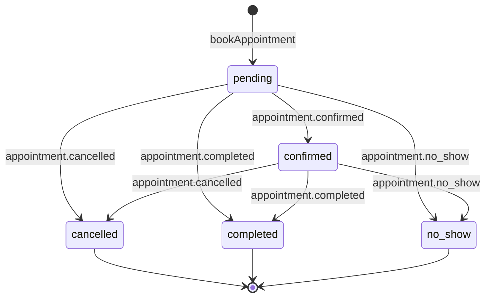

# Appointments and availability

Availability is weekly working-hours rules minus blocked periods minus active appointments, computed in the account's own timezone. Every appointment mutation runs under a per-account advisory lock, appends its domain event in the same transaction as the row change, and a Postgres exclusion constraint is the last line of defence against double-booking. This document explains how a free slot is derived, how a booking is made durable, and who tells the customer about it.

The assistant reaches all of this through tools; see [the assistant and conversation engine](./assistant-conversation-engine.md). The owner reaches it through the **Calendar** screen; see [the owner app](../product/owner-app.md).

## What the schedule is made of

Four tables carry everything the slot math reads, all keyed on `account_id` and defined in `lib/db/schema.ts`.

| Table                | Purpose                        | Shape and guards                                                                                                                 |
| -------------------- | ------------------------------ | -------------------------------------------------------------------------------------------------------------------------------- |
| `availability_rules` | Weekly working hours           | `weekday` (`smallint`, `0` = Sunday, checked `BETWEEN 0 AND 6`), `start_time`/`end_time` (`time`), check `end_time > start_time` |
| `blocked_periods`    | Arbitrary busy ranges          | `starts_at`/`ends_at` (`timestamptz`), optional `label`, check `ends_at > starts_at`                                             |
| `appointments`       | The bookings themselves        | `starts_at`/`ends_at`, `service_type`, `status`, `notes`, `cancelled_by`, `cancellation_reason`, check `ends_at > starts_at`     |
| `services`           | Name, duration, optional price | `duration_min` checked `BETWEEN 5 AND 480`, `price_lek` positive, unique on `lower(btrim(name))` per account                     |

Rules are business-wide, not per service. A service sets only how long a slot is, which is why `getFreeSlots` in `lib/appointments/availability.ts` takes a duration and refuses to take a service name — accepting one would promise a filter the query cannot honour.

## The database constraints that make double-booking impossible

Two partial indexes on `appointments` cover the two ways the same slot could be claimed twice, both scoped to the active statuses `pending` and `confirmed`.

- `appointments_active_idempotency_uq` is unique on `(account_id, customer_id, starts_at)`. It turns a repeated booking of the same customer at the same instant into a violation the booking path recovers from as a replay rather than an error.
- `appointments_no_active_overlap` is a GiST `EXCLUDE` constraint over `account_id WITH =` and `tstzrange(starts_at, ends_at, '[)') WITH &&`, defined in `drizzle/migrations/0007_phase4_appointments.sql` on the `btree_gist` extension. The half-open range is what lets one appointment end exactly when the next starts.

Application checks run first and give better errors, but they read a snapshot. The exclusion constraint is what actually holds under concurrency, including for manual bookings that deliberately skip the availability check. `lib/appointments/__tests__/mutations.integration.test.ts` pins both: one of two concurrent bookings for the same slot fails, and direct overlapping inserts are rejected at the database boundary.

## Timezones and daylight saving

All slot math happens in `accounts.timezone` (default `Europe/Berlin`), using `TZDate` from `@date-fns/tz` so wall-clock arithmetic stays local while the stored values remain instants. `assertValidTimezone` rejects a timezone `Intl.DateTimeFormat` cannot resolve before any slot is computed.

Daylight saving is handled by three separate rules, because an offer and a bound need opposite treatment.

- **Spring-forward, offers.** A slot whose start does not exist locally is dropped, not moved. `localDateTime` returns `null` when the constructed wall time is not the one that was asked for, so a customer is never offered a time their own clock never shows.
- **Fall-back, offers.** When a wall time occurs twice, the grid resolves to the second occurrence: if the computed interval is longer than the requested duration by exactly the repeated hour, the start is advanced so the slot keeps its true length.
- **Spring-forward, bounds.** A rule edge inside the gap moves with the clock instead of dropping the rule. `isSlotBookable` reads rule bounds through `wallDateTime` rather than `localDateTime`, because rejecting an edge would close the business for the whole day — every slot under an 02:00 rule would become unbookable on the one day a year the clock skips 02:00.

`lib/appointments/__tests__/availability.integration.test.ts` pins each of these, plus a window that crosses local midnight.

## Generating free slots

`getFreeSlots` returns a grid of offerable intervals plus the timezone they were computed in. It walks each local day in the window, expands the rules for that weekday, and steps a cursor across each rule in whole `durationMinutes` increments.

- **Inputs**: `accountId`, `start`, `end`, and an optional `durationMinutes` that defaults to 60 minutes.
- **Bounds**: the window must be forward-going and no wider than 31 days; the duration must be a whole number from 5 to 480 minutes. Anything else raises `AppointmentError('invalid_input', …)`.
- **Subtraction**: a candidate is dropped if it overlaps any `blocked_periods` row or any `pending`/`confirmed` appointment in the window. The internal variant `getFreeSlotsInternal` also accepts `excludeAppointmentId`, so an appointment being moved does not block its own new time.
- **Clamping and dedupe**: candidates that fall outside the requested window are dropped, and identical `startsAt/endsAt` pairs are emitted once even when two overlapping rules produce them.

An account with no rules gets an empty list rather than an error.

## Validating an exact interval

`isSlotBookable` answers a different question from `getFreeSlots`: not "is this one of the times we offered" but "can this exact interval be booked". Grid membership is the wrong test, because a grid is stepped by a single duration and would reject a perfectly free 45-minute booking whenever the offered step and the booked service differ.

The check loads the same snapshot, rejects any overlap with a blocked period or active appointment, and then looks for one rule that wholly contains the interval. It scans the slot's own local day and the day before it, because a rule ending at `24:00` covers instants that land on the next local day. The **Availability** settings form writes times through an `<input type="time">` and so produces `00:00`–`23:59`, but the slot math accepts the `24:00` bound wherever a rule carries it.

## Booking

`bookAppointment` in `lib/appointments/book.ts` is the single write path for a new appointment, used by both the assistant's `book_appointment` tool and the owner's manual booking.

1. Validate the start instant, a non-blank service type, and a duration of 5 to 480 minutes (default 60).
2. Take the advisory lock `appointments:<accountId>`, so every mutation for one business serialises.
3. Confirm the customer belongs to this account, or raise `not_found`.
4. Look for an active appointment for the same `(account, customer, startsAt)`. If one exists, return it unchanged with `eventId: null` — a replay, not a second booking.
5. Unless `allowOutsideAvailability` is set, require `isSlotBookable`; otherwise raise `unavailable`.
6. In one transaction, insert the row as `pending` and append `appointment.booked`. Publish the outbox row on a best-effort basis afterwards.

Postgres error `23505` triggers one more replay lookup before it is reported, and both `23505` and `23P01` (the exclusion violation) surface as `AppointmentError('conflict', …)`.

`allowOutsideAvailability` is what the owner's manual booking passes. It skips the working-hours and blocked-period check only; the overlap constraint still applies, so a manual booking can sit outside working hours but never on top of another appointment.

## Rescheduling

`rescheduleAppointment` moves an existing active appointment and keeps everything else about it.

- It matches only `pending` or `confirmed` rows, and only within the account (plus the customer, when a `customerId` is supplied — that is how a conversation-side reschedule stays bound to the customer who asked).
- Moving to the same instant is a no-op: the row comes back unchanged with `eventId: null`.
- Duration is derived from the existing row and carried forward, so a 45-minute appointment stays 45 minutes. Status is untouched, which is why a confirmed appointment stays confirmed across a move.
- Availability is checked with `excludeAppointmentId` set to the appointment itself.
- The write re-reads the row `FOR UPDATE` inside the transaction before updating, then appends `appointment.rescheduled` carrying both `from` and `to` intervals.

## Status transitions

`transitionAppointment` in `lib/appointments/state.ts` owns every status change. It locks the row `FOR UPDATE`, asserts the transition, writes the row, and appends the matching event — all in one transaction.

A transition to the current status is idempotent and appends nothing. Any other move out of `cancelled`, `completed`, or `no_show` raises `invalid_transition`. Cancelling requires `cancelledBy` (`customer`, `account`, or `ai`); `cancelled_by` and `cancellation_reason` are written on a cancel and cleared on every other transition. `cancelAppointment` is a thin wrapper that calls this with `nextStatus: 'cancelled'`.

The `appointment_status` enum also carries `rescheduled`, and the transition table has a row for it, but nothing writes that value — a reschedule keeps the status it found.

## Domain events and where the customer hears about it

Every mutation appends its event through `appendAppointmentEvent` in `lib/events/appointments.ts`, inside the same transaction as the row change, so an appointment and its event cannot disagree. The six events are `appointment.booked`, `appointment.confirmed`, `appointment.cancelled`, `appointment.rescheduled`, `appointment.completed`, and `appointment.no_show`, each validated by a zod schema before it is stored. Delivery to Inngest is the outbox's job; see [events and background jobs](./events-and-background-jobs.md).

Each payload carries an optional `origin` of `conversation` or `account`. It records which side of the product produced the change, and therefore whether the customer was already answered inside the turn that made it. It is deliberately not the same field as `cancelledBy`, which records who decided rather than who speaks: a reminder-fallback turn records a customer cancellation from inside an assistant turn.

`appointmentEventPlan` in `lib/inngest/functions/appointment-events.ts` turns that into two booleans.

| Case                                                 | Notify the owner | Confirm the customer                                                 | Reason                                                              |
| ---------------------------------------------------- | ---------------- | -------------------------------------------------------------------- | ------------------------------------------------------------------- |
| Cancelled by `account` with reason `customer_erased` | No               | No                                                                   | The owner performed the erasure and the customer row is gone        |
| `origin: 'conversation'`                             | Yes              | No                                                                   | The turn already sent the confirmation inline                       |
| `origin: 'account'`                                  | Yes              | Yes                                                                  | Nobody has told the customer yet                                    |
| No `origin` on the payload                           | Yes              | Cancellations follow `cancelledBy`; bookings and reschedules confirm | Reproduces the routing of payloads written before the field existed |

The erasure case resolves first so the `customer_erased` marker stays trusted only on an owner-side cancellation. A customer's own free-text reason becomes `cancellation_reason` on a conversation-side cancel, and must not be able to spoof it. `lib/inngest/functions/__tests__/appointment-events.test.ts` pins each branch.

## The customer confirmation job

`handle-appointment-event` subscribes to `appointment.booked`, `appointment.cancelled`, and `appointment.rescheduled`, with `idempotency: 'event.id'` and two retries. The other three events are stored without an Inngest subscriber: `appointment.confirmed` still reaches the notification bell through `NOTIFICATION_TYPES`, while `appointment.completed` and `appointment.no_show` reach no consumer at all.

The run does four things in order. It cancels the appointment's `reminder_jobs` row on a cancellation. It sends `notification.requested` when the plan says to notify the owner. It then, when the plan says to confirm the customer, writes the confirmation message keyed on `source_event_id` and sends it, and finally stamps the returned wamid onto the row.

Keying the message row on `source_event_id`, under the partial unique index `messages_source_event_id_uq`, is what makes the job replay-safe: a retry finds the existing row rather than writing a second one, and `sendAppointmentConfirmation` returns early when the row already carries an `external_id`. Loading the delivery context is `loadAppointmentJobContext` in `lib/inngest/functions/appointment-context.ts`, which resolves the conversation and picks the newest active connection — the same "newest active connection wins" rule every other consumer uses. A missing appointment or missing delivery context skips the send with a reason instead of failing.

If every retry is spent, `onFailure` runs `recordConfirmationFailure`, which finds the undelivered confirmation and appends `conversation.failed`. Without it the message row would sit with a null `external_id` while the owner's own push claimed the change went through.

## Confirmation wording

`appointmentConfirmationContent` in `lib/format/appointment-confirmation.ts` is the single customer-facing wording of an appointment change, for `booked`, `rescheduled`, and `cancelled`. Both producers use it: the conversation turn says it inline, and this background job says it for owner-side changes.

It routes the instant through `formatAppointmentTime` in `lib/format/appointment-time.ts`, the one renderer of an appointment instant in the product, shared with [reminders](./reminders.md). A customer comparing a confirmation against a reminder for the same booking must not be shown two different times. The bodies also keep their dynamic parts positional and contiguous so they could be submitted to Meta as template bodies unchanged.

## Services

A service supplies the name and the duration a booking is made with. `lib/services/queries.ts` has three resolvers, each for a different caller.

- `getActiveServiceByName` matches an active service case- and whitespace-insensitively. The assistant's tools use it, so a booking always lands on a real service or fails.
- `resolveBookingService` accepts either a `serviceId` or a legacy free-text `serviceType`. An unmatched legacy name falls back to the entered text at 60 minutes, which keeps old queued offline mutations replayable.
- `getServices` lists them for the prompt and the settings screen.

Active services are capped by plan. `app/(dashboard)/settings/services/actions.ts` counts other active services against `maxActiveServices` when a service is created or re-activated, and a downgrade deactivates services beyond the cap. See [billing and plans](./billing-and-plans.md).

## Owner-side entry points

Owner-side mutations reach the library through `POST /api/pwa/mutations/appointment`, which carries the five actions `manual_book`, `cancel`, `reschedule`, `transition` and `notes`. Every calendar and appointment-sheet write goes through `queueAppointmentMutation` to that route, so a change made offline is stored and replayed rather than lost. The route runs each mutation through the server mutation ledger, so a replayed client mutation id resolves to its earlier result, and a manual booking that crashed after creating a customer resumes from the stashed `createdCustomerId` instead of creating a second one. See [PWA and offline behaviour](./pwa-offline.md).

| Route action  | Calls                   | Notes                                                                                      |
| ------------- | ----------------------- | ------------------------------------------------------------------------------------------ |
| `manual_book` | `bookAppointment`       | Resolves the service, may create the customer first, sets `allowOutsideAvailability: true` |
| `reschedule`  | `rescheduleAppointment` | Takes an ISO instant                                                                       |
| `transition`  | `transitionAppointment` | Restricted to `confirmed`, `completed`, `no_show`                                          |
| `cancel`      | `cancelAppointment`     | Always `cancelledBy: 'account'`                                                            |
| `notes`       | direct update           | Notes are not part of the state machine and append no event                                |

`app/(dashboard)/calendar/actions.ts` holds the two read-side server actions the screens call directly. `getUpcomingSlots` runs `getFreeSlotsInternal` over a 14-day horizon and groups the result by local day; it accepts an optional duration and an appointment id to exclude, which a picker matching the service being moved would pass. `searchCustomers` returns the 20 newest customers matching a name or phone fragment. The same file also exposes the five mutations as instrumented server actions that translate `AppointmentError` codes into Albanian copy, which the screens bypass in favour of the queued route.

## Locking

`withAppointmentLock` takes the advisory lock `appointments:<accountId>` around every mutation, so two bookings for the same business serialise rather than racing to the constraint.

Advisory locks are reentrant per transaction, which matters here: an assistant turn already holds `ai-turn:<messageId>` while its tool calls take the appointment lock, and the nested call piggybacks on the enclosing transaction instead of reserving a second pooled connection. Waiters are bounded at 30 seconds, so a stuck holder surfaces as an error rather than hanging. The mechanism is described in [events and background jobs](./events-and-background-jobs.md).

## Related documents

The appointment lifecycle touches several other subsystems.

- [Reminders](./reminders.md) — what `appointment.booked` and `appointment.rescheduled` schedule, and how a customer's reply changes an appointment.
- [The assistant and conversation engine](./assistant-conversation-engine.md) — the tools that call these functions and the inline confirmation.
- [Events and background jobs](./events-and-background-jobs.md) — the outbox, the Inngest registry, and advisory lock namespaces.
- [The owner app](../product/owner-app.md) — the **Calendar** screen, the appointment sheet, and badges.
