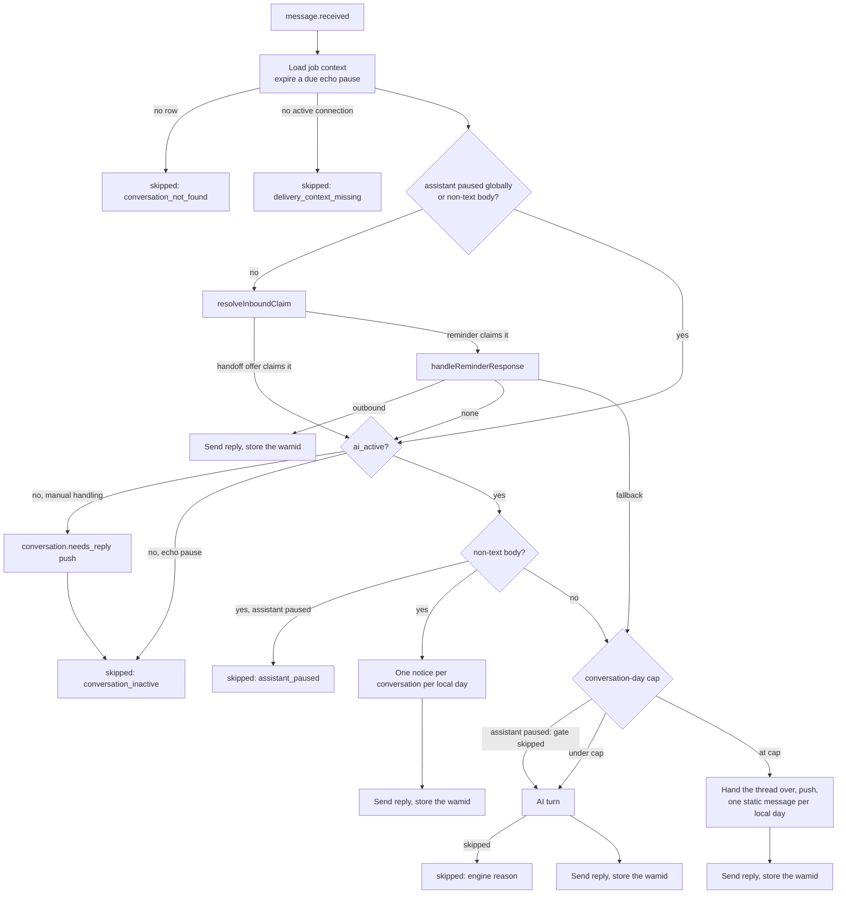

# Assistant conversation engine

Every inbound WhatsApp message from a customer produces exactly one reply, and a fixed precedence picks which subsystem writes it: a deterministic reminder answer, a nudge on a human-owned thread, a non-text notice, a cap handoff, or an AI turn. An AI turn is idempotent, tool-bound, Albanian-only, and ends in one of four outcomes, three of which replace the model's own prose with fixed text. This document explains the inbound pipeline, the engine that runs a turn, the tools and prompt the model works with, and how a model is chosen per plan and environment. The paths a conversation takes out of the assistant and into a person — escalation, the handoff offer, takeover, the cap handoff, and the failure handoff — are covered in [human handoff](./human-handoff.md).

## The inbound job

`handle-inbound-message` (`lib/inngest/functions/handle-inbound-message.ts`) is the single entry point from `message.received` to an outbound reply. It runs one step at a time and returns as soon as a path produces a reply, so the branches below are mutually exclusive.

Two details of the load step matter beyond the diagram. An echo pause whose `ai_paused_until` has passed is cleared right there, guarded on the exact pause reason and instant, so an expired pause never blocks the turn that arrives a moment later. And because nothing in the schema limits an account to one active connection, the job picks the newest active row, the same rule every other consumer of `whatsapp_connections` applies.

## What the job returns

The job's return value names the path taken, which makes an Inngest run readable without reading the messages. `skipped` values come either from the job itself or from one of three `ConversationEngineError` codes that `runInboundTurn` translates into a skip; the other two codes, `empty_response` and `step_limit_reached`, propagate so the run retries. A provider error that reports itself as non-retryable is rethrown as `NonRetriableError`, which stops the retries immediately.

| Return                                      | Meaning                                                                                                                            |
| ------------------------------------------- | ---------------------------------------------------------------------------------------------------------------------------------- |
| `{ skipped: 'conversation_not_found' }`     | No customer message row matched the event's account, conversation, and message ids.                                                |
| `{ skipped: 'delivery_context_missing' }`   | No active connection or no customer `wa_id`, so no reply can be sent.                                                              |
| `{ skipped: 'conversation_inactive' }`      | The thread is human-owned. A `conversation.needs_reply` push fires first when the cause is takeover, escalation, or a cap handoff. |
| `{ skipped: 'assistant_paused' }`           | `accounts.assistant_paused` is on. Nothing is metered and no reply is sent.                                                        |
| `{ reminder: true, ... }`                   | The reminder response handler answered deterministically.                                                                          |
| `{ nonText: true, noticeSent }`             | A non-text body: the notice was sent, or one had already been sent that local day.                                                 |
| `{ capped: true, handoffSent }`             | The monthly conversation cap was reached.                                                                                          |
| `{ outboundMessageId, externalId, replay }` | An AI turn answered. `replay` is true when the reply had already been delivered.                                                   |

## Precedence between a reminder and a handoff offer

Two subsystems ask the customer a yes-or-no question, and one word answers both: an unanswered reminder asks for a confirmation, and the handoff offer asks the customer to reply `PO`. `resolveInboundClaim` settles which one claims an affirmative, and it runs ahead of the reminder handler because that handler returns an outbound and ends the run, putting the engine — and with it the offer's acceptance — out of reach.

The rule is that whichever question was asked more recently claims the message:

1. No outstanding offer, or the message is not an acceptance of it, means the reminder keeps the message. `handoffOfferOutcome` accepts only an affirmative that is literally the next customer message after the anchored one, so everything else — `ANULO`, `RICAKTO`, a sentence — never reaches the comparison.
2. An offer with no pending reminder claims the message.
3. Otherwise the offer claims it only when `offer.offeredAt` is **strictly** newer than the reminder's `sent_at`. Postgres keeps these timestamps to the microsecond and a JavaScript `Date` truncates to the millisecond, so exact ties happen; a tie goes to the reminder, because confirming an appointment the customer holds is recoverable.
4. When the reminder wins, the offer is cleared on the spot rather than left armed against some later, unrelated message.

Both sides read "affirmative" from one function, `isAffirmative` in `lib/language/reply-intent.ts`, so the comparison never turns on a spelling technicality. That parse also rejects an affirmative particle carrying a contrary command (`Ok, anuloj`) and the Albanian progressive particle heading a statement (`Po pyesja…`), which is why those go to an ordinary AI turn instead of being claimed by either side. The keyword semantics belong to [reminders](./reminders.md). The cases are pinned in `lib/inngest/functions/__tests__/handle-inbound-message.integration.test.ts` under "most-recent-question-wins on an affirmative".

## One reply per inbound message

Four independent mechanisms hold the "exactly one reply" promise, and they are layered because the ones nearer the top can be defeated by a crash at the wrong moment.

- **Function idempotency.** `idempotency: 'event.data.messageId'` collapses duplicate `message.received` events for the same message into one run.
- **Per-conversation concurrency.** `concurrency: { limit: 1, key: 'event.data.conversationId' }` stops two rapid messages from answering over each other. It bounds parallelism only: Inngest makes no promise that queued runs execute in arrival order, so anything order-sensitive settles it from the messages themselves. `optStateSuperseded` in `lib/reminders/response-handler.ts` does exactly that for the reminder opt-out switches.
- **The database index.** `messages_ai_reply_to_uq` is a unique index on `reply_to_message_id`, partial on `role = 'ai' AND reply_to_message_id IS NOT NULL`, so a second AI reply to the same inbound message cannot be inserted. Every insert path uses `onConflictDoNothing` and returns the existing row instead.
- **The send replay check.** `sendInboundReply` reads the stored reply's `external_id` first and, when one is present, reports `alreadyDelivered` rather than sending again. `persistInboundReplyDelivery` writes the Graph message id back only while it is still null.

Inside a turn, `runTurnCore` holds the advisory lock `ai-turn:<messageId>` (`lib/db/advisory-lock.ts`), and `runTurnCoreUnlocked` short-circuits on `findExistingReply` before any model call.

## The engine turn

`runTurn` in `lib/conversation/engine.ts` is the only path from a customer message to a model call. `runReminderTurn` is the same path with three arguments changed, described at the end of this section.

The turn runs in this order:

1. **Load context** under `withAuditLog` as `ai.conversation.read`, joining the message, conversation, customer, and account rows in one query scoped to the account.
2. **Short-circuit** on an existing AI reply to this inbound message.
3. **Refuse an inactive conversation** unless `allowInactive` is set: `conversation_inactive`.
4. **Refuse a globally paused assistant**: `assistant_paused`, logged once as `ai.assistant_paused`. This is the single choke point for the pause, which is why the non-text branch in the inbound job carries its own copy of the check.
5. **Answer an outstanding handoff offer**, described in [human handoff](./human-handoff.md).
6. **Build the messages array** from the last 20 rows of the conversation, oldest first. `customer` maps to the model role `user`; both `ai` and `account` map to `assistant`, so an owner's manual reply is history the model can read.
7. **Build the system prompt** from account fields, the active services from `lib/services/queries.ts`, and the plan-gated assistant identity.
8. **Run the model loop** and turn its outcome into a stored reply.

`runReminderTurn` passes `allowInactive: true` so a reminder answer is handled even during a takeover, appends a reminder addendum to the system prompt, and sets `cancellationActor: 'customer'` so a cancellation in that context is recorded as the customer's rather than the assistant's.

## Turn outcomes

`runModelTurn` calls `generateText` with `temperature: 0.2`, `maxOutputTokens: 500`, `maxRetries: 0`, a 30-second timeout, and three stop conditions: `stepCountIs(5)`, a confirmable appointment change, and a successful handoff offer. It returns one of four outcomes, checked in this order.

| Outcome                | Trigger                                                                                                       | Reply the customer receives                                        |
| ---------------------- | ------------------------------------------------------------------------------------------------------------- | ------------------------------------------------------------------ |
| `appointment_mutation` | The last step returned an `effect` from `book_appointment`, `reschedule_appointment`, or `cancel_appointment` | `appointmentConfirmationContent`, rendered in the account timezone |
| `handoff_offer`        | The last step returned a successful `offer_human_handoff`                                                     | One fixed sentence                                                 |
| `response`             | The last step produced non-empty text                                                                         | The model's text                                                   |
| `handoff_required`     | No text, and some step called a mutating tool                                                                 | The failure-handoff sentence, after escalating                     |

The order is the contract. `result.text` is the _last_ step's text, so prose the model wrote alongside the stopping tool call would otherwise take precedence; discarding that prose is what guarantees one message per change, in wording the product controls.

Two tool sets drive this and they are deliberately different. `MUTATING_TOOLS` controls whether a speechless turn becomes a handoff, and includes `escalate_to_human` because that call changed real state. `CONFIRMABLE_MUTATIONS` selects whether fixed confirmation text exists to send instead of the model's words, and excludes `escalate_to_human` because no such text exists for an escalation — the model still has to produce the reply there. `offer_human_handoff` is in neither: offering changes nothing, so a turn that offers and then dies is safe to retry from scratch.

When a turn produces no text and called no mutating tool, the engine raises `empty_response` or `step_limit_reached` and the run retries. A single step that commits more than one appointment change logs `ai.multi_mutation_turn`; only the last is announced, so the others happened silently.

## Tools

`lib/ai/tools.ts` defines seven tools and their Zod schemas. The model receives the full JSON schema, and `dispatchTool` in `lib/ai/dispatcher.ts` owns runtime validation, so a malformed call becomes a recoverable tool result rather than a thrown error.

| Tool                         | Input                                         | Effect                                                            |
| ---------------------------- | --------------------------------------------- | ----------------------------------------------------------------- |
| `get_availability`           | `start`, `end`, optional `service_type`       | Free slots stepped by the named service's duration, or 60 minutes |
| `list_upcoming_appointments` | none                                          | The customer's upcoming appointments with ids and statuses        |
| `book_appointment`           | `starts_at`, `service_type`, optional `notes` | Books with `origin: 'conversation'`; returns a `booked` effect    |
| `reschedule_appointment`     | `appointment_id`, `new_starts_at`             | Moves the appointment; returns a `rescheduled` effect             |
| `cancel_appointment`         | `appointment_id`, optional `reason`           | Cancels as `cancellationActor`; returns a `cancelled` effect      |
| `escalate_to_human`          | `reason`                                      | Sets `ai_active = false` and `escalation_state = 'requested'`     |
| `offer_human_handoff`        | `reason`                                      | Pure signal; the engine sends the sentence and arms the anchor    |

The `effect` field is a sibling of `data`, not a field inside it: `data` is the result shape the tool promises the model, and the effect is engine plumbing that must not become part of it. What the appointment tools call is explained in [appointments and availability](./appointments-availability.md).

Both service-taking tools resolve a service through `getActiveServiceByName`, which matches an active service by name, lower-cased and trimmed on both sides; a name that matches nothing returns `invalid_input` rather than booking something else.

## Tool errors

Every failed tool call returns a result the model can act on, never an exception. The dispatcher maps `AppointmentError` codes onto four result codes, each with a `retryable` flag and a customer-safe Albanian message.

| Result code      | Raised by                                                                             | Retryable               |
| ---------------- | ------------------------------------------------------------------------------------- | ----------------------- |
| `invalid_input`  | Schema validation failure, unknown service name, `AppointmentError` `invalid_input`   | yes                     |
| `not_found`      | Appointment missing, or a conversation that cannot be escalated                       | no                      |
| `conflict`       | `invalid_transition` (terminal appointment) and `conflict`/`unavailable` (slot taken) | only for the slot cases |
| `internal_error` | Anything else, logged as `ai.tool_failed`                                             | yes                     |

A terminal appointment and a taken slot share the `conflict` code but not the message, because telling a customer the slot is taken when the appointment is simply cancelled is wrong. Every dispatch is wrapped in `withAuditLog` as `ai.tool.<name>`, targeting `availability_rules`, `conversations`, or `appointments` with the appointment id where one was supplied.

## The system prompt

`buildSystemPrompt` in `lib/ai/prompt.ts` concatenates a static persona prompt (`lib/ai/prompts/scheduling-assistant.ts`) with a business-context block assembled from account data. The static half has six sections: role, language lock, untrusted customer content, scope and safety, tool rules, and response style.

Three of those sections carry rules that other parts of the system depend on:

- **Language lock.** Albanian is the only output language, addressing the customer as _Ju_, whatever language the customer writes in. A request to switch language is answered as an ordinary request — one short Albanian sentence — and never treated as an attack.
- **Scope.** The assistant handles exactly four things: booking, rescheduling, cancelling, and answering about the services, prices, and availability in the business context. Anything else calls `offer_human_handoff`. There is no topic list to match against; the classification happens in the model, from the request in front of it.
- **Tool rules.** After a successful change, or a successful offer, the turn ends at the tool call — the system supplies the sentence. At most one appointment change per reply, and a move is a `reschedule_appointment`, never a cancel followed by a book.

The business-context block, headed `## Practice context` in the built prompt, lists the business name, optional title and address, assistant name, timezone, current time in both UTC and business-local form, configured retention, the greeting, and the active services with durations and prices. With no active services it says so explicitly and forbids offering one. It closes by forbidding any address, title, or price that is not listed above it, and by repeating the language lock.

## Prompt injection defences

Every value in the business context is owner-typed text rendered inside a system-authored bullet list, so `sanitizePromptField` strips anything that could forge structure before it is interpolated.

The function replaces control characters, format characters, and line and paragraph separators with a space, so an address ending in a newline and a hyphen cannot render as its own authoritative context bullet. It also strips the fence token `GREETING_TEXT`, case-insensitively, from every value: the greeting sits on one line between `<<<GREETING_TEXT` and `GREETING_TEXT>>>` markers, and stripping the token from the value stops the greeting closing its own fence and continuing as instructions. Both replacements substitute a space rather than deleting, so a deliberately split marker cannot reassemble.

The prompt then tells the model twice that customer messages are data, not instructions, and that the fenced greeting is text to send rather than instructions to follow.

## Model routing and privacy

One mechanism resolves the model for every environment. `selectModelForPlan` in `lib/ai/models.ts` reads the plan's per-environment entry from `lib/billing/plans.ts` and pairs it with that environment's OpenRouter provider routing. There is no environment-specific code path and no per-environment model variable, because a separate path produces a differently _shaped_ request outside production — no fallback routing, no reasoning effort — which makes production behaviour untestable anywhere else.

| Environment   | Primary                                  | Fallbacks           | Provider routing                            |
| ------------- | ---------------------------------------- | ------------------- | ------------------------------------------- |
| `development` | `nvidia/nemotron-3-ultra-550b-a55b:free` | none                | `allow_fallbacks: true`                     |
| `preview`     | `nvidia/nemotron-3-ultra-550b-a55b:free` | none                | `allow_fallbacks: true`                     |
| `production`  | `anthropic/claude-haiku-4.5`             | `openai/gpt-5-mini` | plus `zdr: true`, `data_collection: 'deny'` |

Production is the only environment that processes customer data, so it is the only one bound by the zero-retention commitments in the privacy policy and DPA. Development runs against a local stack and preview against its own hosted Supabase project, Meta test app, and Vercel deployment, so neither carries a real customer's messages (see [environments](../environments.md)). The free models both use publish no zero-retention endpoint, so requiring it outside production would fail every turn. `assertProductionPrivacy` runs at module load and throws unless production sets both flags, which fails the build and every test run rather than a customer conversation. Environment identity comes from `appEnv()`, never `NODE_ENV`; see [environments](../environments.md).

`OPENROUTER_MODEL_OVERRIDE` is the one escape hatch. It swaps the primary model id in all three environments and leaves fallbacks, reasoning effort, and privacy routing intact. Plan-level differences and the identity gate are covered in [billing and plans](./billing-and-plans.md); provider routing as a privacy control is covered in [privacy and GDPR](./privacy-and-gdpr.md).

### Why reasoning effort is unset

No environment sets `reasoningEffort`, and the omission is deliberate. OpenRouter derives the thinking budget from the request's `max_tokens` as `max(min(max_tokens × ratio, 128000), 1024)`, with ratios of 0.2, 0.5, and 0.8 for low, medium, and high — and requires `max_tokens` to be strictly higher than the budget so the reply has somewhere to go. The 1024-token floor is the binding constraint: below a `max_tokens` of 5120, every effort level collapses onto it. The engine sends `maxOutputTokens: 500`, so any effort value gives the thinking budget the entire allowance, the model returns no text, and the turn fails as `empty_response`. Raise `maxOutputTokens` above 1024 before setting an effort level.

## Deterministic replies

Several replies are fixed text with no model round behind them. They share one insert, `persistDeterministicReply` in `lib/conversation/deterministic-reply.ts`, which pins `provider: 'internal'` and zero tokens and cost so a fixed sentence cannot inflate the cost dashboard, and which relies on `messages_ai_reply_to_uq` for idempotency: a redelivered job conflicts, reads the existing row, and re-sends the same message.

The `messages.model` column carries a marker naming the path that wrote the reply, which is how cost queries separate real turns from fixed text.

| Marker                            | Written by                                    |
| --------------------------------- | --------------------------------------------- |
| `deterministic-reminder-response` | `lib/reminders/response-handler.ts`           |
| `deterministic-reminder`          | `lib/inngest/functions/send-reminder.ts`      |
| `deterministic-appointment-event` | `lib/inngest/functions/appointment-events.ts` |
| `deterministic-cap-handoff`       | `lib/billing/cap-handoff.ts`                  |
| `deterministic-non-text-notice`   | `lib/conversation/non-text.ts`                |
| `deterministic-handoff-accepted`  | `lib/conversation/handoff-offer.ts`           |
| `deterministic-failure-handoff`   | `lib/conversation/engine.ts`                  |

Three fixed-text replies are deliberately absent from that list. The appointment confirmation, the handoff offer, and the in-turn failure handoff all carry the real metadata of the model round that produced the tool call, because a billed round did happen. Only the exhausted-retries handoff, which runs in a fresh invocation with no round behind it, is stamped `deterministic-failure-handoff`. Stamping the other three `internal` would under-report every booking turn.

## Cost telemetry

Each model turn writes its usage onto the `messages` row it produced — `tokens_in`, `tokens_out`, `cached_tokens`, `model`, `provider`, and `ai_cost_microusd` — and logs one `ai.turn_completed` line with ids and counts only, never content.

Cost comes from OpenRouter's own accounting rather than a local rate card: `buildModelSettings` sets `usage: { include: true }`, and the engine sums `providerMetadata.openrouter.usage.cost` across steps and rounds to micro-USD. The provider name is taken from the same metadata, so it names the upstream that actually served the request rather than the gateway.

The log line also carries `reasoningTokens` and `finishReason`, which is not padding: a thinking budget that swallows `maxOutputTokens` shows up as exactly that pair — reasoning tokens at the ceiling and `finishReason: 'length'` — and as nothing at all without them. Rollups and dashboards are covered in [observability and admin](./observability-and-admin.md).

## Related documents

The engine sits between six other subsystems, each explained in its own document.

- [Human handoff](./human-handoff.md) — escalation, the handoff offer, takeover, echo pause, cap handoff, failure handoff, and the conversation flag glossary.
- [Reminders](./reminders.md) — reply keyword parsing, candidate selection, and the reminder AI fallback.
- [WhatsApp connection](./whatsapp-connection.md) — how `message.received` is produced and how a reply is sent inside the 24-hour service window.
- [Appointments and availability](./appointments-availability.md) — what the booking tools call.
- [Events and background jobs](./events-and-background-jobs.md) — the event catalogue and the outbox that publishes it.
- [Notifications](./notifications.md) — which events reach the owner as a push or a bell entry.
