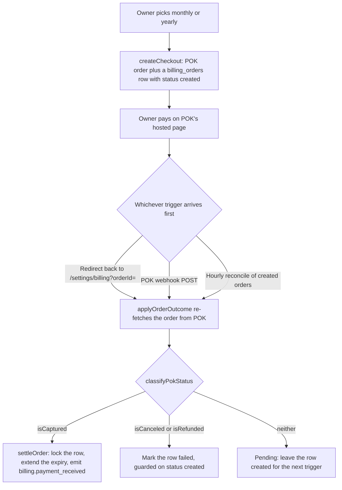
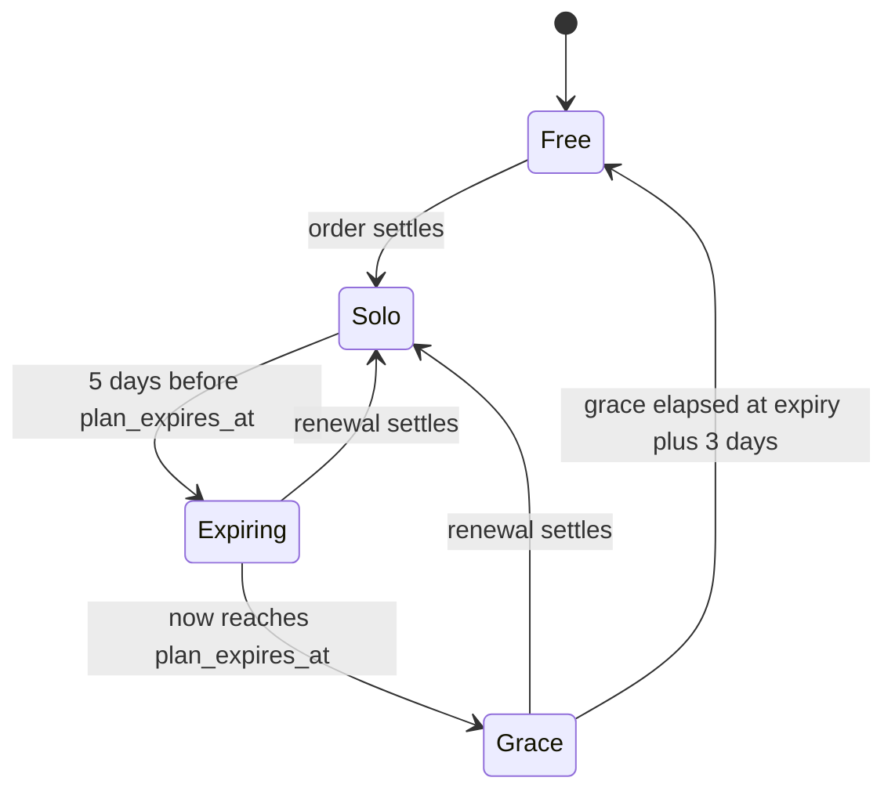

# Billing and plans

Medium has two plans and no internal subscription state machine. Solo is prepaid time held in `accounts.plan_expires_at` and bought as one-off orders through the POK payment provider; Free is where every account starts and where a lapsed Solo lands. Usage is metered as conversation-days and Meta-confirmed reminder deliveries, capped per calendar month in the account's own timezone, and warned about at 80%. An expired plan keeps Solo entitlements for a three-day grace window, after which a daily job downgrades the account without deleting anything.

## Plans and limits

`lib/billing/plans.ts` is the only place a limit, a price, or a per-plan model id is declared. Everything else reads it through `getPlan(planId)`, so no feature carries its own copy of a number.

| Entitlement                        | Free                   | Solo                                  |
| ---------------------------------- | ---------------------- | ------------------------------------- |
| Conversations per month            | 30                     | 400                                   |
| Reminders per month                | 10                     | 250                                   |
| Active services                    | 1                      | unlimited (`null`)                    |
| Retention maximum                  | 30 days                | 365 days                              |
| Custom assistant name and greeting | no                     | yes                                   |
| Price, VAT-inclusive               | none (not purchasable) | 2,500 ALL monthly · 25,000 ALL yearly |

Prices are whole Lekë, not minor units. The same file holds the lifecycle constants: `USAGE_WARN_RATIO` (0.8), `EXPIRY_GRACE_DAYS` (3), `RETENTION_CLAMP_GRACE_DAYS` (30), and `RENEWAL_REMINDER_DAYS_BEFORE` (`[5, 0]`). It also holds the per-environment model config both plans share, which the [assistant and conversation engine](./assistant-conversation-engine.md) doc explains.

## Where each entitlement bites

Every limit is enforced at one named site, and each one degrades rather than erroring out.

| Entitlement               | Enforced in                                                                                                           | Effect at the limit                                                                                        |
| ------------------------- | --------------------------------------------------------------------------------------------------------------------- | ---------------------------------------------------------------------------------------------------------- |
| `conversationsPerMonth`   | `checkAndRecordConversation` in `lib/billing/usage.ts`, called from `lib/inngest/functions/handle-inbound-message.ts` | A new customer-day gets the cap handoff instead of an assistant turn                                       |
| `remindersPerMonth`       | `reminderQuotaAvailable`, called from `lib/inngest/functions/send-reminder.ts` and `app/(dashboard)/chat/actions.ts`  | The reminder job is skipped with reason `plan_reminder_quota` and the appointment badge shows it           |
| `maxActiveServices`       | `app/(dashboard)/settings/services/actions.ts`                                                                        | Creating or activating a service returns `PLAN_LIMIT`; deactivating is never gated, so a swap always works |
| `retentionMaxDays`        | `app/(dashboard)/settings/account/actions.ts` and `effectiveRetentionDays`                                            | A longer retention option is rejected, and the purge job clamps a stored value after a downgrade           |
| `customAssistantIdentity` | `app/(dashboard)/settings/assistant/actions.ts` and `effectiveAssistantIdentity`                                      | Name and greeting writes are rejected, and the prompt falls back to the default persona                    |

## Overriding the plan table

`BILLING_PLAN_OVERRIDES` is a JSON environment variable that changes limits, prices, or model ids without a deploy. `resolvePlans` deep-merges it over the base table at module load: plain objects merge recursively, while arrays, scalars, and `null` replace outright.

The parser fails loudly. Invalid JSON, or JSON that does not match the deep-partial plan shape, throws at module initialization rather than silently leaving the defaults in place.

## Plan state on an account

Five columns on `accounts` carry the whole plan state. `lib/db/schema.ts` declares them and migration `0020` adds them.

| Column               | Meaning                                                                                        |
| -------------------- | ---------------------------------------------------------------------------------------------- |
| `plan`               | The stored plan, `free` or `solo`. Written only by a settle or a downgrade                     |
| `plan_expires_at`    | When prepaid Solo time runs out. `null` on Free                                                |
| `plan_lifetime`      | Grants Solo unconditionally, ignoring expiry. Set by hand for pilot accounts; nothing sells it |
| `plan_downgraded_at` | When the downgrade job ran. Starts the retention clamp grace window; a later settle nulls it   |
| `plan_step_seen_at`  | Marks that the owner saw and skipped the onboarding plan card                                  |

The money ledger is a separate table, `billing_orders` (migration `0022`): one row per checkout, holding the POK order id, the plan and period bought, the amount, the settle status, and the expiry the settle moved from and to. Tenants may read their own rows and never write them — every write goes through the owner connection. The metered facts live in `conversation_days` (migration `0020`, loosened by `0025`) and `reminder_deliveries` (migration `0026`).

## Which plan applies

`resolveEffectivePlan` in `lib/billing/entitlements.ts` is pure and takes the account's billing columns plus an instant. Nothing reads `accounts.plan` directly to decide an entitlement.

| Account state                                                  | Effective plan |
| -------------------------------------------------------------- | -------------- |
| `plan_lifetime` is true                                        | `solo`         |
| Stored `solo` and `now <= plan_expires_at + 3 days`            | `solo`         |
| Stored `solo`, past that grace window or with no expiry at all | `free`         |
| Stored `free`                                                  | `free`         |

The third row is what makes the grace window safe: entitlements stop honoring an expired plan the moment it lapses, instead of waiting for the daily job to write the downgrade back to the row.

## How long conversations are kept

`effectiveRetentionDays` decides the window the daily purge job applies, and a downgrade deletes nothing immediately. The account's stored `retention_days` stands for 30 days after `plan_downgraded_at`, and only then clamps to the effective plan's maximum. A settle nulls `plan_downgraded_at`, so re-upgrading lifts the clamp on its own.

An account that has never been downgraded keeps its stored value whatever the plan maximum says. The sign-up trigger in `drizzle/migrations/0003_pts_signup_trigger.sql` seeds `retention_days` at 90, and `updateRetention` rejects a value above the plan maximum but never lowers one already stored. A Free account that was never Solo therefore purges at 90 days rather than at Free's 30-day maximum, and the clamp reaches it only after a downgrade. The purge itself belongs to [privacy and GDPR](./privacy-and-gdpr.md).

## Assistant identity on Free

`effectiveAssistantIdentity` returns nulls for any plan without `customAssistantIdentity`, and the prompt layer resolves nulls to the default assistant persona. The resolution happens where the system prompt is built, not where the values are saved, so an account holding a custom name from an earlier Solo period gets the default persona as soon as the plan lapses.

## Metering a conversation-day

A billable conversation is one customer active on one local day, not one message and not one thread. `conversationDayKeys` derives both the `YYYY-MM-DD` day key and the `YYYY-MM` month key from the same zoned instant in the account's timezone, so a message sent at 23:59 local counts against the local day and month it happened on even when UTC has already rolled over.

`checkAndRecordConversation` runs inside the advisory lock `usage:conv:<account_id>` and one transaction, in this order:

1. Insert a `conversation_days` row for `(account, customer, local day)` with `onConflictDoNothing`.
2. If nothing was inserted, this customer-day is already paid for: return `allowed` with `counted: false`, whatever the month total is.
3. Otherwise count the month's rows.
4. If the count now exceeds the limit, delete the row just inserted and return `at_cap`. Nothing is counted for a customer that is turned away.
5. If the count reached the limit, emit `billing.limit_reached`; if it crossed `ceil(0.8 × limit)`, emit `billing.limit_warning`.

Two properties follow from that order. A retry or a later message on the same customer-day always flows, so a conversation is never cut off mid-thread once its day is counted. And because the insert, the count, and the compensating delete share one transaction inside the lock, a crash can never leave a committed over-limit row that a retry would then wave through.

The metering instant is the customer message's own `occurredAt`, not wall-clock time, so an Inngest retry hours later still lands on the original billing day.

### A month on the Free plan

Take an account on Free (30 conversations) in `Europe/Tirane`, in the month `2026-03`.

| Event                                                               | Row written            | Month count | Gate result                                                                        |
| ------------------------------------------------------------------- | ---------------------- | ----------- | ---------------------------------------------------------------------------------- |
| Customer A messages on 3 March at 09:00                             | Yes, `2026-03-03`      | 1           | `allowed`, counted                                                                 |
| Customer A messages again on 3 March at 18:00                       | No, conflict           | 1           | `allowed`, not counted                                                             |
| Customer A messages on 4 March                                      | Yes, `2026-03-04`      | 2           | `allowed`, counted                                                                 |
| Customer B messages on 4 March                                      | Yes, `2026-03-04`      | 3           | `allowed`, counted                                                                 |
| A 24th distinct customer-day is inserted                            | Yes                    | 24          | `allowed`, counted, `billing.limit_warning` at the `ceil(0.8 × 30) = 24` threshold |
| A 31st distinct customer-day is attempted                           | Inserted, then deleted | 30          | `at_cap`                                                                           |
| Customer C, already counted on 20 March, messages again on 20 March | No, conflict           | 30          | `allowed`, not counted                                                             |

`getConversationUsage` reads the same count for the chat cap banner and the billing screen, resolving the grace-aware effective plan so a lapsed Solo sees Free's limits.

One accepted inaccuracy is documented on the table itself. `customer_id` is nullable with `ON DELETE SET NULL` so erasure keeps the metered day, and because NULLs are distinct in a unique index, erasing a customer who then messages again on the same local day records a second fact for one real customer-day. The error is bounded to one extra day per erasure and always counts against the account, never in its favor.

## When the conversation cap is reached

At the cap the assistant genuinely cannot serve a new customer-day, so the thread is handed to a person rather than answered. `lib/billing/cap-handoff.ts` does three things, in this order: it sets `ai_active = false` and `escalation_state = 'requested'` on the conversation, dispatches a `conversation.needs_reply` push, then sends one static Albanian message telling the customer a person will reply.

The customer message carries no plan, limit, or AI language; that wording lives on the owner-facing surfaces. It is sent at most once per conversation per local day, guarded by `conversations.limit_handoff_at`. Later messages that day are not silent either: because the conversation is already human-owned, they take the manual-handling path in `handle-inbound-message.ts` and push the same nudge, collapsed on the device by a per-conversation tag.

The owner's inbox and manual replies are never blocked — only the automated reply is. A globally paused assistant skips the gate entirely, so a paused account meters nothing. The handoff's place in the inbound decision tree belongs to [the assistant and conversation engine](./assistant-conversation-engine.md).

## Reminder quota

Reminders count only when Meta confirms delivery. The statuses webhook writes one `reminder_deliveries` row per delivered message id, and `countDeliveredReminders` counts those rows for the month — there is no stored counter and nothing is counted at send time.

`getReminderUsage` returns `used = delivered + inFlight`, where in-flight means a job with status `sent` and a `sent_at` inside the window that Meta has neither delivered nor failed. In-flight sends hold a quota slot for up to 30 days, clamped to the month, because Meta queues an accepted template for about that long: a reminder to a phone switched off overnight is still going to be delivered and billed. A send Meta has already reported as `failed` frees its slot immediately, whatever its age. Delivery is read per message id from `wa_message_statuses` rather than from `reminder_jobs.delivered_at`, because that column is a single scalar on a row unique per appointment, so a rescheduled appointment's second — separately billed — template would otherwise be invisible.

`reminderQuotaAvailable` is the gate both send paths call, and it fails open when the limit cannot be resolved (a missing account yields limit 0). Manual sends from the chat screen count exactly like automated ones, and they take the extra advisory lock `reminder-quota:<account_id>` so two sends in different threads cannot both read "available" before either books a job row. What happens to a skipped job is covered in [reminders](./reminders.md).

## Usage warnings and the daily monitor

Billing limit events are emitted at most once per `(account, event type, kind, month)`. `emitBillingEventOnce` checks the `events` table for a matching row inside the caller's transaction before appending, so the inline gate, the reminder gate, and the cron all share one dedupe.

`billing-usage-monitor` runs at 06:00 UTC over accounts with an active WhatsApp connection, since those are the only accounts that can accrue usage. Per account it does two things: it emits `billing.limit_warning` with kind `reminders_predictive` when reminders still queued for this month's appointments would exhaust the remaining quota, and it re-checks conversation usage so a race that let the inline gate miss its warning is caught the next morning. Both emits go through the same dedupe, so a daily re-run never double-fires.

Which of these events reach the owner as a push or a bell entry is covered in [notifications](./notifications.md), and the event names themselves in [events and background jobs](./events-and-background-jobs.md).

## Paying for Solo

A purchase is a single one-off POK order, and the plan gains a period of prepaid time when that order settles. `lib/billing/payments.ts` is the only module allowed to import `lib/billing/pok/`; `scripts/smoke-pok.ts` is the one sanctioned exception, a manual staging spike that is never part of the test run.

`createCheckout` sends the whole-ALL price straight through: `ALL_MINOR_FACTOR` is 1, confirmed by the staging spike, because POK renders an integer amount of `250000` as "250,000.00 ALL". The order is created with `autoCapture` so a successful guest payment lands captured in one flow, and both the success and failure redirect URLs point at the same `/settings/billing` page, which POK returns to with `?orderId=` appended. The ledger row is written with status `created` and no expiry columns until settle.

The POK client is built lazily on the first payment call rather than at module scope. `lib/billing/payments.ts` sits in the import graph of the Inngest function registry, so a module-scope throw over a missing credential would fail the load of `/api/inngest` and take down every background job. Lazily, only checkout and settle fail. Each call is bounded by a 10-second deadline, so one degraded response cannot push a reconcile run past its own window.

## Settling an order

`applyOrderOutcome` is the one idempotent settle, called by the post-redirect page, the webhook, and the reconcile cron alike. It re-fetches the authoritative order from POK before doing anything, which is what makes a forged or replayed trigger harmless.

| Result            | Cause                                                                                | Effect                                                         |
| ----------------- | ------------------------------------------------------------------------------------ | -------------------------------------------------------------- |
| `unknown`         | No ledger row for that POK order id                                                  | Nothing, and no POK call is made                               |
| `already_applied` | The row is already `paid`, or another caller won the row lock                        | Nothing                                                        |
| `failed`          | The row is already `failed` or `expired`, or POK reports `isCanceled` / `isRefunded` | The row is set to `failed`, guarded on `status = 'created'`    |
| `pending`         | POK reports the order neither captured nor cancelled                                 | Nothing; the row stays `created` for the next trigger          |
| `not_found`       | POK answers 404 for an order we created                                              | Logged as a warning; the row stays `created`                   |
| `applied`         | POK reports `isCaptured` and this caller sees `status = 'created'` under the lock    | The plan is extended and `billing.payment_received` is emitted |

Plan time is credited only on `isCaptured` — POK exposes boolean flags rather than a status string, and an ambiguous state never credits. `not_found` is deliberately distinct from `pending`, because only `pending` licenses the reconcile cron to expire an order; expiring on a 404 would be terminal and would lose a payment POK captures once its API is consistent again.

`settleOrder` holds the mutex. It selects the ledger row `FOR UPDATE`, re-checks `status = 'created'`, then locks the account row, computes the new expiry with `computeExtendedExpiry`, writes `status = 'paid'` with the before and after expiry on the ledger row, sets `plan = 'solo'` and `plan_downgraded_at = null` on the account, and appends `billing.payment_received` — all in one transaction. A double webhook and a concurrent redirect all block on the same lock, and exactly one observer extends.

`computeExtendedExpiry` extends from `max(now, current expiry)` using UTC calendar arithmetic, so renewing early adds a full period to the remaining time rather than losing the unused days.

The webhook at `app/api/webhooks/pok/route.ts` is a trigger and nothing more. It pulls an order id out of an undocumented payload, hands it to `applyOrderOutcome`, and always answers 200 — including on a processing failure, because the reconcile cron is the retry net and POK is never asked to redeliver. There is no signature verification: POK's webhook contract is undocumented, so authenticity comes entirely from the server-side re-fetch, and the route says so in its header comment.

The redirect path is guarded by ownership. `/settings/billing` settles an `?orderId=` only after confirming a `billing_orders` row with that POK order id belongs to the signed-in account.

## Reconciling orders POK never confirmed

`reconcile-pok-orders` runs hourly and re-drives every still-`created` order through the same idempotent settle, which is what makes the payment flow survive a missed, delayed, or entirely nonexistent webhook.

| Order age and POK's answer                      | Outcome                                                 |
| ----------------------------------------------- | ------------------------------------------------------- |
| Younger than 10 minutes                         | Skipped, so the trigger paths get first crack           |
| 10 minutes or older                             | Polled through `applyOrderOutcome`                      |
| 24 hours or older and POK still reports pending | Expired, guarded on `status = 'created'`                |
| POK answers 404, order younger than 7 days      | Left `created` and counted as not-found                 |
| POK answers 404, order 7 days or older          | Expired and logged at error level for manual settlement |

The scan is capped at 200 orders per run, split between the oldest and the newest halves so a wall of permanently stuck old orders cannot head-of-line block the freshest checkouts. The run also carries a four-minute budget; past it the remainder is reported as skipped rather than running into the next tick. The entire scan is one Inngest step, because per-order steps are memoized and a retry would replay old results without re-polling POK.

A failure on one order is contained and counted, never allowed to abort the scan. But a run in which every order actually polled came back broken throws instead of reporting success: with at least two polls in the denominator, an all-failed or all-404 run is an outage — a rotated credential or the wrong merchant environment — not a quiet scan. Skipped orders stay out of that denominator.

## Renewal, grace, and downgrade

`billing-renewal-monitor` runs at 07:00 UTC over every non-lifetime Solo account that has an expiry. Renewal itself is not a job: it is an ordinary POK payment that moves `plan_expires_at` forward, which re-arms both reminders naturally.

`planRenewalActions` is a pure decision core, and `processRenewalForAccount` applies its decisions with dedupe.

| Condition at run time                       | Decision                    | Emitted once per                         |
| ------------------------------------------- | --------------------------- | ---------------------------------------- |
| `now >= expiry - 5 days` and `now < expiry` | `renewal_due` with offset 5 | account, event type, `expiresAt`, offset |
| `now >= expiry`                             | `renewal_due` with offset 0 | account, event type, `expiresAt`, offset |
| `expiry <= now < expiry + 3 days`           | `grace_started`             | account, event type, `expiresAt`         |
| `now >= expiry + 3 days`                    | `downgrade`                 | guarded by the conditional write below   |

The offset sits in the dedupe key, so both reminders land. Including `expiresAt` in the key means a renewal that moves the expiry re-arms the whole set for the new period.

`runDowngrade` is the only money-path write, and its guard is the mutex. Inside the transaction it re-checks `plan = 'solo' AND NOT plan_lifetime AND plan_expires_at + interval '3 days' <= now` with `RETURNING`: a payment that settled between the scan and this write has already moved the expiry, so the `WHERE` misses, no rows come back, and the account is skipped rather than downgraded.

A downgrade deletes nothing. It sets `plan = 'free'` and `plan_downgraded_at = now`, deactivates every active service beyond Free's cap while keeping the oldest ones (the owner can swap later by toggling), emits `billing.downgraded`, and leaves retention to clamp lazily on the purge job's next run.

Expiry, grace, and downgrade are compared as exact instants while the job fires once a day, so a boundary crossed between two runs is acted on up to a day late relative to local midnight. Entitlements already honor the grace window live, so the lag changes nothing an owner can do, and it self-corrects on the next run.

## What the owner sees on the billing screen

`getBillingSnapshot` in `lib/billing/read-model.ts` assembles the whole screen in one read: the effective and stored plan, the lifecycle state, days left, both usage meters, receipts, the period of the most recent paid order, and the Solo price. It carries no POK customer data, no model names, and no cost-of-goods.

The lifecycle state is derived, not stored.

| State      | Condition                                                                                             |
| ---------- | ----------------------------------------------------------------------------------------------------- |
| `lifetime` | `plan_lifetime` is set                                                                                |
| `free`     | The effective plan is Free                                                                            |
| `grace`    | Past `plan_expires_at` but still inside the three-day window; `daysLeft` counts down to the downgrade |
| `expiring` | Within 5 days of `plan_expires_at`; `daysLeft` counts down to expiry                                  |
| `active`   | Solo with expiry further out                                                                          |

`resolveCheckoutSlot` decides what the payment slot offers, and it never sells to a lifetime account or when Solo has no price: `upgrade` (both periods, yearly preselected) on Free, `switch` (yearly only) for an active monthly buyer, `reassure` — a note, no form — for an active yearly buyer, `renew` (both periods) when expiring or in grace, and `none` otherwise.

After the redirect, `checkoutBannerTone` maps the settle result to the banner: `applied` and `already_applied` read as paid, `failed` as failed, and both `pending` and `not_found` as pending. Treating `not_found` as pending is deliberate — POK's read-after-write lag 404s an order for the first seconds after checkout, which is exactly when it redirects the owner back, and the reconcile job settles it either way.

Receipts list `paid` and `failed` orders only. A `created` order was never settled and an `expired` one is an abandoned checkout, and showing either next to a price would read as a charge that failed. Each receipt shows the amount stored on that order, so a later price change never restates history. The meters show conversation usage and delivered reminders against the effective plan's limits, turning amber at the same `ceil(0.8 × limit)` threshold the warning events use.

## Plan prompts elsewhere in the product

Three screens carry a lock rather than a paywall, and each gate rejects on the server as well as locking in the UI: the services list (`PLAN_LIMIT` when creating or activating past the cap, under an advisory lock so two concurrent activations cannot both slip through), the assistant identity rows, and the retention options in **Account and data**.

Onboarding shows a plan card that is deliberately soft. `lib/onboarding/state.ts` keeps `plan` out of the five-step completion gate entirely, so a Free account always reaches the dashboard; picking Solo routes to the billing screen, and declining records `plan_step_seen_at` so the card stops appearing.

The landing page's pricing section and the onboarding card both render their numbers from `PLANS`, so published prices and limits cannot drift from the table the gates read. The public Albanian explanation of the plans lives at `/help/plans` (`app/(legal)/help/plans/page.tsx`), which interpolates the same values.

## Configuration and environments

POK runs in its own environment per deployment: `POK_ENV` selects the API host (`production` and `prod` map to `api.pokpay.io`, anything else to `api-staging.pokpay.io`), with `POK_API_BASE` as a host override. `POK_MERCHANT_ID`, `POK_KEY_ID`, and `POK_KEY_SECRET` are per-environment secrets, and the checkout and settle paths throw when they are absent while every other background job keeps running. `lib/env/env-vars.ts` declares all five, and [environments](../environments.md) covers how the three deployments are kept apart.

Two other configuration facts matter here. `BILLING_PLAN_OVERRIDES` tunes the plan table per environment, and `NEXT_PUBLIC_APP_URL` supplies the return URL POK redirects to, so a checkout started on one deployment lands back on the same one.

The admin dashboard's monetization cards — plan distribution, conversion, renewals, downgrades, cap hits, Free-plan cost of goods, and the payments CSV — are described in [observability and admin](./observability-and-admin.md), together with the Meta rate card that the daily cost rollup uses.

## Where the behavior is pinned

Several of the subtler rules above are held in place by tests rather than by types, and those are the fastest way to check a change against the intended behavior.

- `lib/billing/__tests__/entitlements.test.ts` and `plans.test.ts` — grace resolution, retention clamping, override merging.
- `lib/billing/__tests__/usage.integration.test.ts` and `reminder-usage.integration.test.ts` — the metering transaction, the compensating delete, in-flight accounting.
- `lib/billing/__tests__/payments.integration.test.ts` and `payments-extension.test.ts` — settle idempotency and expiry extension.
- `lib/billing/__tests__/checkout-slot.test.ts` and `read-model.integration.test.ts` — slot resolution and banner tone.
- `lib/inngest/functions/__tests__/billing-renewal-monitor*.test.ts`, `reconcile-pok-orders.integration.test.ts`, and `retention-clamp.integration.test.ts` — the lifecycle jobs.
- `app/(dashboard)/settings/services/__tests__/plan-gate.integration.test.ts` — the active-service gate.
