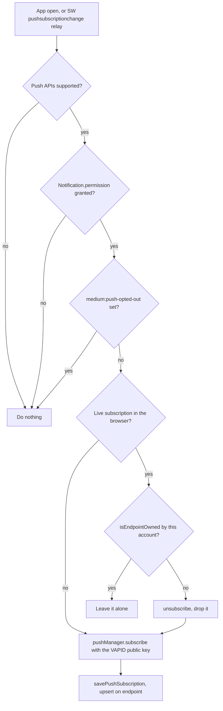

# Notifications

Notifications are events. A fixed list of event types feeds the in-app bell straight from the `events` table, and a partly overlapping subset fans out as Web Push through one Inngest function gated by nine per-account toggles. Nothing in this system invents its own trigger: if a surface shows something, some feature wrote a domain event first.

This doc explains both surfaces, the mapping between them, and the browser-side subscription lifecycle that keeps push alive. For what each business event _means_, follow the link in the emitter column to the feature that owns it; for the event store and outbox itself, see [events and background jobs](./events-and-background-jobs.md).

## Two surfaces over one event stream

The bell and Web Push read the same domain events but reach the owner in different ways, so they are wired differently.

The bell is a **pull** surface: `getNotificationData` in `lib/notifications/query.ts` queries the `events` table directly, filtered to the account and to `NOTIFICATION_TYPES`. Nothing is copied into a notifications table, and no job runs — an event row is the notification.

Push is a **fan-out** surface: `dispatch-push-notification` (`lib/inngest/functions/dispatch-push.ts`) subscribes to ten event names and calls `dispatchPushForEvent`, which resolves preferences, builds a payload, and posts it to every browser the account has subscribed. One event type, `conversation.needs_reply`, skips Inngest and calls `dispatchPushForEvent` in process from two call sites instead.

Because the two surfaces have separate lists, an event can appear on one, both, or neither. Owner-initiated events such as `conversation.taken_over` are deliberately absent from both: the owner did them.

## Event to surface matrix

This is the complete mapping. `NOTIFICATION_TYPES` (`lib/notifications/format.ts`) defines the bell column; the `PushEvent` union (`lib/notifications/push-payload.ts`) defines the push column.

| Event                         | Bell | Push                         | Preference        | Emitted by                                                                               |
| ----------------------------- | ---- | ---------------------------- | ----------------- | ---------------------------------------------------------------------------------------- |
| `appointment.booked`          | yes  | via `notification.requested` | `booking`         | [appointment mutations](./appointments-availability.md)                                  |
| `appointment.confirmed`       | yes  | no                           | —                 | [appointment mutations](./appointments-availability.md)                                  |
| `appointment.cancelled`       | yes  | via `notification.requested` | `cancellation`    | [appointment mutations](./appointments-availability.md)                                  |
| `appointment.rescheduled`     | yes  | via `notification.requested` | `reschedule`      | [appointment mutations](./appointments-availability.md)                                  |
| `notification.requested`      | no   | yes                          | by `kind`         | `lib/inngest/functions/appointment-events.ts`                                            |
| `conversation.escalated`      | yes  | yes                          | `escalation`      | [escalation](./human-handoff.md)                                                         |
| `conversation.needs_reply`    | no   | yes (direct)                 | `manualReply`     | [inbound job](./assistant-conversation-engine.md), [cap handoff](./billing-and-plans.md) |
| `conversation.resume_offered` | no   | yes                          | `resumeOffer`     | [resume offer job](./human-handoff.md)                                                   |
| `conversation.failed`         | yes  | no                           | —                 | [failure handoff](./human-handoff.md)                                                    |
| `reminder.failed`             | yes  | yes                          | `reminderFailure` | [reminders](./reminders.md)                                                              |
| `wa.connection.revoked`       | yes  | yes                          | `connection`      | [WhatsApp connection](./whatsapp-connection.md)                                          |
| `billing.limit_warning`       | yes  | yes                          | `billing`         | [usage metering](./billing-and-plans.md)                                                 |
| `billing.limit_reached`       | yes  | yes                          | `billing`         | [usage metering](./billing-and-plans.md)                                                 |
| `billing.renewal_due`         | yes  | yes                          | `billing`         | [renewal lifecycle](./billing-and-plans.md)                                              |
| `billing.grace_started`       | yes  | yes                          | `billing`         | [renewal lifecycle](./billing-and-plans.md)                                              |
| `billing.downgraded`          | yes  | yes                          | `billing`         | [renewal lifecycle](./billing-and-plans.md)                                              |
| `billing.payment_received`    | yes  | no                           | —                 | [payments](./billing-and-plans.md)                                                       |
| `wa.connection.expiring`      | no   | no                           | —                 | `lib/inngest/functions/poll-whatsapp-health.ts`                                          |
| `wa.quality_warning`          | no   | no                           | —                 | `lib/inngest/functions/poll-whatsapp-health.ts`                                          |

Three rows need a word of explanation:

- **Appointment pushes travel under a different name.** The `appointment.*` rows land in `events` and light up the bell. The push comes later, from `handle-appointment-event`, which emits `notification.requested` carrying a `kind`. That extra hop exists so the push payload can quote resolved appointment fields. `appointmentEventPlan` suppresses it for a cancellation caused by customer erasure.
- **`notification.requested` and `conversation.resume_offered` never reach `events`.** Both are sent with `step.sendEvent`, so they exist only as Inngest events. They can push, but they can never appear in the bell.
- **`conversation.needs_reply` bypasses Inngest entirely.** The inbound job and the cap handoff call `dispatchPushForEvent` directly, so this nudge is push-only with no row anywhere.

## The bell feed

The bell is a sheet in the dashboard header (`components/notifications/notification-bell.tsx`) showing the most recent notification-type events for the account. For where it sits among the app's other screens, see [the owner app](../product/owner-app.md).

`getNotificationData` runs three queries: the account's timezone and `notifications_seen_at` watermark, the newest 30 matching events (`FEED_LIMIT`, `lib/notifications/query.ts:11`), and an unread count. The count deliberately spans every notification event past the watermark rather than the 30-row window, so the badge stays truthful when more than 30 pile up.

Customer names come from one batched lookup on `customers`, passed through `privacyName` before they reach the view. An event whose customer no longer exists renders the neutral label `Një klient`. Because the bell subscribes to `events` for the account through `useRealtimeRefresh`, a new row refreshes the badge and feed without a reload.

`markAllNotificationsRead` (`components/notifications/actions.ts`) stamps `accounts.notifications_seen_at` with the current time and revalidates the layout. The sheet then renders the first `unreadCount` items under **E re** and the rest under **Më herët** — the split is positional, which works because both the feed and the count use the same ordering.

### Bell copy and destinations

`formatNotification` turns an event row into a title, an icon key, and an in-app destination. The icon key is one of `calendar-plus`, `check`, `x`, `repeat`, `alert`, or `unplug`; the client maps it to a Lucide icon and a tint.

| Event                      | Title                                                                                                 | Destination                                                    |
| -------------------------- | ----------------------------------------------------------------------------------------------------- | -------------------------------------------------------------- |
| `appointment.booked`       | `{who} rezervoi një takim{when}`                                                                      | `/calendar`                                                    |
| `appointment.confirmed`    | `{who} konfirmoi një takim{when}`                                                                     | `/calendar`                                                    |
| `appointment.cancelled`    | `{who} anuloi një takim{when}` when `cancelledBy` is `customer`, otherwise `Një takim u anulua{when}` | `/calendar`                                                    |
| `appointment.rescheduled`  | `{who} ricaktoi një takim`                                                                            | `/calendar`                                                    |
| `conversation.escalated`   | `{who} kërkoi të flasë me ty`                                                                         | `/chat/<conversationId>`, or `/chat` when the payload has none |
| `conversation.failed`      | `Biseda me {who} kërkon vëmendjen tënde`                                                              | `/chat`                                                        |
| `reminder.failed`          | `Një kujtesë nuk u dërgua`                                                                            | `/calendar`                                                    |
| `wa.connection.revoked`    | `WhatsApp u shkëput. Duhet rilidhur.`                                                                 | `/settings`                                                    |
| `billing.limit_warning`    | `Po i afrohesh kufirit mujor`                                                                         | `/settings/billing`                                            |
| `billing.limit_reached`    | `Arrite kufirin mujor`                                                                                | `/settings/billing`                                            |
| `billing.renewal_due`      | `Plani skadon sot` when `daysLeft <= 0`, otherwise `Rinovo planin Solo`                               | `/settings/billing`                                            |
| `billing.grace_started`    | `Plani skadoi — rinovoje së shpejti`                                                                  | `/settings/billing`                                            |
| `billing.downgraded`       | `Kalove te plani Falas`                                                                               | `/settings/billing`                                            |
| `billing.payment_received` | `Pagesa u krye — plani u rinovua`                                                                     | `/settings/billing`                                            |

`{who}` is the privacy-trimmed customer name and `{when}` is ` më EEE d MMM, HH:mm` rendered in the account timezone with the Albanian locale, both empty-safe. A type outside the table falls through to a generic `Përditësim` line, which the `NOTIFICATION_TYPES` filter in the query makes unreachable in practice.

## Web Push transport

`lib/notifications/push.ts` owns the single hop from the server to a push service, using the `web-push` library.

VAPID details come from `VAPID_SUBJECT`, `VAPID_PUBLIC_KEY`, and `VAPID_PRIVATE_KEY`, read at module construction — the module throws if any is missing, so a misconfigured deployment fails loudly instead of silently dropping notifications. **Never regenerate the keypair.** Every stored subscription is bound to the public key that minted it, so a new pair invalidates all of them at once and every browser has to re-subscribe.

`sendPush(accountId, payload)` reads every row in `push_subscriptions` for the account and posts the serialized payload to all of them in parallel, returning `{ sent, removed }`:

- A `404` or `410` from the push service means the subscription is dead, so the row is deleted. This is the only automatic pruning path.
- Any other failure is logged as `push.send_failed` with the subscription id and status code, and the row is left in place because the failure may be transient.
- Endpoint URLs and subscription keys are never logged. `lib/notifications/__tests__/push.integration.test.ts` pins that.

To verify the transport without a device, `pnpm push:smoke` (`scripts/smoke-push.ts`) generates a real P-256 subscription and asserts the outgoing request's VAPID JWT, encryption headers, and audience against the app's actual keys.

## Push payloads and dedupe tags

`buildPushPayload` (`lib/notifications/push-payload.ts`) produces the four fields the service worker needs: `title`, `body`, `url`, and `tag`.

Customer names stay out of the title and go in the body instead, so a lock-screen preview that shows only the title never leaks who is booking. The `tag` is the on-device dedupe key: the browser replaces an existing notification carrying the same tag rather than stacking a second one.

| Event                                                | Title                                      | Tag                                      |
| ---------------------------------------------------- | ------------------------------------------ | ---------------------------------------- |
| `notification.requested` (`appointment.booked`)      | `Rezervim i ri`                            | `appointment-<id>-booked`                |
| `notification.requested` (`appointment.cancelled`)   | `Takim i anuluar`                          | `appointment-<id>-cancelled`             |
| `notification.requested` (`appointment.rescheduled`) | `Takim i ricaktuar`                        | `appointment-<id>-rescheduled`           |
| `conversation.escalated`                             | `Kërkohet ndihma jote`                     | `conversation-<id>-escalated`            |
| `conversation.needs_reply`                           | `Mesazh i ri`                              | `conversation-<id>-reply`                |
| `conversation.resume_offered`                        | `Ta rimarr bisedën?`                       | `conversation-<id>-resume`               |
| `wa.connection.revoked`                              | `WhatsApp u shkëput`                       | `connection-<id>-revoked`                |
| `reminder.failed`                                    | `Kujtesa nuk u dërgua`                     | `appointment-<id>-reminder-failed`       |
| `billing.limit_warning`                              | `Po i afrohesh kufirit mujor`              | `billing-warning-<kind>-<monthKey>`      |
| `billing.limit_reached`                              | `Arrite kufirin mujor`                     | `billing-reached-<kind>-<monthKey>`      |
| `billing.renewal_due`                                | `Plani skadon sot` or `Rinovo planin Solo` | `billing-renewal-<daysLeft>-<expiresAt>` |
| `billing.grace_started`                              | `Plani skadoi`                             | `billing-grace-<expiresAt>`              |
| `billing.downgraded`                                 | `Kalove te plani Falas`                    | `billing-downgraded`                     |

Three tag choices carry intent worth knowing. The manual-reply nudge is tagged per conversation rather than per message, so a burst of customer messages collapses into one notification. The billing limit tags keep the `kind` (conversations or reminders) separate, so a warning about one never overwrites a warning about the other in the same month. The day-0 renewal notice and the grace notice share an expiry date but differ in both copy and tag, so the two never read as one repeated push.

Appointment and reminder pushes deep-link to `/calendar?appointmentId=<id>`; conversation pushes to `/chat/<conversationId>`; billing pushes to `/settings/billing`; the revoked-connection push to `/settings`.

## Preference gates

Nine boolean toggles in `accounts.notification_prefs` decide whether a push is sent at all. They gate push only — the bell shows everything in `NOTIFICATION_TYPES` regardless.

`pushPrefKey` maps each push event to exactly one key, and `resolveNotificationPrefs` (`lib/pwa/read-models.ts`) fills gaps: a key absent from the stored JSON reads as `true`, and any stored value other than `true` reads as `false`. New accounts therefore get every category enabled without a migration.

| Key               | Settings label        | Group   | Gates                                                        |
| ----------------- | --------------------- | ------- | ------------------------------------------------------------ |
| `booking`         | Rezervime të reja     | Takimet | `notification.requested` with kind `appointment.booked`      |
| `cancellation`    | Anulime               | Takimet | `notification.requested` with kind `appointment.cancelled`   |
| `reschedule`      | Ricaktime             | Takimet | `notification.requested` with kind `appointment.rescheduled` |
| `escalation`      | Eskalime              | Bisedat | `conversation.escalated`                                     |
| `manualReply`     | Mesazhe që presin ty  | Bisedat | `conversation.needs_reply`                                   |
| `resumeOffer`     | Rikthim i asistentit  | Bisedat | `conversation.resume_offered`                                |
| `connection`      | Shkëputje e WhatsApp  | Sistemi | `wa.connection.revoked`                                      |
| `reminderFailure` | Dështime të kujtesave | Sistemi | `reminder.failed`                                            |
| `billing`         | Kufijtë mujorë        | Sistemi | all five `billing.*` push events                             |

The **Settings › Njoftimet** screen renders these as autosaving switches (`app/(dashboard)/settings/notifications/notification-prefs.tsx`). Each switch owns its own transition so a pending write on one row never disables the others, and reverts with a toast on failure. Switches disable while the browser is offline. The `setNotificationPref` action writes an atomic `jsonb` merge (`coalesce(prefs, '{}') || {"<key>": <value>}`) rather than a read-modify-write, so concurrent toggles of different keys can't clobber each other.

`lib/notifications/__tests__/push-dispatch.integration.test.ts` runs a `describe.each` over `NOTIFICATION_PREF_KEYS`, asserting for every key that the push sends when the toggle is absent and skips when it is off.

## Dispatch

`dispatchPushForEvent` (`lib/notifications/push-dispatch.ts`) is the whole dispatch path, shared by both entry points. It loads the account's timezone and preferences, checks the gate, resolves the customer name if the payload names one, builds the payload, and calls `sendPush`.

It returns either `{ status: 'sent', sent, removed }` or a skip:

| Skip reason     | Meaning                                                   |
| --------------- | --------------------------------------------------------- |
| `pt_not_found`  | No `accounts` row for the event's account id.             |
| `pref_disabled` | The toggle that `pushPrefKey` selected is off.            |
| `no_payload`    | `buildPushPayload` produced nothing for this event shape. |

Two things happen after a successful fan-out. A counts-only `push.dispatched` event is appended so delivery-rate metrics can see silent churn; a failure there is swallowed and logged as `push.dispatched_record_failed`, because recording a metric must never fail a real dispatch. And when `sent` is zero while `removed` is not, the dispatcher logs `push.dispatch_no_live_subscriptions` — that combination means the server believed it could reach the owner and could not, unlike a plain zero, which just means push was never enabled.

The Inngest wrapper adds durability and idempotency. `dispatch-push-notification` subscribes to the ten event names in the matrix (every push event except `conversation.needs_reply`), sets `idempotency: 'event.id'` so retries can't double-send, and returns the dispatch result as the step output so a run's history records how many browsers each event reached.

The two direct callers skip Inngest because they already run inside a durable, idempotent step: the inbound job's `notify-manual-reply` step (whose function is keyed on the message id) and `handOffCappedConversation`.

## Browser subscription lifecycle

A subscription is a browser-level object, not an account-level one, which drives every rule in `lib/pwa/push-client.ts`. The server row in `push_subscriptions` is unique on `endpoint`, so re-subscribing the same browser updates the row instead of piling up duplicates.

`reconcilePushSubscription` runs that flow on every mount of `PwaProvider` and on every service-worker relay. It exists because push dies quietly in two ways: the browser can rotate its endpoint on its own, and the server prunes a row the moment a dispatch returns 404 or 410 — after which nothing re-uploads the subscription while Settings still reports push as on.

The ownership check is the subtle part. Because reconcile runs unattended, it must never claim an endpoint the current account doesn't already own. On a shared device where one session merely expired without an explicit sign-out, the browser-level subscription survives; without `isEndpointOwned`, the next person to open the app would silently take over the previous owner's subscription and that owner would stop receiving push with no signal. When the live endpoint isn't ours, reconcile drops it and mints a fresh one. `lib/pwa/__tests__/push-client.test.ts` pins each branch.

The opt-out marker is the second subtlety. `subscribeToPush` requests permission, subscribes, saves, and clears the marker. `unsubscribeFromPush({ optOut: true })` — what the Settings switch calls — sets `medium:push-opted-out` in `localStorage` before tearing the subscription down. Permission stays `granted` after an unsubscribe, so without that marker the next reconcile would re-subscribe and the switch would flip itself back on. Sign-out calls `unsubscribeFromPush` without `optOut` and clears the marker through `clearPwaData`, because the marker belongs to the browser, not to the person who set it: leaving it behind would silently withhold push from whoever signs in next on that device.

### Where the owner turns push on

Two surfaces call `subscribeToPush`, both in Albanian and both device-scoped.

**Settings › Njoftimet › Njoftimet në këtë pajisje** (`device-push-card.tsx`) is the durable control. It shows a user-agent-derived device label, toggles optimistically, and reverts with a toast when permission isn't granted. The switch disables while offline, when the browser lacks the Push APIs (`Ky shfletues nuk mbështet njoftime push.`), and when permission is `denied` (`Njoftimet janë të bllokuara. Lejoji te cilësimet e shfletuesit për këtë faqe.`) — a denied permission can only be undone in browser settings.

**The prompt banner** in `PwaProvider` is the opportunistic one. It appears from the second dashboard visit onward, only when the Push APIs exist and permission is still `default`, and dismissing it stores `medium:pwa-push-dismissed-at` for 7 days.

On iOS, push works only once the app is installed to the home screen, and Safari never fires `pushsubscriptionchange` — which is exactly why the mount-time reconcile exists rather than relying on the worker relay alone.

## Service worker handlers

The worker (`app/sw.ts`) holds the three notification handlers. Its caching rules are separate and belong to [PWA and offline](./pwa-offline.md).

On `push`, it parses the JSON body and calls `showNotification` with the payload's title, body, and tag, stashing the URL in `data` and using `/icons/icon-192.png` as both icon and badge. A push with no data, or a body that isn't JSON, is dropped.

On `notificationclick`, it closes the notification and runs `focusOrOpenWindow` with the stashed URL, defaulting to `/today`. That helper looks for an open window whose pathname already matches the target: if it finds one it focuses it, then navigates only when the full URL differs — which is what makes a second appointment push re-target an already-open `/calendar` tab instead of opening another. With no match, it opens a new window.

On `pushsubscriptionchange`, it posts `MEDIUM_PWA_RECONCILE_PUSH` to every window client. A worker can't call a server action, so the re-upload has to be handed to an open page; `PwaProvider` listens for that message and calls `reconcilePushSubscription`.

## Server actions

Four actions in `app/(dashboard)/settings/push-actions.ts` back the browser lifecycle. All are wrapped in `instrumentedAction` and all resolve the account from the Supabase session rather than trusting the caller.

| Action                   | Behavior                                                                                                                    |
| ------------------------ | --------------------------------------------------------------------------------------------------------------------------- |
| `getVapidPublicKey`      | Returns the public VAPID key so the browser can build `applicationServerKey`.                                               |
| `savePushSubscription`   | Validates the subscription shape with zod, upserts on `endpoint`, and appends a best-effort `push.subscribed` metric event. |
| `isEndpointOwned`        | Reports whether this endpoint is stored for the current account. Ownership in the browser proves nothing server-side.       |
| `removePushSubscription` | Deletes the row for this account and endpoint.                                                                              |

## Events with no owner-facing surface

Two events are written and published but reach nobody, which is worth knowing before you go looking for the notification that explains a dead connection.

`wa.connection.expiring` (the token is within 7 days of expiry) and `wa.quality_warning` (Meta reports the number's quality as `YELLOW` or `RED`) are both appended by `lib/inngest/functions/poll-whatsapp-health.ts` in the same transaction as the state change that produced them, and both are published through the outbox to Inngest. Neither appears in `NOTIFICATION_TYPES`, so neither reaches the bell; neither is in the `PushEvent` union, so `dispatch-push-notification` doesn't subscribe. No other function subscribes either. The rows are queryable and nothing else reads them, so the owner learns about an expiring token or a degraded number only when something else breaks.

Separately, `pwa.installed`, `push.subscribed`, and `push.dispatched` are metric-only by design. They land in `events`, drain out of the outbox with no matching trigger, and are read by [the admin dashboard](./observability-and-admin.md), not by a person.
