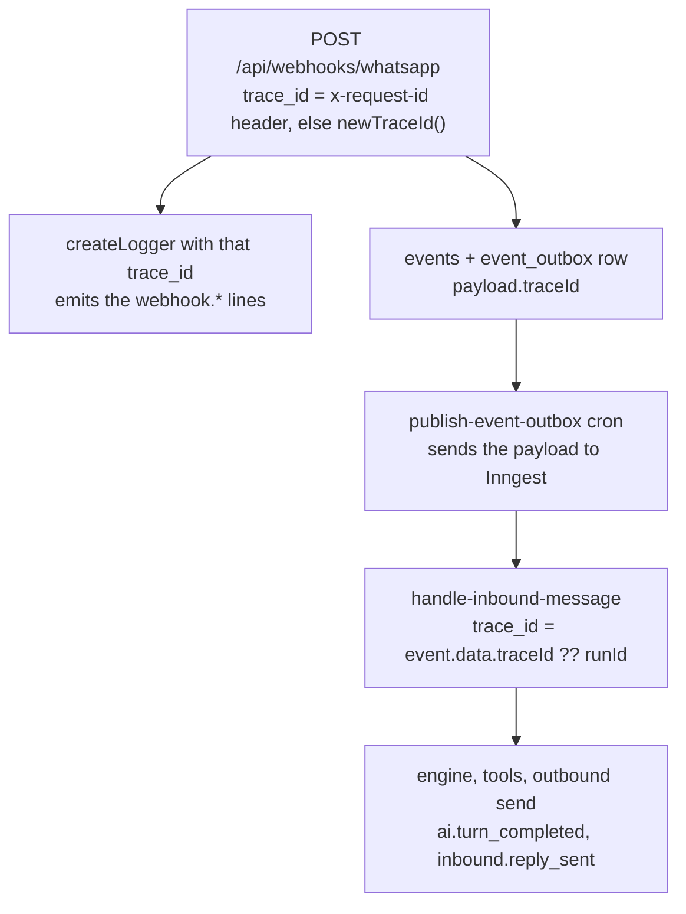

# Observability and admin

There's no dedicated log platform. Observability is one JSON line per event on `console`, picked up by Vercel and Supabase log ingestion, carrying a trace id that survives the whole webhook → outbox → job → outbound-send chain. On top of that sit three things: a cross-tenant admin page gated by an email allowlist, a nightly cost rollup that prices AI in micro-USD and Meta in micro-EUR and never adds the two together, and a set of guards that refuse to let a process boot, build, or wipe against the wrong environment.

This page explains what those pieces emit and how they fit together. For what to actually look at during a launch, use the [launch-period log review checklist](../observability/launch-log-review.md); for incident procedures, the [runbook](../runbook.md).

## The log line

`lib/log.ts` exports a `logger` and a `createLogger(context)` factory. Every call writes exactly one `JSON.stringify` line to the level-mapped `console` function, in one fixed shape:

```json
{
  "timestamp": "…",
  "level": "info",
  "trace_id": "…",
  "account_id": "…",
  "conversation_id": "…",
  "event_name": "inbound.reply_sent",
  "message": "Inbound reply sent",
  "message_id": "…",
  "durationMs": 812
}
```

The first seven keys are the envelope; `message_id` and `durationMs` stand in for whatever attrs the call site passed.

The split between envelope and attrs is what makes the line both greppable and safe. Envelope keys — `timestamp`, `level`, `trace_id`, `account_id`, `conversation_id`, `event_name`, `message` — are structural uuids or the log discriminator, and are never redacted. Everything else the caller passes is an attr, and attrs go through redaction before they're written. Attrs named `trace_id`, `account_id`, or `conversation_id` are promoted into the envelope instead, so a caller can supply them per call rather than per logger. Attrs are spread first so an attr can never overwrite an envelope key.

`createLogger` freezes its base context, so a logger built once per request or per turn stamps the same trace id on every line without the call sites repeating it. `serializeError(err)` produces `errorName` and `errorMessage` and attaches a `stack` only when called with `{ debug: true }`. `newTraceId()` returns a uuid.

The redaction rules themselves are a privacy control and are documented with the rest of them in [privacy and GDPR](./privacy-and-gdpr.md#redaction-in-structured-logs).

## Trace ids

One trace id ties a customer's inbound WhatsApp message to the reply that goes back out, across a webhook, a database transaction, an outbox row, and an Inngest run.



`traceId` is declared as an optional uuid on every appointment and background event schema (`lib/events/appointments.ts`, `lib/events/background.ts`). It has to be declared explicitly, because `z.object().parse()` strips undeclared keys and an undeclared `traceId` would silently vanish at the outbox boundary; it's optional so events written before the field existed still validate.

Jobs that start from a cron rather than a request mint their own with `newTraceId()`. A job whose event carries no trace id falls back to the Inngest `runId`, so every line still joins to something.

Filtering by `account_id` and `trace_id` is covered in the [launch-period log review checklist](../observability/launch-log-review.md).

## Log event catalogue

Every `event_name` in the codebase, grouped by area. The level column is the level the call site uses; a few names are emitted at more than one place.

| Area              | Event name                                                                                                                                                                                                                                                                                                                                                                                                                                            | Level             | Source                                                             |
| ----------------- | ----------------------------------------------------------------------------------------------------------------------------------------------------------------------------------------------------------------------------------------------------------------------------------------------------------------------------------------------------------------------------------------------------------------------------------------------------- | ----------------- | ------------------------------------------------------------------ |
| Server actions    | `action.error`                                                                                                                                                                                                                                                                                                                                                                                                                                        | error             | `lib/actions/instrument.ts`                                        |
| Inbound pipeline  | `inbound.processing`, `inbound.reply_sent`, `inbound.capped`, `inbound.non_text`                                                                                                                                                                                                                                                                                                                                                                      | info              | `lib/inngest/functions/handle-inbound-message.ts`                  |
| AI turns          | `ai.turn_completed`, `ai.multi_mutation_turn`                                                                                                                                                                                                                                                                                                                                                                                                         | info, warn        | `lib/conversation/engine.ts`                                       |
| AI turns          | `conversation.turn_failed`                                                                                                                                                                                                                                                                                                                                                                                                                            | error             | `lib/conversation/engine.ts`                                       |
| AI tools          | `ai.tool_failed`                                                                                                                                                                                                                                                                                                                                                                                                                                      | error             | `lib/ai/dispatcher.ts`                                             |
| WhatsApp webhook  | `webhook.message_accepted`, `webhook.non_text_message_accepted`, `webhook.reminder_delivery_failed`                                                                                                                                                                                                                                                                                                                                                   | info              | `app/api/webhooks/whatsapp/route.ts`                               |
| WhatsApp webhook  | `webhook.bad_signature`, `webhook.invalid_json`, `webhook.schema_mismatch`, `webhook.missing_phone_number_id`, `webhook.unknown_phone_number_id`, `webhook.unknown_message_status`, `webhook.skipping_non_text_message`, `webhook.skipping_non_text_message_echo`, `webhook.contact_sync_failed`, `webhook.unsupported_coexistence_request`, `webhook.account_restricted`, `webhook.account_update_ignored`, `webhook.phone_number_removed_unmatched` | warn              | `app/api/webhooks/whatsapp/route.ts`                               |
| Graph API         | `graph.api_error`                                                                                                                                                                                                                                                                                                                                                                                                                                     | warn              | `lib/channels/whatsapp/graph.ts`                                   |
| Embedded Signup   | `meta_embedded.bad_origin`, `meta_embedded.signup_failed`, `meta_embedded.unexpected_error`                                                                                                                                                                                                                                                                                                                                                           | warn, error       | `app/api/auth/meta-embedded/route.ts`                              |
| Outbox            | `outbox.publish_failed`, `outbox.publish_rejected`, `outbox.immediate_publish_unavailable`, `outbox.publish_dead_lettered`                                                                                                                                                                                                                                                                                                                            | warn, error       | `lib/events/outbox.ts`                                             |
| Push              | `push.send_failed`, `push.dispatch_no_live_subscriptions`, `push.dispatched_record_failed`                                                                                                                                                                                                                                                                                                                                                            | warn              | `lib/notifications/push.ts`, `lib/notifications/push-dispatch.ts`  |
| Payments          | `pok.order_applied`, `pok.order_failed`, `pok.order_not_found`                                                                                                                                                                                                                                                                                                                                                                                        | info, warn        | `lib/billing/payments.ts`                                          |
| Payments          | `pok.order_expired`, `pok.reconcile_poll_failed`, `pok.order_abandoned_not_found`                                                                                                                                                                                                                                                                                                                                                                     | warn, error       | `lib/inngest/functions/reconcile-pok-orders.ts`                    |
| Payments          | `pok_webhook.processed`, `pok_webhook.no_order_id`, `pok_webhook.invalid_json`, `pok_webhook.apply_failed`                                                                                                                                                                                                                                                                                                                                            | info, warn, error | `app/api/webhooks/pok/route.ts`                                    |
| Cost rollup       | `cost_rollup.unknown_pricing_category`                                                                                                                                                                                                                                                                                                                                                                                                                | warn              | `lib/inngest/functions/daily-cost-rollup.ts`                       |
| Privacy           | `customer.erasure_archive_failed`                                                                                                                                                                                                                                                                                                                                                                                                                     | error             | `lib/customers/erase.ts`                                           |
| Settings          | `settings.waba_detach_failed`                                                                                                                                                                                                                                                                                                                                                                                                                         | warn              | `app/(dashboard)/settings/actions.ts`                              |
| Auth              | `auth.app_url_missing`, `auth.reset_email_failed`                                                                                                                                                                                                                                                                                                                                                                                                     | warn, error       | `lib/auth/email-links.ts`, `app/(auth)/forgot-password/actions.ts` |
| Chat              | `chat.reminder_persist_failed`                                                                                                                                                                                                                                                                                                                                                                                                                        | error             | `app/(dashboard)/chat/actions.ts`                                  |
| Client boundaries | `route.error_boundary`, `route.global_error`                                                                                                                                                                                                                                                                                                                                                                                                          | error             | `app/error.tsx`, `app/global-error.tsx`                            |
| Web Vitals        | `web_vitals`                                                                                                                                                                                                                                                                                                                                                                                                                                          | info              | `app/api/metrics/vitals/route.ts`                                  |

`ai.turn_completed` is the cost and diagnosis line for a model turn. It carries the model and provider, tokens in and out, cached and reasoning tokens, micro-USD cost, step count, `finishReason`, duration, and whether a deterministic confirmation replaced the model's prose. The reasoning-token and `finishReason` pair is there because their absence once made an empty-response outage undiagnosable: a thinking budget that swallows the output budget shows up as exactly reasoning tokens at the ceiling plus `finishReason: 'length'`, and as nothing at all without them.

Two names don't come from `lib/log.ts`. `route.error_boundary` and `route.global_error` are hand-built JSON lines in client components, and they log only `digest` and `errorName` — never `error.message`, which can echo server-thrown data.

## Server action instrumentation

`instrumentedAction(name, fn)` in `lib/actions/instrument.ts` wraps every exported server action. It mints a trace id, runs the action, and on a throw logs `action.error` with that trace id, the action name, and a serialized error, then re-throws unchanged.

`unstable_rethrow` runs before the log so Next's router control-flow throws — `redirect()`, `notFound()`, `forbidden()`, including through `error.cause` — pass through un-logged. An intentional `redirect('/sign-in')` inside `requireAccountId()` is not an error and doesn't appear in the error stream.

The wrapper deliberately carries no `account_id`. Every wrapped action's first argument is a conversation or appointment id, and the account id is derived inside the action from the session, so it isn't available at that boundary. `trace_id` is the join key instead: deeper logs from the engine, tenancy, and Graph layers already carry `account_id`.

## Web Vitals

`components/web-vitals-reporter.tsx` samples 25% of Core Web Vitals reports and beacons `{ name, value, path }` to `/api/metrics/vitals`, via `navigator.sendBeacon` where available and a `keepalive` fetch otherwise.

The sink at `app/api/metrics/vitals/route.ts` is unauthenticated, so it's built not to be useful to anyone probing it. It caps the body at 1 KB by both `content-length` and actual length, allowlists the metric name to `LCP`, `CLS`, `FCP`, `TTFB`, `INP`, and `FID`, and requires a finite numeric value before logging `web_vitals`. Every request returns 204 regardless of outcome — a rejected beacon isn't worth surfacing to the browser, and a distinguishing status code would only help someone probe the endpoint.

## The admin dashboard

`/admin` is an internal, cross-tenant operator page. It isn't linked from the app's navigation and is reachable only by URL, its copy is English rather than the product's Albanian, and its queries run on the RLS-bypassing owner connection because they span every tenant.

The only gate is `isAllowedAdminEmail(user.email, process.env.ADMIN_EMAILS)` (`app/(dashboard)/admin/gate.ts`), which splits the env var on commas, lowercases and trims both sides, and returns false for an empty allowlist. An empty or misconfigured `ADMIN_EMAILS` therefore 404s the route rather than exposing cross-tenant cost data — which is why the variable is empty by default. The same gate guards the CSV route, which returns a bare 404 because route handlers can't call `notFound()`. `app/(dashboard)/admin/__tests__/gate.test.ts` pins the allowlist rules.

The page renders two independent fan-outs, `getAdminMetrics` and `getBillingMetrics` (`lib/metrics/admin.ts`), each wrapped in its own 10-second `withTimeout`. With the supporting indexes in place these queries return in well under a second, so the timeout only trips on a real regression such as a missing index or a socket the pooler dropped — turning a request that would otherwise hang until Vercel kills the function into a visible error.

| Card                            | What it shows                                                                                                                                         | Source                                                                           |
| ------------------------------- | ----------------------------------------------------------------------------------------------------------------------------------------------------- | -------------------------------------------------------------------------------- |
| Funnel — yesterday, last 7 days | Signups, WhatsApp connections, accounts reaching a first message, accounts reaching a first booking                                                   | `accounts`, `whatsapp_connections`, `messages`, `appointments`                   |
| Onboarding cohort               | Share of accounts that connected WhatsApp within 24 hours of signup                                                                                   | `accounts` joined to first `connected_at`                                        |
| Push delivery — last 7 days     | Sent, removed, dispatch count, and the derived delivery rate                                                                                          | `push.dispatched` event payloads                                                 |
| Cost — yesterday, current month | Per-account AI cost in µUSD and Meta cost in µEUR, with an `actual` / `estimated` / `mixed` provenance label and billable message count               | `cost_daily`                                                                     |
| Cost — today (live)             | The same row set for the current UTC day, before any rollup exists                                                                                    | `messages` plus `wa_message_statuses`, using the rollup's own actual-first logic |
| Plan distribution               | Free, Solo, lifetime, and total accounts by _effective_ plan, so a lapsed Solo counts as Free                                                         | `accounts` through `resolveEffectivePlan`                                        |
| Conversion                      | All-time paid-over-eligible rate with raw counts, new payers this month, and average and median days to upgrade; lifetime accounts excluded           | `billing_orders`                                                                 |
| Renewal and churn               | Renewal rate over 90 days and all time, plus downgrades this and last month                                                                           | `billing_orders`, `billing.downgraded` events                                    |
| Cap hits — this month           | Distinct accounts that hit the conversation cap and the reminder cap, over accounts active this month                                                 | `billing.limit_reached` events, `conversation_days`                              |
| Free-tier COGS                  | Current-month AI µUSD and Meta µEUR for the effective-Free cohort, per-account averages, billable messages, and the actual-versus-estimated day split | `cost_daily` filtered to Free accounts                                           |
| Payments — current month        | Recent orders with email, plan, period, raw amount, currency, status, and POK order id, plus CSV links for the last six months                        | `billing_orders`                                                                 |

Every rate is rendered next to its raw numerator and denominator, so a small population reads honestly rather than as a percentage with no base.

`metaCostSource` is worth one note: per `cost_daily` row it's strictly `actual` or `estimated`, and `mixed` exists only as a label the aggregate derives when a window spans both. It's never written to the column.

The CSV route is `/admin/payments-export?month=YYYY-MM`, defaulting to the current UTC month and rejecting a malformed month with a 400. The default view is the fiscal one — `status = 'paid'`, keyed on `paid_at` — and `?all=1` dumps every order keyed on `created_at` for reconciliation. Amounts stay raw in a column named `amount_minor_units` with no converted major-unit column; see [billing and plans](./billing-and-plans.md) for how the currency is handled.

## The cost pipeline

Cost is two currencies that never meet. AI cost is micro-USD taken from OpenRouter's own usage accounting and persisted per message; Meta cost is micro-EUR derived from a rate card. They live in separate columns end to end and are surfaced separately in every card above.

`daily-cost-rollup` runs at `0 2 * * *` UTC and re-aggregates a trailing window of UTC days, oldest first, one Inngest step per day. The window is `META_ROLLUP_LOOKBACK_DAYS` (3) days ending yesterday. Re-processing recent days is how a late-arriving Meta status webhook flips a day from estimated to actual: the upsert on `(account_id, day)` is idempotent and simply overwrites.

Per account and day, the rollup does two things:

- **AI.** Sums `ai_cost_microusd` and `cached_tokens` over `messages` where the role is `ai` and a model is set, and records the count of distinct conversations with a customer message in `meta_conversations`, which is informational once actual costing is in play.
- **Meta, actual-first.** If the account-day has any `wa_message_statuses` row, bucketed by `COALESCE(sent_at, created_at)`, the row is priced from the rate card: `meta_cost_source = 'actual'`, `meta_billable_messages` is the count of rows Meta flagged billable, and cost is the sum of billable messages times their category rate. This holds even when every status row is non-billable, because that's a real €0. If there are no status rows at all, the day falls back to the per-conversation estimate and is marked `estimated`.

The rollup deliberately never joins statuses to `messages`: `wa_message_statuses` survives the retention purge, so a join would drop cost for messages that were purged.

The rate card lives in `lib/billing/meta.ts`, in micro-EUR per billable message.

| Category                  | Rate                 | Status                                                                                    |
| ------------------------- | -------------------- | ----------------------------------------------------------------------------------------- |
| `utility`                 | 21,000 µEUR (€0.021) | Confirmed for the product's markets                                                       |
| `service`                 | 0                    | Confirmed — service conversations are free                                                |
| `marketing`               | 0                    | Placeholder, marked ⚠ CONFIRM in code; not a real Meta price                              |
| `authentication`          | 0                    | Placeholder, marked ⚠ CONFIRM in code; not a real Meta price                              |
| Unknown or blank category | 21,000 µEUR          | Falls back to the utility rate, never €0, and logs `cost_rollup.unknown_pricing_category` |

`META_RATE_CARD_SOURCE` is likewise a placeholder string rather than a cited source URL. The two placeholder zeros only undercount marketing and authentication traffic, which the product doesn't send: its outbound is utility reminders and free service replies. `META_RATE_CARD_OVERRIDES` is the escape hatch — a JSON object of `{ category: microEurInteger }` parsed at module load, which throws on anything malformed so a mistyped override fails loudly instead of quietly pricing wrong.

The fallback estimate is `DEFAULT_META_CONVERSATION_COST_MICRO_EUR`, 60,000 µEUR (€0.06) per conversation. It's retained on purpose so a day with no delivery truth yet shows something rather than €0.

## Environment and migration guards

Three checks stop a misconfigured process before it can do damage, all reading the same environment manifest in `lib/env/environments.ts`.

- **At boot.** `instrumentation.ts` calls `assertEnvironmentIntegrity()` on the Node runtime, which Next runs once per runtime start including the build's prerender pass. It reduces `NEXT_PUBLIC_SUPABASE_URL`, `SUPABASE_URL`, and `DATABASE_URL` to a Supabase project ref, compares each against the ref declared for the resolved app environment, and checks that every variable required in that environment is set. It fails closed, with one documented escape hatch — `ALLOW_ENV_MISMATCH=1`, which behaves identically in all three environments so no environment quietly tolerates a mismatch by default. The Edge runtime is skipped because its narrowed build-time env would report spurious misses.
- **Before a build.** `vercel.json` sets `buildCommand` to `pnpm check:migrations && pnpm build`, so a merge whose migration was never applied is a red deploy instead of a runtime crash. Only _behind_ fails: the database being ahead of the code is the documented order, since you migrate first and merge second.
- **On demand.** `pnpm check:env` validates the environment the process is running in. `pnpm check:env:vercel` validates how the Vercel project itself is wired, by reading `vercel env ls --json` and flagging any variable marked `mustDiffer` that is one entry targeting both Preview and Production. Neither mode ever prints a value.

Full provisioning and promotion detail lives in [environments](../environments.md).

## Ops scripts

Everything under `scripts/` is run through a `pnpm` script. The destructive ones all pass through `assertDestructiveTarget` (`scripts/lib/destructive-target.ts`), which refuses production under any flag — it deliberately does not consult `ALLOW_ENV_MISMATCH`, because that hatch is for migrations and backfills, not data wipes — and checks both the Postgres URL and the Supabase URL, since they're two different blast radii.

| Command                                       | What it does                                                                              | Guard                                                                         |
| --------------------------------------------- | ----------------------------------------------------------------------------------------- | ----------------------------------------------------------------------------- |
| `pnpm check:env`                              | Validates the current process's environment                                               | Read-only                                                                     |
| `pnpm check:env:vercel`                       | Checks Preview and Production don't share variables                                       | Read-only                                                                     |
| `pnpm check:migrations`                       | Fails when the database is behind the migration journal                                   | `assertEnvironmentIntegrity`                                                  |
| `pnpm seed`                                   | Seeds one fixed development account with a small fixture set                              | `assertDestructiveTarget`                                                     |
| `pnpm seed:reset`                             | Wipes and re-seeds that account                                                           | `assertDestructiveTarget`                                                     |
| `pnpm seed:qa`, `pnpm seed:qa:preview`        | Seeds the multi-customer fixture used for signed-in visual QA                             | `assertDestructiveTarget`                                                     |
| `pnpm db:reset:test`, `pnpm db:reset:preview` | Wipes a database back to bare migrated schema — no rows, no auth users, nothing seeded    | `assertDestructiveTarget`; preview also needs a typed confirmation or `--yes` |
| `pnpm rotate:token-key`                       | Re-encrypts every stored WhatsApp token under a new key in one transaction; needs `--yes` | Verifies each row round-trips before commit                                   |
| `pnpm backfill:wa-display-number`             | Fills in missing display phone numbers from Graph; dry run unless `--yes`                 | Per-row failures are logged and skipped                                       |
| `pnpm ai:smoke`                               | Live single-turn provider check                                                           | Refuses to run against a non-free development model                           |
| `pnpm push:smoke`                             | Proves VAPID signing and payload encryption without a browser or database                 | Read-only                                                                     |
| `pnpm smoke:pok`                              | Manual POK staging spike; never part of the automated run                                 | Staging only; never prints the token or key secret                            |
| `pnpm dev:test`                               | Runs the dev server on port 3105, the port the QA tooling expects                         | —                                                                             |
| `pnpm tunnel`                                 | Cloudflare quick tunnel to the local port, for borrowing the Meta test app                | —                                                                             |

Two scripts have no `pnpm` entry and are run directly with `tsx`: `scripts/smoke-tenancy.ts` (asserts `getServiceClient` validation and audit-log behaviour) and `scripts/verify-schema.ts` (checks the expected table list exists).

## Test infrastructure

`vitest.config.ts` defines two projects. `unit` includes every `*.test.{ts,tsx}` except integration files; `integration` includes only `*.integration.test.ts`. `pnpm test` runs the unit project, `pnpm test:integration` the other, and `pnpm test:all` both. `fileParallelism` is off because the suites share one database.

Both projects need a local Supabase Postgres. The global setup in `tests/setup/global.ts` refuses any `DATABASE_URL` that isn't `127.0.0.1` or `localhost`, tells you to run `supabase start` when it can't connect, applies the migrations, then clears `auth.users` — which cascades to all tenant data — and clears `erasure_archive` explicitly, since that's the one table the cascade can't reach by design.

Two helpers under `tests/support/` handle the recurring hazards. `clock.ts` anchors the test clock in `Europe/Tirane`, because fixtures are seeded in that zone and rendered times would otherwise depend on where the suite runs. `isolation.ts` covers integration tests that drive a genuinely cross-tenant query — the admin funnel, the outbox publisher, the token-expiry claim — which scan the whole table on the owner connection the way a cron or an admin page does, and so need their assertions made deterministic against whatever else is in the local database. Tenant isolation itself is proved by `tests/rls/`.

For signed-in browser QA, `pnpm seed:qa` followed by `pnpm dev:test` gives a populated account on port 3105. Integration tests wipe `auth.users`, so re-seed after running them.
