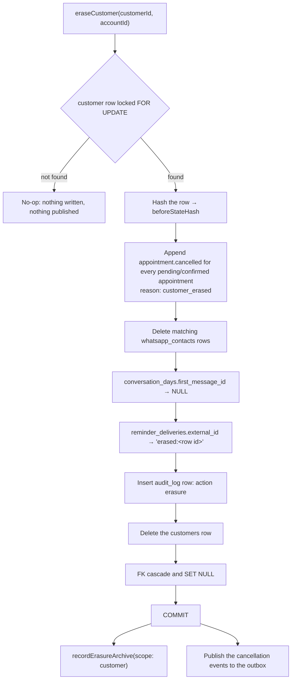

# Privacy and GDPR

Medium holds one business's customer contact details, WhatsApp conversations, and appointment history, so every privacy control works on the same boundary: one `customers` row and everything that hangs off it. Erasure is a single transaction that cancels, scrubs, audits, and deletes. Export is a symmetric read of that same boundary. Retention runs nightly per account, and the facts a month was billed on survive it, anonymised, on purpose.

The mechanics live in `lib/customers/erase.ts`, `lib/gdpr/export.ts`, `lib/gdpr/archive.ts`, `lib/inngest/functions/purge-expired-messages.ts`, and `lib/tenancy/audit.ts`. The legal and operational paperwork — cookies, subprocessors, the processing agreement, key rotation — lives in `docs/gdpr/` and isn't repeated here.

## Customer erasure

`eraseCustomer` in `lib/customers/erase.ts` is the right-to-erasure path for one customer of one account. The owner starts it from a client's detail screen behind a typed confirmation — the client's name, or the literal `FSHI` when the stored name is blank (`lib/settings/confirm-phrase.ts`) — and everything below runs in one transaction, so the compliance proof and the delete share a boundary.

The cancellations are appended before the delete, inside the same transaction, because `appointment.cancelled` is what trips the reminder job's `cancelOn` — so a reminder already scheduled for an erased customer can never fire. They carry `reason: 'customer_erased'`, and the appointment-event consumer skips the customer confirmation for that reason, since there's nobody left to message. See [appointments and availability](./appointments-availability.md) for the event plan.

Erasure is idempotent. A customer that isn't there is a no-op that writes nothing and publishes nothing, so a retried call after a successful erasure costs nothing.

Two steps deliberately sit outside the transaction:

- `recordErasureArchive` (`lib/gdpr/archive.ts`) writes an `erasure_archive` row with scope `customer`, the before-state hash, and a timestamp — never personal data. It's best-effort: the delete has already committed, so a failed archive write logs `customer.erasure_archive_failed` instead of turning a completed erasure into an error for the owner.
- The cancellation events are handed to `tryPublishOutboxEvent` only after commit, so no consumer can observe an appointment cancellation for a customer whose delete later rolls back.

`lib/customers/__tests__/erase.integration.test.ts` pins the cascade, the scrubs, and the idempotency.

## What erasure keeps, and why

Erasure removes the subject's data and preserves the facts the month was billed on. Anything that survives is either content-free or has had every customer-linked field stripped.

| Data                                                | What erasure does                           | Why                                                                                                                                              |
| --------------------------------------------------- | ------------------------------------------- | ------------------------------------------------------------------------------------------------------------------------------------------------ |
| `customers` row                                     | Deleted                                     | The subject record itself.                                                                                                                       |
| `conversations` and `messages`                      | Deleted by FK cascade                       | The thread belongs to the customer.                                                                                                              |
| `appointments` and `reminder_jobs`                  | Deleted by FK cascade                       | Bookings belong to the customer.                                                                                                                 |
| `whatsapp_contacts` rows matching the customer      | Deleted                                     | The synced address-book entry names the person.                                                                                                  |
| `conversation_days.customer_id`, `.conversation_id` | Set to `NULL` by FK (`ON DELETE SET NULL`)  | The metered day survives; erasing a chatty customer must not hand back quota already spent.                                                      |
| `conversation_days.first_message_id`                | Set to `NULL` in the transaction            | A bare uuid with no FK, so nothing nulls it automatically; it would otherwise leave a message id for a deleted message.                          |
| `reminder_deliveries.appointment_id`                | Set to `NULL` by FK                         | Same rule as the metered day: the billed delivery survives.                                                                                      |
| `reminder_deliveries.external_id`                   | Rewritten to `erased:<row id>`              | A wamid embeds the recipient's phone number, and the column is `NOT NULL` and unique, so it's rewritten rather than cleared.                     |
| `wa_message_statuses`                               | Untouched                                   | Content-free and customer-free by construction; it's keyed only to `accounts`.                                                                   |
| `audit_log`                                         | One `erasure` row added; earlier rows stay  | Proof of processing, purged on its own 730-day window.                                                                                           |
| `erasure_archive`                                   | One `customer`-scope row added after commit | The compliance record has to outlive the account it describes.                                                                                   |
| `events`                                            | Existing rows kept, cancellations appended  | Appointment events carry the customer id in their payload, and they leave only when the [nightly purge](#the-nightly-purge) window reaches them. |

Because `conversation_days.customer_id` becomes `NULL` and Postgres treats NULLs as distinct in a unique index, one edge case is accepted rather than fixed: if an erased person messages the same business again on the same local day, the webhook creates a new customer and inserts a second metered row for one real customer-day. Deduplicating across the erasure would need a customer-derived key on the surviving row, which would be pseudonymisation rather than erasure. The error is bounded to one extra day per erasure and always counts against the business, never in its favour. See [billing and plans](./billing-and-plans.md) for what a conversation-day means.

## Account deletion

`deleteAccount` in `app/(dashboard)/settings/actions.ts` closes the whole tenant, behind the same typed confirmation (`app/(dashboard)/settings/account/account-danger.tsx`). It runs three steps in a fixed order:

1. **Archive.** `recordErasureArchive` with scope `account`. This one is not best-effort — if the compliance record can't be written, the deletion stops.
2. **Detach the WhatsApp Business account.** `detachWabaSubscription` is best-effort; a Meta-side failure logs `settings.waba_detach_failed` and never blocks the deletion.
3. **Delete the auth user.** `auth.admin.deleteUser` through the service-role client, then sign out and redirect to `/sign-in`.

Deleting the auth user is what erases the data. `accounts.id` references `auth.users.id` with `ON DELETE CASCADE` (`drizzle/migrations/0003_pts_signup_trigger.sql`), and every tenant table's `account_id` cascades from `accounts`, so one delete takes the whole tree. `erasure_archive` is the single exception: its `account_id` is a bare uuid with no foreign key, precisely so the record of the deletion outlives it.

## Subject access exports

`lib/gdpr/export.ts` builds two JSON documents, both read through the owner connection and both wrapped in an audit entry. The owner downloads the per-customer export from a client's detail screen (`export.customer`) and the full-account export from **Settings → Account & data** (`export.account`); the browser turns the returned object into a downloaded file.

- `buildCustomerExport` returns the customer row, their conversations and messages, appointments, reminder jobs, metered conversation-days, matching address-book contacts, and the audit entries that touched them.
- `buildAccountExport` returns everything scoped to the account: profile, customers, conversations, messages, appointments, services, availability rules, blocked periods, the newest WhatsApp connection, contacts, message templates, reminder jobs, conversation-days, message statuses, daily cost rows, queued PWA mutations, events, billing orders, push subscriptions, and the full audit log.

Three rules keep the exports honest:

- **Symmetry with erasure.** Address-book contacts are matched with the same `customerWhatsappContactsFilter` the erasure uses (`lib/customers/whatsapp-contacts.ts`), so access discloses exactly what erasure deletes.
- **Shared numbers are withheld.** `customers` has no unique constraint on `(account_id, phone)`, so two customers of one business can legitimately share a number and resolve to one contact row whose name is whoever WhatsApp says owns it. `contactMatchesCustomer` detects that case, and the shared row is dropped from both subjects' exports rather than disclosed to either.
- **Audit rows are matched by target, not by customer id.** An AI context read logs the inbound message id and an appointment tool logs the appointment id, so matching only `targetId = customerId` would drop nearly every real access event. The export matches `(targetTable, targetId)` across the customer's conversation, message, and appointment ids as well.

Two values are redacted rather than exported. The connection's `access_token_encrypted` is never selected — the export projects the connection row column by column and attaches `accessTokenEncrypted: 'REDACTED'` — and push subscriptions disclose only id, account, user agent, and creation time, with `endpoint` and `keys` set to `REDACTED`.

## Retention windows

`accounts.retention_days` sets how long an account's messages and events are kept. The signup trigger defaults it to 90 (`drizzle/migrations/0003_pts_signup_trigger.sql`), the settings screen offers `RETENTION_OPTIONS` = 30, 60, 90, 180, and 365 days (`app/(dashboard)/settings/constants.ts`), and `updateRetention` rejects any value above the effective plan's maximum.

| Plan | Maximum the owner can choose | Window actually applied                                                               |
| ---- | ---------------------------- | ------------------------------------------------------------------------------------- |
| Free | 30 days                      | The stored value, clamped to 30 only once the account has been downgraded for 30 days |
| Solo | 365 days                     | The stored value                                                                      |

The clamp lives in `effectiveRetentionDays` (`lib/billing/entitlements.ts`) and fires only when `plan_downgraded_at` is set and at least `RETENTION_CLAMP_GRACE_DAYS` (30) old, so a downgrade never deletes anything the same day. One consequence follows directly: an account that has always been Free has no `plan_downgraded_at`, so it keeps its stored window and purges at the default 90 days even though the Free maximum is 30. Only a change made through the settings action is held to the plan maximum. `lib/inngest/functions/__tests__/retention-clamp.integration.test.ts` pins both halves of this rule.

Settling a payment nulls `plan_downgraded_at`, which lifts the clamp again — see [billing and plans](./billing-and-plans.md).

## The nightly purge

`purge-expired-messages` runs at `0 3 * * *` UTC. It loads every account together with the retention window that applies at run time, then purges each account in its own transaction.

Within one account, the cutoff is `now − retentionDays` and two deletes run against it:

- **Messages** older than the cutoff, except any message still linked from a `reminder_jobs` row whose appointment is `pending` or `confirmed`. A reminder that hasn't happened yet needs its message row.
- **Events** older than the cutoff, except `billing.%` rows and any event whose outbox row is still unpublished. `events` is a personal-data store too — appointment events carry the customer id and the schedule — so leaving it out of retention would keep an erased customer's appointments forever. The two carve-outs exist because an unpublished event is still owed to a consumer, and `billing.*` rows are the once-per-month deduplication key for usage warnings.

Each account's purge writes an `audit_log` row with action `messages.retention_purge` carrying the deleted counts, the window, and the cutoff. After the per-account passes, one flat global delete removes `audit_log` rows older than `AUDIT_LOG_RETENTION_DAYS` (730). `lib/inngest/functions/__tests__/purge-expired-messages.integration.test.ts` covers the carve-outs.

## The audit log

`withAuditLog(input, fn)` in `lib/tenancy/audit.ts` runs `fn` first and writes the `audit_log` row only after it resolves, so the log records completed access rather than attempted access. It refuses to run without an account id. Rows carry an actor, an action, a target table and optional target id, and free-form metadata.

| Action                            | Actor     | Target table                                             | Written by                                                                       |
| --------------------------------- | --------- | -------------------------------------------------------- | -------------------------------------------------------------------------------- |
| `ai.conversation.read`            | `ai`      | `messages`                                               | Every AI turn, when it loads conversation context (`lib/conversation/engine.ts`) |
| `ai.conversation.failure_handoff` | `system`  | `messages`                                               | The failure-handoff path re-reading context after a failed turn                  |
| `ai.tool.<tool_name>`             | `ai`      | `availability_rules`, `conversations`, or `appointments` | Every tool dispatch (`lib/ai/dispatcher.ts`)                                     |
| `conversation.takeover`           | `account` | `conversations`                                          | The chat handling switch (`app/(dashboard)/chat/actions.ts`)                     |
| `customer.created`                | `account` | `customers`                                              | Manually adding a client                                                         |
| `customer.notes_updated`          | `account` | `customers`                                              | Editing a client's notes                                                         |
| `export.customer`                 | `account` | `customers`                                              | Per-customer export                                                              |
| `export.account`                  | `account` | `accounts`                                               | Full-account export                                                              |
| `wa.token.issued`                 | `account` | `whatsapp_connections`                                   | The Embedded Signup token exchange (`app/api/auth/meta-embedded/route.ts`)       |
| `erasure`                         | `account` | `customers`                                              | Written directly inside the erasure transaction                                  |
| `messages.retention_purge`        | `system`  | `messages`                                               | Written directly inside each account's purge transaction                         |

The last two bypass `withAuditLog` on purpose: both need the audit row and the deletion to commit or roll back together, which a helper running after its callback can't give them.

## Redaction in structured logs

`lib/log.ts` is the backstop for the rule that tokens, phone numbers, customer names, and message bodies never reach a log line. Callers are still expected to pass ids and counts only; the logger enforces it anyway.

| Rule                                                                                                                                                                                         | Effect                                                                           |
| -------------------------------------------------------------------------------------------------------------------------------------------------------------------------------------------- | -------------------------------------------------------------------------------- |
| Key matches `REDACT_KEY_RE` — `phone`, `name`, `body`, `content`, `notes`, `email`, `token`, `secret`, `key`, `authorization`, `endpoint`, `p256dh`, `auth`, as a case-insensitive substring | Value becomes `'[REDACTED]'`                                                     |
| Key is in `REDACT_ALLOWLIST` — `event_name`, `errorName`, `template_name`, `templateName`, `phone_number_id`, `phoneNumberId`                                                                | Value survives, because these match the pattern but are non-personal identifiers |
| A string value that survives key redaction                                                                                                                                                   | E.164 numbers (`+` followed by 7–15 digits) are replaced with `[REDACTED]`       |
| Arrays and nested plain objects                                                                                                                                                              | Recursed element by element and key by key                                       |
| Non-plain objects such as `Error` or `Date`                                                                                                                                                  | Coerced to a string, then scrubbed                                               |
| Envelope keys — `timestamp`, `level`, `trace_id`, `account_id`, `conversation_id`, `event_name`, `message`                                                                                   | Never redacted; they're uuids or the log discriminator                           |

`serializeError` scrubs the error message the same way and keeps only `errorName` and `errorMessage`; a stack is attached only when the caller passes `{ debug: true }`. `lib/__tests__/log.test.ts` pins the redaction cases. For the shape of the line itself, see [observability and admin](./observability-and-admin.md).

## Minimisation elsewhere in the product

Several other surfaces apply the same discipline without going through the erasure or export paths.

- **Notifications.** The bell feed trims names through `privacyName` (`lib/format/name.ts`), so "John Doe" reads as "John D."; push payloads keep customer names out of the title and put them in the body, because the title is what an iOS lock screen shows. See [notifications](./notifications.md).
- **AI provider routing.** Production requests set `zdr: true` and `data_collection: 'deny'` on OpenRouter, and `assertProductionPrivacy()` runs at module load in `lib/ai/models.ts`, so a bad edit fails the build rather than a customer conversation. Development and preview route to a free model instead, and each runs against its own database and the Meta test app, so production is the only environment that sees real customer conversations — see [environments](../environments.md). The disclosed upstream providers live in `app/(legal)/privacy/ai-providers.ts` and are asserted against the plan model configuration by `app/(legal)/privacy/__tests__/ai-providers.test.ts`, so introducing an undisclosed provider fails a test until the policy, terms, and subprocessor annex are updated.
- **Tokens at rest.** `whatsapp_connections.access_token_encrypted` is encrypted with pgcrypto `pgp_sym_encrypt` keyed by `TOKEN_ENCRYPTION_KEY` (`lib/db/crypto.ts`), and decrypts only inside the WhatsApp client. See [WhatsApp connection](./whatsapp-connection.md).
- **Content-free operator tables.** `wa_message_statuses` stores delivery state and Meta's pricing flags with no message body and no customer link, which is why it survives both erasure and retention. `billing_orders.pok_payload` holds an order snapshot with no personal data.
- **Client error boundaries.** `app/error.tsx` and `app/global-error.tsx` log only `digest` and `errorName`, never `error.message`, which can echo server-thrown data.

## Related documents

The operational and legal companions to this page are:

- [Cookie audit](../gdpr/cookie-audit.md) — every cookie the app sets, and what isn't set.
- [Subprocessors](../gdpr/subprocessors.md) — who processes what, where.
- [Data processing agreement template](../gdpr/dpa-template.md) — the Article 28 starting point.
- [WhatsApp token encryption key rotation](../gdpr/key-rotation.md) — the procedure `scripts/rotate-token-key.ts` implements.

The public-facing policies are served from `app/(legal)`: `/privacy` and `/terms` in Albanian, `/en/privacy` and `/en/terms` in English. For which tables cascade from where, see [the data model](./data-model.md).
