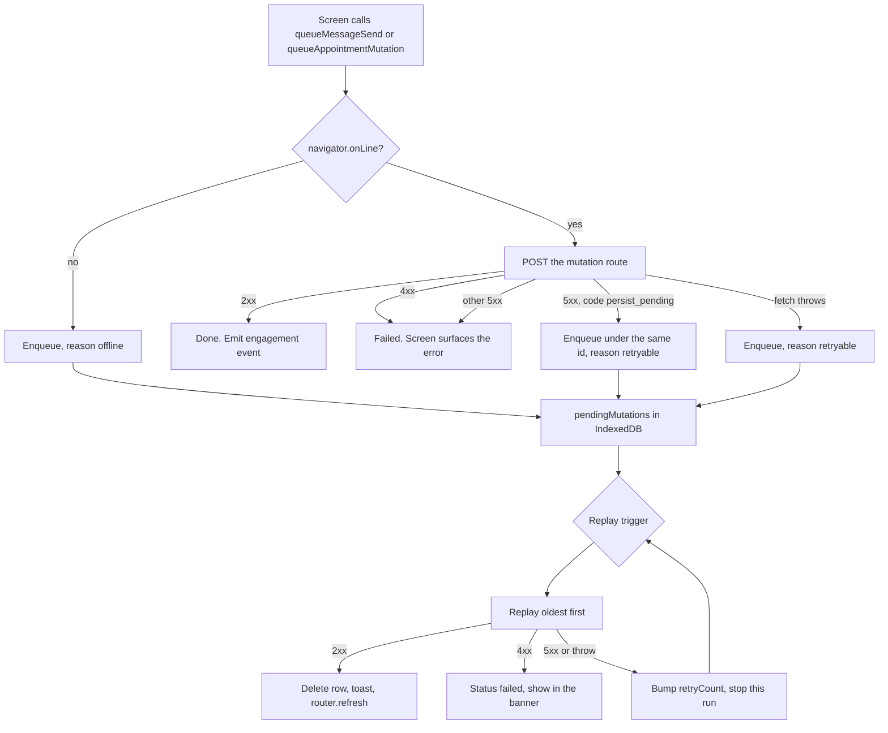

# PWA and offline

The owner app installs as a standalone progressive web app. Its service worker precaches the build and caches dashboard shells and static assets, but never an API route. Writes made while offline are queued in IndexedDB under a client-generated mutation id and replayed against a server ledger that makes each mutation exactly-once, so a flaky connection can't send a customer two copies of the same WhatsApp message.

This doc covers installation, the worker, the queue on both sides, and the realtime layer that keeps screens fresh. Push notifications also live in the worker; they are explained in [notifications](./notifications.md).

## Manifest and installation

`public/manifest.json` is what makes the app installable, and it is deliberately small.

The app declares `display: standalone`, `orientation: portrait`, `lang: sq`, `dir: ltr`, and a `start_url` of `/today` — so a launch from the home screen lands on the day view rather than the marketing page. Scope is `/`, and the background and theme colors are both `#f3f3f0`. Icons cover 192, 256, 384, and 512 px plus maskable 192 and 512, all generated by `scripts/generate-pwa-icons.mjs`. `lib/pwa/__tests__/manifest.test.ts` pins the fields the install prompt depends on.

`PwaProvider` (`components/pwa/pwa-provider.tsx`) drives the install experience:

- It captures `beforeinstallprompt`, calls `preventDefault()` on it, and stores the event so the banner can fire the prompt on the owner's terms rather than the browser's.
- The banner appears from the second dashboard visit onward — a counter kept in `localStorage` under `medium:pwa-dashboard-visits` — or as soon as the app dispatches its engagement event, which a successful online mutation raises.
- Dismissing stores `medium:pwa-install-dismissed-at` and suppresses the banner for 7 days.
- iOS has no `beforeinstallprompt`, so the banner shows the Share-sheet instruction (`Instalo nga Safari: prek Ndaj, pastaj Shto në ekran.`) with no install button.
- Accepting a native prompt calls `recordPwaInstalled` (`app/(dashboard)/pwa-install-actions.ts`), which appends a best-effort `pwa.installed` event. Nothing consumes it; it exists for funnel metrics, and a failure to record it can never fail the install.

When the app runs standalone, the provider drops the install banner entirely and keeps only the status, failed-changes, update, and push banners.

## Service worker

The worker is written in TypeScript at `app/sw.ts` and compiled by `@serwist/next` (configured in `next.config.ts`) to `public/sw.js`.

Serwist runs with `register: false`, so registration is explicit: `PwaProvider` calls `navigator.serviceWorker.register('/sw.js', { scope: '/', updateViaCache: 'none' })`. The build is disabled when `NODE_ENV` is `development`, which means `public/sw.js` on a dev box is a stale production worker whose precache would poison localhost. Rather than register it, the provider **unregisters** every existing worker in development, so a browser already poisoned by an earlier production build heals on the next visit.

Precaching covers the Next build output plus the public globs `manifest.json`, `icons/**/*`, and `apple-touch-icon.png`, with `cleanupOutdatedCaches` on.

Updates are opt-in rather than silent. The worker sets `skipWaiting: false` and `clientsClaim: true`, so a new build waits instead of swapping under a screen the owner is using. The provider watches for a waiting or newly installed worker, shows the **Version i ri i disponueshëm** banner, and posts `SKIP_WAITING` when the owner taps **Rifresko**. The resulting `controllerchange` reloads the page once, guarded by a flag so a repeated event can't loop. `navigationPreload` is on, so the network request for a navigation starts before the worker boots.

### Runtime caching

Four rules run in order; the first matcher wins. Everything below matches same-origin `GET` requests.

| Rule                   | Matches                                                                           | Strategy                    | Budget               |
| ---------------------- | --------------------------------------------------------------------------------- | --------------------------- | -------------------- |
| Never cache            | `/api/webhooks`, `/api/inngest`, `/api/auth`, `/api/pwa/mutations`                | `NetworkOnly`               | —                    |
| Dashboard navigations  | `navigate` requests under `/today`, `/calendar`, `/chat`, `/clients`, `/settings` | `NetworkFirst`, 3 s timeout | 24 entries, 7 days   |
| Dashboard RSC payloads | the same paths with an `RSC: 1` header or `_rsc` query param                      | `NetworkFirst`, 3 s timeout | 48 entries, 7 days   |
| Static assets          | `/_next/static/`, `/icons/`, `/manifest.json`, `/apple-touch-icon.png`            | `CacheFirst`                | 160 entries, 30 days |

The never-cache list is the load-bearing one. Webhooks, the Inngest endpoint, auth callbacks, and the mutation routes must never be served from a cache or replayed by one — the queue below is the only thing allowed to replay a write. `NEVER_CACHE_PREFIXES` and `runtimeCaching` are exported from `app/sw.ts` so `lib/pwa/__tests__/service-worker.test.ts` drives the real matchers instead of grepping source text.

Only navigations and RSC payloads are cached, never a page's data fetch, so a cached shell always re-fetches its content. The 3-second network timeout is what makes a flaky connection fall back to the last shell rather than hanging.

## The offline mutation queue

Every write the owner can make from a screen goes through one client helper that either sends it now or queues it, and every queued item carries a `clientMutationId` that the server uses as the idempotency key.

### Client store

`lib/pwa/client-store.ts` owns an IndexedDB database named `medium-pwa` at version 1, with a single `pendingMutations` object store keyed on `id` and indexed by `createdAt` and `status`.

Each `PendingMutation` records `id` (the client mutation id), `endpoint`, `body`, `type`, `createdAt`, `retryCount`, `status` (`pending` or `failed`), and an optional `lastError`. Nothing else is persisted — no headers and no cookies, which `lib/pwa/__tests__/client-store.test.ts` asserts, because a queued request is re-authenticated by the session at replay time.

The queue caps at 100 items (`MAX_QUEUE_ITEMS`). Enqueuing past that throws with `Shumë ndryshime në pritje. Lidhu me internetin para se të shtosh të tjera.` rather than growing without bound. Enqueuing an id that already exists preserves the original `createdAt` and `retryCount`, so a re-queue keeps its place in the replay order.

### Send-or-queue outcomes

`sendOrQueueMutation` decides queue-versus-fail from the response, and the distinction matters because a queued mutation retries itself while a failed one waits for the owner.

| Situation                         | Outcome                                                     | Why                                                                                                                                                                         |
| --------------------------------- | ----------------------------------------------------------- | --------------------------------------------------------------------------------------------------------------------------------------------------------------------------- |
| Browser reports offline           | queued, reason `offline`                                    | No point attempting the request.                                                                                                                                            |
| `2xx`                             | sent                                                        | Also emits the engagement event that can surface the install banner.                                                                                                        |
| `4xx`                             | failed                                                      | A client error won't fix itself. Includes `429`, whose server-side ledger row is discarded so a manual retry starts clean.                                                  |
| `5xx` with code `persist_pending` | queued under the same id, reason `retryable`                | The WhatsApp send already succeeded; only the local write is unfinished. Replay finishes it without re-sending.                                                             |
| Other `5xx`                       | failed                                                      | Surfaced for a deliberate retry.                                                                                                                                            |
| `fetch` throws                    | queued, reason `retryable` when online, `offline` otherwise | A thrown fetch is always a transport failure. `lastError` is set to the app's own copy, because the browser's message is English and the banner shows `lastError` verbatim. |

### Replay

`replayPendingMutations` walks pending items oldest-first. A success deletes the row and emits the synced event. A final `4xx` marks the row `failed`, emits the failed event, and **continues** to the next item. A non-final response or a thrown fetch bumps `retryCount`, leaves the row pending, and **stops** the run — there is no point hammering a server or a network that just refused.

`triggerReplay` in `PwaProvider` coalesces every trigger into one run at a time. The triggers are:

- mount, when the browser reports online;
- the `online` event;
- `visibilitychange` back to visible, while online;
- a bounded backoff of 15 s, 30 s, then 60 s repeating, active only while the pending count is above zero and reset whenever that count changes;
- a `MEDIUM_PWA_REPLAY_MUTATIONS` message from the worker.

The backoff exists because a queue can otherwise sit stuck with nothing driving it: a `5xx` enqueues while the connection is perfectly fine, so no `online` event ever fires, and iOS has no Background Sync at all. Where Background Sync does exist, enqueuing registers the tag `medium-pwa-mutations`, and the worker's `sync` handler relays the replay message to open clients.

### What the owner sees

Three surfaces read the queue, all rendered by `PwaProvider` except the header dot.

The **sync indicator** (`components/dashboard/sync-indicator.tsx`) is a green or amber dot in the header, driven by `useOnlineStatus`, with a screen-reader-only label. The **status banner** shows one line: offline with a pending count, a failed count needing attention, or a pending-sync count. The **failed-changes banner** lists up to three failed mutations with their `lastError`, each with **Riprovo** (reset to pending and replay immediately) and **Hiq** (drop it), plus a count of the rest.

Sign-out calls `clearPwaData`, which empties the queue, deletes every Cache Storage entry, and clears the push opt-out marker described in [notifications](./notifications.md).

### Mutation types

Two endpoints accept queued writes, and the `type` string on each queued item names the action for the failed banner.

`queueMessageSend` posts `message.send` to `/api/pwa/mutations/message` with a conversation id and body. `queueAppointmentMutation` posts `appointment.<action>` to `/api/pwa/mutations/appointment` for one of five actions: `manual_book`, `cancel`, `reschedule`, `transition`, and `notes`. The chat thread composer uses the first; the calendar FAB, the Today screen, and the appointment sheet use the second — see [the owner app](../product/owner-app.md) for those screens.

## The server ledger

`pwa_mutations` (`lib/db/schema.ts`) is what turns an at-least-once client into an exactly-once server. It is unique on `(account_id, client_mutation_id)`, so a replayed id can never start a second attempt.

| Status       | Meaning                                                                | Next                                                                     |
| ------------ | ---------------------------------------------------------------------- | ------------------------------------------------------------------------ |
| `processing` | An attempt holds the row.                                              | Advances to `sent`, `success`, or `failed`; reclaimable once when stale. |
| `sent`       | The external side effect succeeded but the local write did not finish. | A same-id retry recovers by finishing the write, never by re-sending.    |
| `success`    | Done. `result` holds the response to replay verbatim.                  | Terminal.                                                                |
| `failed`     | Rejected, or the outcome is unknown. `error` holds owner-facing copy.  | Terminal. A retry gets the stored error.                                 |

`beginPwaMutation` (`lib/pwa/mutation-store.ts`) attempts an insert with `onConflictDoNothing` and reports what it found:

| Outcome      | When                                                                                                     | What the route does                |
| ------------ | -------------------------------------------------------------------------------------------------------- | ---------------------------------- |
| `new`        | The insert won, or a stale row was reclaimed. `priorProgress` carries anything the dead attempt stashed. | Run the work.                      |
| `recover`    | The row is `sent`, and carries the external message id.                                                  | Finish the local write only.       |
| `processing` | Another attempt holds the row, or lost the race to reclaim it.                                           | Reply `503`.                       |
| `success`    | Already done.                                                                                            | Replay the stored result.          |
| `failed`     | Already dead-ended.                                                                                      | Reply `409` with the stored error. |

### Stale reclaim

A row stuck in `processing` for more than two minutes counts as abandoned. Reclaiming re-runs the side effect, so `MAX_RECLAIMS` is 1: a second reclaim would mean two attempts already died mid-flight, and a third try risks a duplicate WhatsApp message, since the `sent` stamp only lands after Graph returns. Past the limit the row is failed with `Ndryshimi nuk përfundoi. Kontrollo dhe provo sërish.`

The claim is a single guarded `UPDATE` that re-checks staleness and the reclaim count under the row lock, because two replays of the same id can genuinely overlap — two tabs, or a tab plus a Background Sync relay — and a read-then-write would let both win. Exactly one caller gets a row back; the loser is told `processing`. The counter merges into the existing `result` object rather than replacing it, so a stashed `progress` key survives.

Both routes set `maxDuration = 60`, deliberately below the two-minute stale window, so a still-running attempt can never be reclaimed out from under itself and run twice concurrently.

`recordPwaMutationProgress` stashes a fragment against a still-`processing` row for handlers whose work is a sequence of side effects rather than one transaction. It is guarded on `processing`, so it is a no-op once the mutation has moved on.

## Message route

`app/api/pwa/mutations/message/route.ts` sends a free-form WhatsApp message on the owner's behalf, and its whole design turns on one rule: **never auto-resend a message that may already have been delivered.**

Failures are sorted into three dispositions:

| Disposition | When                                                                                                                   | Ledger effect                                                                              |
| ----------- | ---------------------------------------------------------------------------------------------------------------------- | ------------------------------------------------------------------------------------------ |
| `discard`   | No send happened: conversation not found, no active connection, the 24-hour window is closed, or Graph returned `429`. | Delete the row so a same-id retry is a clean new attempt.                                  |
| `fail`      | Graph rejected the send, or the outcome is unknown (a `5xx`, a network throw, a timeout). No external id came back.    | Mark `failed` so a same-id retry dead-ends.                                                |
| `retain`    | The message _was_ sent; only local persistence is incomplete.                                                          | Leave the row as `sent` (or `processing`, if the stamp itself failed) so a retry recovers. |

The `retain` path is why `markPwaMutationSent` runs immediately after Graph returns and _before_ the `messages` insert. If the process dies in between, the next attempt sees `recover`, skips Graph, and only finishes the database write. When the stamp itself fails, the route answers `503` with code `persist_pending`, which is the one server error the client queues instead of failing — so the optimistic bubble heals on its own.

Success is atomic. One transaction inserts the `messages` row (`onConflictDoNothing` on `source_event_id`, which holds the client mutation id), clears the conversation's assistant flags, and flips the ledger to `success` with the response body. The message row and the ledger can't diverge.

Answering by hand _is_ a takeover — the composer never calls `setTakeover` — so the transaction reads `ai_active` under a `FOR UPDATE` lock first and emits `conversation.taken_over` only on a real on-to-off flip. A second reply on an already-human thread must not re-arm the [resume offer](./assistant-conversation-engine.md).

## Appointment route

`app/api/pwa/mutations/appointment/route.ts` is thinner, because the [appointment functions](./appointments-availability.md) it calls are already transactional and idempotent.

It validates a discriminated union on `action`, begins the ledger entry, runs the matching function, and completes or fails the row. A thrown `AppointmentError` maps to Albanian copy and an HTTP status; anything at or above `500` is left in `processing` rather than failed, so a retry can still recover. Zod's own issue text is English, so only the schema's custom Albanian messages are surfaced to the owner — everything else falls back to `Kërkesa nuk është e vlefshme.`

`manual_book` is the one action that isn't a single transaction: it may create a customer and then book. If a crashed attempt already created the customer, a plain retry would call `createManualCustomer` again, hit `DUPLICATE_PHONE` for the customer it just made, and dead-end on a misleading error without ever having booked. So the route stashes `createdCustomerId` through `recordPwaMutationProgress` and reads it back from `priorProgress` on a reclaimed retry.

## Authentication

Both routes resolve the account with `getPwaAccountId` (`lib/pwa/auth.ts`), which reads the Supabase session from cookies and returns the user id, answering `401` when there is none. `requirePwaAccountId` is the redirecting variant used by server components. Queued requests carry no stored credentials, so a replay after a session expires fails with `401` rather than acting as the wrong account, and every query in both routes still scopes on `account_id`.

## Realtime refresh

Screens stay current through Supabase `postgres_changes` rather than polling, which works because the tenant role has SELECT-only access under row-level security — see [the data model](./data-model.md).

`lib/hooks/realtime.ts` lazily imports the Supabase browser client the first time a subscription mounts, keeping that bundle out of every dashboard route's initial JavaScript. Each channel gets a unique topic from a module counter, because supabase-js dedupes channels by topic and an already-joined channel throws when a second binding is added — and two hooks on the same table and filter (an app-wide refresher plus a page-level one) would otherwise collide.

Two hooks sit on top:

- `useRealtimeRefresh(table, filter)` calls `router.refresh()` on any change, debounced 250 ms so a burst coalesces into one refetch. `RealtimeRefresher` (`components/realtime-refresher.tsx`) is the invisible component wrapper that lets a server-rendered list stay live without becoming a client component.
- `useMessages(conversationId, initial)` keeps a live thread keyed by message id, so an optimistic bubble and its realtime echo dedupe. Realtime rows never carry a delivery status, so an update echo preserves whatever the last server snapshot seeded — ticks arrive only by snapshot refresh.

Missed events are the real hazard, and `useCatchUpRefresh` handles them. The socket connects after the server render, so any change in that window is lost; it also dies silently when a backgrounded iOS PWA is suspended, and a reconnect never replays what it missed. So the app refetches on every transition _into_ `connected`, on `visibilitychange` back to visible, and on a `pageshow` with `persisted` (a bfcache restore). Those catch-up refreshes are throttled to one per second across the whole tab, since several hooks mount per screen and a single reconnect would otherwise fire all of them at once.

Realtime also normalizes timestamps on ingest. A live row's `created_at` arrives in Postgres text form while server snapshots are ISO, and a space sorts before `T`, which would throw every live row to the top of its day. `normalizeTimestamp` converts on the way in, and `compareMessages` compares instants with an id tie-break so the ordering stays total and consistent with the keyset cursor the thread pages with.

Subscriptions are placed per screen:

| Screen                       | Tables                                       |
| ---------------------------- | -------------------------------------------- |
| Dashboard layout (app-wide)  | `conversations`                              |
| Today                        | `appointments`, `reminder_jobs`              |
| Calendar                     | `appointments`                               |
| Chat list                    | `messages`                                   |
| Chat thread                  | `messages`, filtered to the conversation     |
| Clients directory and detail | `customers`, `appointments`, `conversations` |
| Notification bell            | `events`                                     |

The layout-level `conversations` subscription keeps the bottom-nav unread badge fresh on screens that have no subscription of their own, which is why the chat list only needs `messages`: assistant replies insert message rows without touching `conversations`.
