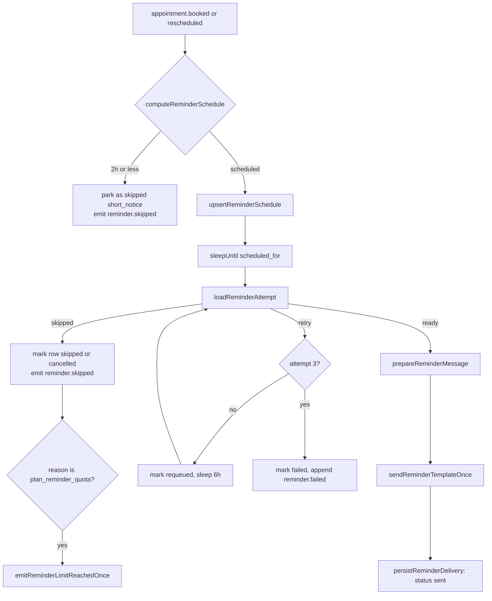

# Reminders

One reminder job exists per appointment. It is sent 24 hours ahead as an approved WhatsApp template, counted against the plan only when Meta confirms delivery, and answered by a small Albanian keyword grammar before the reply ever reaches an assistant turn. This document explains the schedule, the send run and its skip and retry reasons, what makes a reminder "delivered", and how a customer's `KONFIRMO`/`ANULO`/`RICAKTO`/`NDAL`/`AKTIVIZO` changes an appointment.

Template creation and approval belong to [the WhatsApp connection](./whatsapp-connection.md). The monthly quota that gates a send belongs to [billing and plans](./billing-and-plans.md).

## Scheduling

`send-reminder` in `lib/inngest/functions/send-reminder.ts` is triggered by `appointment.booked` and `appointment.rescheduled`, with `idempotency: 'event.id'`. Its first act is `computeReminderSchedule`, which reads the appointment start against the event's own timestamp.

| Notice at booking time             | Outcome                        | Stored as                                             |
| ---------------------------------- | ------------------------------ | ----------------------------------------------------- |
| 2 hours or less                    | No reminder is ever sent       | `status: 'skipped'`, `skipped_reason: 'short_notice'` |
| More than 2 hours but less than 24 | Sent 5 minutes from now        | `status: 'scheduled'`                                 |
| 24 hours or more                   | Sent 24 hours before the start | `status: 'scheduled'`                                 |

The row lives in `reminder_jobs`, unique on `appointment_id`. That uniqueness is why the two writers differ.

- `upsertReminderSchedule` re-arms the row for a new cycle: it resets `scheduled_for`, `inngest_run_id`, `attempts`, `last_error`, `skipped_reason`, `sent_at`, and `message_id`, and clears the response fields. The customer's answer belongs to the cycle it answered, so a reschedule that kept it would let the previous cycle's `KONFIRMO` stand for a time that no longer exists.
- `recordShortNoticeSkip` parks the row instead: it touches only the scheduling columns, because no replacement reminder will follow and the previous cycle's answer is a fact that already happened.

Neither writer clears `delivered_at`. That column is a Meta-billed fact, and wiping it would refund quota the account already spent.

The function also declares `cancelOn` for `appointment.cancelled` and `appointment.rescheduled` matching the same `appointmentId`, so a sleeping run stops when the appointment it is waiting on changes.

## The send run

After `step.sleepUntil` the run makes up to three attempts, six hours apart. Each attempt calls `loadReminderAttempt`, which returns `ready`, `skipped`, or `retry`.

`loadReminderAttempt` runs its checks in a fixed order, and the order decides which reason a reminder is filed under when more than one would apply. Run ownership is settled first, the appointment and customer next, and only then the two questions that cost money to answer.

| #   | Check                                                                               | Failure                       |
| --- | ----------------------------------------------------------------------------------- | ----------------------------- |
| 1   | The row still belongs to this run (`inngest_run_id` and `scheduled_for` both match) | skip `stale_run`              |
| 2   | The appointment and its account context load                                        | skip `appointment_not_found`  |
| 3   | Status is `pending` or `confirmed`                                                  | skip `appointment_<status>`   |
| 4   | The customer has not opted out                                                      | skip `customer_opted_out`     |
| 5   | The appointment has not started                                                     | skip `appointment_started`    |
| 6   | A connection, a WhatsApp id, and a conversation all exist                           | skip `connection_inactive`    |
| 7   | Plan reminder quota is available                                                    | skip `plan_reminder_quota`    |
| 8   | The connection's messaging tier has capacity                                        | retry `rate_tier_near_limit`  |
| 9   | An approved reminder template exists                                                | retry `template_not_approved` |

A skip ends the run; a retry sleeps six hours and tries again, and the third retry marks the row `failed` and appends `reminder.failed`. The quota check is deliberately a skip rather than a retry: quota will not free inside the retry window, and the appointment has to be flagged to the owner immediately.

Skips are announced with `reminder.skipped`, an Inngest-only event with no `events` row and no subscriber, and the row is marked `cancelled` rather than `skipped` when the reason is `appointment_cancelled`. When the reason is `plan_reminder_quota`, the run additionally calls `emitReminderLimitReachedOnce`, so the cap is never silent.

Every write to the row is guarded on `inngest_run_id`. A stale run waking after a reschedule re-armed the row would otherwise park the live cycle as skipped and tell the owner that a reminder about to go out was dropped. When the guarded write matches nothing, the run leaves quietly. `lib/inngest/functions/__tests__/send-reminder-delivery.integration.test.ts` pins both directions of that guard.

## Sending exactly once

The send is split into three steps so a retry can never pay for a second template.

`prepareReminderMessage` writes the message row inside a transaction, reusing the row already linked from `reminder_jobs.message_id` when there is one. The row carries `model: 'deterministic-reminder'`, `provider: 'internal'`, zero token counts and zero cost, plus the `template_id` that was chosen. Its stored `content` is the Albanian body the owner sees in the thread, `Kujtesë: <first name>, takimi juaj me <business> është më <time>.`, which is a local rendering — the text Meta actually sends is the approved template body.

`sendReminderTemplateOnce` re-reads `messages.external_id` from the database before sending, rather than trusting the memoised prepare step. Two runs for the same appointment — a booking plus a reschedule — resolve to the same message row, and the second one's memoised snapshot still says `external_id: null` long after the first one sent. Re-sending would mean two identical templates, two Meta charges, and only the last wamid on the row, so the first delivery's status callbacks would resolve to no reminder job at all.

`persistReminderDelivery` then stamps the wamid onto the message and flips the job to `sent` with `sent_at`, in one transaction.

## Templates and variables

`REMINDER_TEMPLATE_PRIORITY` in `lib/inngest/functions/bootstrap-wa-connection.ts` lists five reminder templates in preference order, and `selectApprovedReminderTemplate` picks the first one this account has approved.

| Order | Name                                   | Language | Variables |
| ----- | -------------------------------------- | -------- | --------- |
| 1     | `appointment_reminder_24h_sq_v1`       | `sq`     | `v2`      |
| 2     | `appointment_reminder_24h_sq_fallback` | `sq`     | `v2`      |
| 3     | `appointment_reminder_24h_v2`          | `en_US`  | `v2`      |
| 4     | `appointment_reminder_24h_fallback`    | `en_US`  | `v2`      |
| 5     | `appointment_reminder_24h`             | `en_US`  | `legacy`  |

A `v2` template takes three positional values: the customer's first name, the business name (falling back to `praktika` when the account has no name), and the appointment time. The `legacy` template takes two — first name and time — because it predates the business-name slot.

The time is rendered by `formatAppointmentTime` in `lib/format/appointment-time.ts`, the product's single renderer of an appointment instant. Reminders, deterministic reminder replies, and appointment confirmations all quote the same booking, so they have to name it identically; see [appointments and availability](./appointments-availability.md).

## The messaging tier cap

Meta caps how many business-initiated conversations a number may start per day, and stores that as `messaging_limit_tier` on the connection. `hasRateCapacity` guards against hitting it.

`tierLimit` parses the string form Meta returns — `TIER_50`, `TIER_250`, `TIER_1K`, `TIER_10K`, `TIER_100K`, `TIER_UNLIMITED` — multiplying out the `K` and `M` suffixes. Scraping digits alone would read `TIER_1K` as a limit of one and throttle the account to a single template a day. An unrecognised string is treated as uncapped so a future tier never silently blocks reminders.

The guard then counts messages from the last 24 hours that carry both a `template_id` and an `external_id`, and refuses when that count has reached 95% of the tier. A refusal is a retry, not a skip, so the reminder gets another chance six hours later.

## What "delivered" means

A reminder is not counted when it is sent. It is counted when Meta's `statuses` webhook says it arrived, handled in `app/api/webhooks/whatsapp/route.ts`.

- `delivered` runs `markReminderDelivered`, which joins the wamid through `messages` to its reminder job and writes two things in one statement: a `reminder_deliveries` row keyed on the wamid, and `reminder_jobs.delivered_at`.
- `failed` runs `failReminderDelivery`, which marks the job `failed` and appends `reminder.failed` in one transaction, so the owner's bell and push signal is durable rather than fire-and-forget.

Two records exist because they answer different questions. `reminder_deliveries` is the billing fact: one row per delivered wamid, unique on `external_id`, so a redelivered webhook cannot double-count and a rescheduled appointment's second — separately billed — template is countable at all. `reminder_jobs.delivered_at` is a single scalar on a row that is unique per appointment, so it can only ever describe the latest cycle; it exists for the appointment badge.

The failure path is guarded to match. It only touches a job that is still `sent` with no response recorded, and it ignores the failure when `wa_message_statuses` shows _this_ wamid delivered — not whatever cycle last stamped `delivered_at`, which a reschedule leaves behind.

Retention respects this too: `purge-expired-messages` exempts messages linked to a reminder job whose appointment is still `pending` or `confirmed`, so an active reminder's message survives the purge window. See [privacy and GDPR](./privacy-and-gdpr.md).

## The reply grammar

`parseReplyIntent` in `lib/language/reply-intent.ts` is the whole grammar, and it is deliberately small. It is Albanian-only: the product speaks one language, and the earlier multilingual sets bought nothing but collisions, since Italian `si` is the Albanian interrogative "how" and German `ja` is the Albanian "here you go". Two non-Albanian tokens survive, each on its own merits.

| Intent       | Keywords                                              | Notes                                                                      |
| ------------ | ----------------------------------------------------- | -------------------------------------------------------------------------- |
| `opt_out`    | `ndal`, `ndalo`, `ndalni`, `ndaloni`, `stop`          | `stop` is the Meta convention, and opting out is the recoverable direction |
| `opt_in`     | `aktivizo`, `aktivizoj`, `aktivizoni`, `aktivizoje`   | As forgiving as `opt_out`, because only the customer can undo an opt-out   |
| `reschedule` | `ricakto`, `ricaktoj`                                 | Outranks cancel, so "Jo, ricakto nesër" moves the appointment              |
| `cancel`     | `anulo`, `anuloj`, `jo`                               |                                                                            |
| `confirm`    | `konfirmo`, `konfirmoj`, `dakord`, `po`, `ok`, `okay` | `ok`/`okay` are everyday Albanian texting loanwords                        |

Precedence runs down that table: `opt_out` > `opt_in` > `reschedule` > `cancel` > `confirm`.

Five of those tokens are **ambiguous particles** — `po`, `jo`, `ok`, `okay`, `dakord` — because each is also a high-frequency function word. Albanian `po` is the progressive particle ("Po pyesja…" means "I was asking…"), and `jo` opens plenty of sentences that are not a cancellation. The rest of the parser exists to keep those five from speaking for a message they do not summarise.

### How a message is read

The parse runs in four stages. It used to have a second consumer: `isAffirmative`, the shared definition of "yes" the assistant's handoff offer accepted on. That is deleted (2026-08-30) — the assistant reads its own answers now — so `parseReplyIntent` is this handler's alone, and nothing else should adopt it.

1. **Tokenise.** Decompose to NFD, drop combining marks, keep only letters and digits, lowercase. Albanian keyboards routinely drop `ë` and `ç`, and phone keyboards rewrite `'` into `’`, so `s'ndal` and `s’ndal` tokenise identically.
2. **Strip politeness.** A leading `ju`/`të`/`te` plus `lutem`/`lutemi` is removed when more tokens follow, so "Ju lutem aktivizoni kujtesat" resolves exactly like "Aktivizoni kujtesat".
3. **Short messages (3 tokens or fewer).** Scan for explicit command words — never particles. A command is obeyed in first position, or out of position when it is `opt_out`, `opt_in`, or `reschedule` _and_ only answer particles precede it. If no command is obeyed, the leading particle may speak, subject to the guards below.
4. **Longer messages.** Only an explicit command in first position counts. Scanning the whole sentence would read "Jo, nuk dua ta anuloj, thjesht dua ta ndryshoj orën" — which says the opposite — as a cancellation.

Three guards sit on top of stage 3.

- **A refused command is never downgraded to the particle in front of it.** "Ok, anuloj" is "OK, I'm cancelling", not the confirmation a bare "Ok" would be. When the scan finds a command whose intent differs from the leading particle's, the whole parse returns nothing. A command that agrees ("Po konfirmo") is still obeyed.
- **A bare particle cancels only when the message is that particle.** "Jo" cancels; "Jo, ndryshoj orën" does not.
- **`po` speaks for at most two tokens**, tighter than the other particles, because it is the only one with a second grammatical life as the progressive marker.

Anything the grammar refuses is not lost — it falls through to an assistant turn, which can still call the booking tools.

### Worked examples

These are the shapes the guards exist for, each pinned in `lib/language/__tests__/reply-intent.test.ts`.

| Message                                  | Result       | Why                                                         |
| ---------------------------------------- | ------------ | ----------------------------------------------------------- |
| `KONFIRMO`, `Po, vij`, `po faleminderit` | `confirm`    | A command, or a particle inside its length bound            |
| `Konfirmo takimin per neser ju lutem`    | `confirm`    | Explicit command in first position; length does not gate it |
| `Jo, ricakto nesër`                      | `reschedule` | Out-of-position command behind answer particles only        |
| `Ok, stop`                               | `opt_out`    | Same rule, and opt-out outranks confirm                     |
| `Ju lutem aktivizoni kujtesat`           | `opt_in`     | Leading politeness stripped, command leads                  |
| `Ok anuloj`, `Po, anulo`                 | none         | Refused command, not downgraded to the particle             |
| `Jo, nuk mundem`                         | none         | A bare particle cancels only alone                          |
| `Po pyesja diçka`                        | none         | Progressive particle, over the two-token bound              |
| `mos ndal kujtesat`, `s'ndal`            | none         | A negator is not an answer particle                         |
| `Po e ndal`, `do ta ndal`                | none         | A customer describing an action, not instructing one        |
| `Full stop pls`, `non-stop`              | none         | `stop` as an English noun with a modifier                   |
| `yes`, `CONFIRM`, `annulla`              | none         | Not Albanian                                                |

## Answering a reply

`handleReminderResponse` in `lib/reminders/response-handler.ts` runs before the assistant, under the advisory lock `reminder-response:<messageId>`. It returns one of three outcomes: `outbound` (it answered, and the run ends), `fallback` (hand this to an assistant turn with reminder context), or `none` (not a reminder reply at all).

Which reminder a reply belongs to is `loadReminderCandidates` plus `chooseCandidate`. Candidates are `sent` jobs for this account and customer, joined through the reminder's own message so they share the inbound conversation, whose appointment is still active — or was acted on by this very message — and bounded two ways: the appointment must end after the inbound instant, and the reminder must have been sent within 48 hours of it. Both bounds are measured against the inbound message's own timestamp, not wall clock, so an Inngest retry resolves to the same candidate set.

`chooseCandidate` then prefers unanswered jobs, falls back to jobs already marked `reschedule_requested` (so a customer picking one of the offered slots is still understood), and reports ambiguity when more than one candidate remains.

| Situation                                   | Result                                                                                                  |
| ------------------------------------------- | ------------------------------------------------------------------------------------------------------- |
| Exactly one candidate in the preferred pool | That candidate                                                                                          |
| More than one                               | `fallback` with reason `ambiguous_reminders`, which adds a line to the turn's prompt forbidding a guess |
| None                                        | `none`                                                                                                  |
| A candidate, but no recognised intent       | `fallback` with reason `reschedule_followup` or `unclear_reply`                                         |

An unanswered reminder and an outstanding handoff offer can both claim the same "yes". The rule that settles it is that whichever question was asked most recently wins, with ties going to the reminder; see [the assistant and conversation engine](./assistant-conversation-engine.md).

## What each intent does

Each recognised intent produces a deterministic Albanian reply, written as a message with `model: 'deterministic-reminder-response'`, `provider: 'internal'`, and zero cost, and made idempotent by `messages_ai_reply_to_uq`, the partial unique index on an assistant message's `reply_to_message_id`.

- **Confirm** transitions the appointment to `confirmed` with `origin: 'conversation'`, records the response, and replies with the confirmed time.
- **Cancel** cancels it with `cancelledBy: 'customer'` and the customer's own message as the reason, records the response, and replies with an invitation to pick another time.
- **Reschedule** records `reschedule_requested` and offers up to five free slots over the next 7 days, computed at the appointment's own duration and excluding the appointment itself. With no slots free it asks the customer to name a day or time instead.
- **Opt out** sets `customers.reminder_opted_out_at`, records `opt_out` against the candidate when there is one, and replies with the way back — the reply names `AKTIVIZO` because nothing else in the product tells a customer how to restore reminders.
- **Opt in** clears the flag, guarded on it being set, and picks its reply from whether anything was actually cleared. The clear and the reply share one transaction, so a retry cannot tell a returning customer that reminders were already on.

Opt-out and opt-in are about the customer rather than about any one reminder, so they resolve with or without a candidate, and an opt-in is never recorded as an answer to a reminder job.

Both opt-state writes consult `optStateSuperseded` first, which looks ahead up to 20 later customer messages in the conversation for a contradicting instruction. Per-conversation concurrency bounds parallelism but promises no FIFO order, so a rapid `NDAL` → `AKTIVIZO` pair can run either way round; skipping the write when a newer message contradicts it makes both runs converge on the newest instruction.

There is deliberately no owner-side opt-in toggle. Consent to resume billed template messages has to come from the customer.

## Sending a reminder by hand

The chat thread has a one-tap **send reminder** button, backed by `sendUpcomingReminderTemplate` in `app/(dashboard)/chat/actions.ts`. It targets the customer's next upcoming active appointment and refuses, with Albanian copy, when any precondition fails: no WhatsApp id, the customer has opted out, no active connection, no upcoming appointment, or no approved template.

Two nested advisory locks protect it. `reminder:<conversationId>` serialises the thread and short-circuits when the same template was already sent to it inside 60 seconds, so a double-tap before the button's pending state commits cannot pay for two templates. Inside that, `reminder-quota:<accountId>` serialises the quota check across conversations, because two manual sends fired at once in different threads could otherwise both read "quota available".

A manual send is billed by Meta and counts exactly like an automated one, so it passes through the same `reminderQuotaAvailable` gate. On success it writes the message with `role: 'account'`, upserts the `reminder_jobs` row to `sent` — keeping `inngest_run_id` and `scheduled_for` so a sleeping automated run does not trip its own stale-run guard, and clearing the response fields but not `delivered_at` — and switches the conversation to human handling.

The error copy distinguishes two failures on purpose. A Graph refusal returns "not sent, try again". A persistence failure after a successful send returns a distinct "sent but not saved" message and logs the wamid, because inviting a retry there would lure the owner into a second paid template that the 60-second dedupe cannot catch.

## Plan quota

`reminderQuotaAvailable` in `lib/billing/usage.ts` compares delivered plus in-flight reminders for the calendar month, in the account's timezone, against the plan limit. Delivered comes from `reminder_deliveries`. In-flight counts jobs that are `sent` with no per-wamid delivery or failure recorded, within a 30-day window, because Meta queues an accepted template for roughly that long and a phone that is simply switched off overnight will still be delivered and billed. A shorter window would trade a stuck slot for a quota bypass.

The gate fails open when the limit cannot be resolved. Hitting it emits `billing.limit_reached` with `kind: 'reminders'`, deduplicated to once per month, and a daily cron additionally emits a predictive warning when the reminders already scheduled for the rest of the month would exhaust what remains. See [billing and plans](./billing-and-plans.md).

## What the owner sees

`reminderBadge` in `components/appointments/badges.tsx` maps job state to a single badge on **Calendar**, on **Today**, and in the appointment sheet. The labels are quoted from `lib/i18n/dict/calendar.ts`, whose Albanian copy still calls a customer _pacient_ after the pilot vertical.

| Job status              | Response                     | Badge                      | Tone    |
| ----------------------- | ---------------------------- | -------------------------- | ------- |
| `scheduled`, `requeued` | —                            | Kujtesa në pritje          | warning |
| `sent`                  | none                         | Kujtesa u dërgua           | neutral |
| `sent`                  | `confirm`                    | Konfirmuar                 | success |
| `sent`                  | `cancel`                     | Anuluar nga pacienti       | danger  |
| `sent`                  | `reschedule_requested`       | Kërkon ricaktim            | warning |
| `skipped`               | reason `plan_reminder_quota` | Kufiri i kujtesave u arrit | warning |
| `skipped`               | any other reason             | Kujtesa u anashkalua       | neutral |
| `failed`                | —                            | Kujtesa dështoi            | danger  |

A `sent` reminder with no response also appears in the **Today** attention list, and stays there through the end of the appointment rather than through the reminder's own day — a reminder goes out 24 hours ahead, so an unanswered one usually belongs to a later day. A `reminder.failed` event reaches both the notification bell and Web Push. See [the owner app](../product/owner-app.md) and [notifications](./notifications.md).

## Related documents

Reminders sit between four other subsystems.

- [The WhatsApp connection](./whatsapp-connection.md) — template submission and approval, the `statuses` webhook, and outbound sending.
- [Appointments and availability](./appointments-availability.md) — the events that schedule a reminder and the transitions a reply performs.
- [The assistant and conversation engine](./assistant-conversation-engine.md) — turn precedence and the reminder fallback turn.
- [Billing and plans](./billing-and-plans.md) — how the monthly reminder quota is metered.
