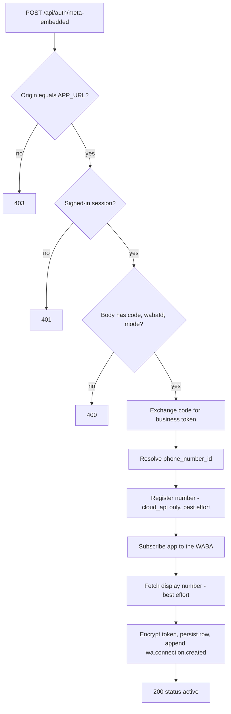
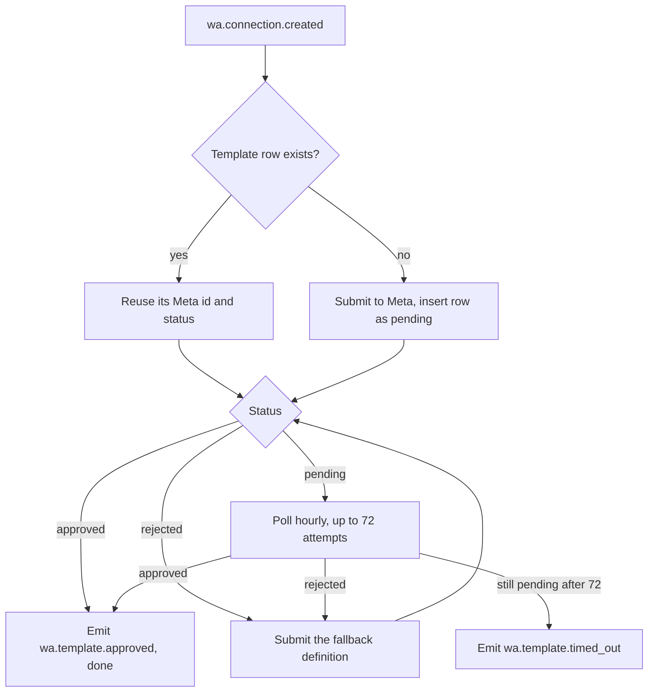

# WhatsApp connection

A connection is one encrypted Meta business token bound to one phone number and one account. Everything inbound arrives through a single signed webhook that fans out by change type; everything outbound goes through a single client that enforces the 24-hour customer-service window and revokes the connection when Meta rejects the token. This document explains how a connection is created, kept healthy, and torn down, and what each moving part is responsible for.

## The connection row

`whatsapp_connections` is the whole record of a business's WhatsApp channel: the Meta identifiers, the encrypted token, the coexistence sync state, and the health fields the daily jobs write (`lib/db/schema.ts`).

| Column group | Columns                                                                                                                                              | Written by                                                     |
| ------------ | ---------------------------------------------------------------------------------------------------------------------------------------------------- | -------------------------------------------------------------- |
| Identity     | `account_id`, `phone_number_id`, `waba_id`, `display_phone_number`                                                                                   | Embedded Signup callback, `scripts/backfill-display-number.ts` |
| Credential   | `access_token_encrypted`, `token_expires_at`, `expiry_warning_sent_at`                                                                               | Signup callback, token-expiry job, disconnect                  |
| Mode         | `mode`, `coexistence_sync_status`, `coexistence_sync_deadline_at`, `coexistence_*_request_id`, `coexistence_last_progress`, `coexistence_last_error` | Signup callback, coexistence sync job, webhook                 |
| Health       | `tier`, `quality_rating`                                                                                                                             | Quality-rating job                                             |
| Lifecycle    | `status`, `connected_at`, `created_at`                                                                                                               | Signup callback, revocation paths                              |

A unique index on `phone_number_id` makes one number map to exactly one account. That single constraint does two jobs: it lets the webhook resolve an inbound payload to an account without ambiguity, and it is what turns a second business connecting the same number into a detectable conflict.

Nothing in the schema stops an account from owning several connection rows, so every consumer picks deterministically: **the newest active row wins**, ordered by `created_at` descending. `lib/inngest/functions/handle-inbound-message.ts`, `lib/inngest/functions/appointment-context.ts`, `app/(dashboard)/chat/actions.ts`, and `app/api/pwa/mutations/message/route.ts` all apply that same rule. The Settings screen is the one deliberate exception: `getSettingsSnapshot` in `lib/pwa/read-models.ts` takes the newest row of _any_ status, because a revoked row is exactly what the reconnect card needs to render.

## Connection status

`connection_status` has three values, but only two ever reach the database.

| Status    | Meaning                                  | How it is reached                                                      |
| --------- | ---------------------------------------- | ---------------------------------------------------------------------- |
| `pending` | Never persisted                          | The column default only; `persistConnection` inserts `active` directly |
| `active`  | Token valid, Meta subscribed             | Embedded Signup callback, on both first connect and reconnect          |
| `revoked` | Token unusable or the owner disconnected | Graph auth failure, `account_update` webhook, `disconnectWhatsApp`     |

The Settings state machine reads that column: no row shows the connect explainer, `revoked` shows the warning card plus **Reconnect**, and `active` shows the connected hero, the reminder-template card, and **Disconnect** (`app/(dashboard)/settings/whatsapp/page.tsx`). The spinner the owner sees mid-signup is client state in `ConnectWhatsApp`, not a persisted `pending` row.

## Embedded Signup in the browser

Connecting runs Meta's Embedded Signup v4 popup from the Settings screen. `app/(dashboard)/settings/connect-whatsapp.tsx` loads the Facebook JS SDK once per page, calls `FB.login` with the configuration id in `NEXT_PUBLIC_META_CONFIG_ID`, and collects the result from two independent channels: `FB.login` returns the one-time auth code, while a `postMessage` from the popup carries the finish event, `phone_number_id`, and `waba_id`.

`app/(dashboard)/settings/whatsapp-signup.ts` holds the trust boundary for that message, deliberately separate from the component so both are testable in isolation:

- The origin must equal one of `https://www.facebook.com`, `https://web.facebook.com`, or `https://business.facebook.com` exactly. Meta's own sample uses a suffix test, which a lookalike domain passes; nothing else in the message authenticates the identifiers it carries.
- The payload's `type` must be `WA_EMBEDDED_SIGNUP` and its `event` must start with `FINISH`, so a later progress message cannot overwrite the identifiers of a completed signup.

The finish event is the only thing that says which mode the business actually onboarded in, and `postableMode` refuses anything it cannot file correctly.

| Finish event                                           | Mode          | Number in the message                                                          |
| ------------------------------------------------------ | ------------- | ------------------------------------------------------------------------------ |
| `FINISH`                                               | `cloud_api`   | Required                                                                       |
| `FINISH_ONLY_WABA`                                     | `cloud_api`   | Required, and never sent — this flow shares no number, so it is always refused |
| `FINISH_WHATSAPP_BUSINESS_APP_ONBOARDING`              | `coexistence` | Optional; the server resolves it from the WABA                                 |
| `FINISH_OBO_MIGRATION`, `FINISH_GRANT_ONLY_API_ACCESS` | None          | Unsupported outcome                                                            |

A session with no supported mode, or no `waba_id`, never reaches the server. Refusing in the browser avoids burning the one-time auth code on a request the server would reject anyway, and the owner sees an accurate "connection stayed half-done" card instead of an error that blames Meta. `postableMode` mirrors the server's rule rather than adding a special case: `FINISH_ONLY_WABA` maps to `cloud_api` and then trips the same "cloud API needs a phone number" precondition as any other numberless `cloud_api` finish.

For the Meta App Dashboard configuration behind `configId` — login settings, allowed domains, webhook fields, roles — see the [Embedded Signup v4 operator setup guide](../whatsapp/embedded-signup-v4-setup.md).

## The signup callback

`app/api/auth/meta-embedded/route.ts` turns the popup's result into a persisted connection. There is no redirect round trip to carry a state token, so CSRF protection is the authenticated session plus an exact `Origin` check against `NEXT_PUBLIC_APP_URL`.

`mode` is required rather than defaulted. An absent mode means the caller never knew how the business onboarded, and defaulting it to `coexistence` would file a plain Cloud API signup as coexistence and start a 24-hour sync deadline that nothing can satisfy.

Two steps are required and two are best effort, which is what decides whether a failure is fatal:

| Step              | Graph call                                                        | Required?                                                           |
| ----------------- | ----------------------------------------------------------------- | ------------------------------------------------------------------- |
| Token exchange    | `GET oauth/access_token` with the app id, app secret, and code    | Required — failure returns `token_exchange_failed`                  |
| Number resolution | `GET <waba_id>/phone_numbers` (coexistence only)                  | Required when the popup sent no number                              |
| Register number   | `POST <phone_number_id>/register` with a random six-digit PIN     | Best effort — Embedded Signup numbers are usually pre-registered    |
| Subscribe app     | `POST <waba_id>/subscribed_apps`                                  | Required — also proves the token works before anything is persisted |
| Display number    | `GET <phone_number_id>?fields=display_phone_number,verified_name` | Best effort — a null result never blocks the connect                |

Number resolution only runs when the popup sent none. It filters the WABA's numbers to those with `is_on_biz_app`, takes that number when exactly one qualifies, otherwise the sole number on the WABA, and rejects anything ambiguous. A `cloud_api` signup that arrives without a number is rejected outright.

The token's lifetime comes from `expires_in` when Meta sends it and defaults to 60 days when it does not. Persisting happens inside `withAuditLog` under the action `wa.token.issued`, and the row insert and the `wa.connection.created` event share one transaction, so a connection can never exist without the event that bootstraps its templates and coexistence sync.

Failures map to a kind, a status code, and a card on the Settings screen.

| Error kind              | Status | What it means                                                |
| ----------------------- | ------ | ------------------------------------------------------------ |
| `duplicate_number`      | 409    | Another account already owns this `phone_number_id`          |
| `token_exchange_failed` | 400    | The auth code did not yield a token                          |
| `rejected`              | 400    | No usable phone number could be resolved from the signup     |
| `graph_error`           | 502    | Any other Graph failure, including a failed app subscription |

### Reconnect versus duplicate

A unique-violation on `phone_number_id` is the fork between the two. The route walks the error's `cause` chain for SQLSTATE `23505`, loads the row that owns the number, and compares its `account_id`.

A different account is a `duplicate_number` conflict. The same account is a reconnect: the existing row is updated in place with the fresh token, WABA id, and mode, `status` returns to `active`, `connected_at` is restamped, `expiry_warning_sent_at` is cleared so the expiry warning can fire again, and the coexistence fields reset to their post-connect state. A null display-number fetch never clobbers a number captured earlier. The update emits `wa.connection.created` again, which is why the bootstrap and coexistence jobs are written to be idempotent.

## Coexistence mode

`mode` records how the number is onboarded. In `cloud_api` the number lives entirely on the Cloud API. In `coexistence` the number stays usable in the WhatsApp Business app on the owner's phone while Medium also sends and receives on it — which is why the owner's replies from their phone arrive as echoes and pause the assistant, covered in [the assistant and conversation engine](./assistant-conversation-engine.md).

Connecting in coexistence mode sets `coexistence_sync_status` to `pending` and `coexistence_sync_deadline_at` to 24 hours out. `sync-whatsapp-coexistence` then runs off `wa.connection.created` (three retries, idempotent on the event id), skips anything that is not an active coexistence row, and asks Meta for both data sets through `POST <phone_number_id>/smb_app_data`: `smb_app_state_sync` for the address book and `history` for past threads. It stores the returned request ids and does not re-request once both exist, so a reconnect cannot start a second sync. A Graph failure writes `failed` plus the error text before rethrowing.

Progress then arrives on the webhook.

| Sync status        | Set when                                                                            |
| ------------------ | ----------------------------------------------------------------------------------- |
| `not_applicable`   | The connection is `cloud_api`                                                       |
| `pending`          | The connection was just written and the sync job has not run                        |
| `syncing`          | Both sync requests are placed, or `history` reports progress below 100              |
| `complete`         | A `history` change reports progress of 100 or more                                  |
| `history_declined` | A `history` change carries Meta error 2593109 — the owner declined to share history |
| `failed`           | Any other `history` error, or a Graph failure in the sync job                       |

History is tracked, not imported: the handler reads progress and errors and writes nothing to `messages`. Address-book entries are upserted into `whatsapp_contacts`, which is unique on both `(account_id, phone)` and `(account_id, wa_id)`. Since an `ON CONFLICT` target covers one index, the handler infers on `wa_id` whenever Meta sends one — two address-book entries with differently formatted phone strings resolve to the same `wa_id` — and falls back to the phone index otherwise. A collision on the other index is logged and skipped per contact rather than failing the batch, which Meta would redeliver indefinitely. Delete actions stamp `deleted_at` instead of removing the row.

Synced contacts do two jobs beyond the sync itself: `contactName` uses them to label a conversation created from an echo, and `customerWhatsappContactsFilter` in `lib/customers/whatsapp-contacts.ts` scopes them to a customer for erasure and export. Because `customers` has no unique constraint on `(account_id, phone)`, two customers can share a number and resolve to the same contact row, so a shared contact is withheld from either customer's export. See [privacy and GDPR](./privacy-and-gdpr.md).

One more coexistence signal arrives on the `messages` field rather than a sync field: error 2593109's sibling, error 131060, marks a coexistence request the number does not support. The webhook acknowledges it and writes nothing.

## Token storage

Tokens are encrypted in the database with pgcrypto's symmetric functions, keyed by `TOKEN_ENCRYPTION_KEY`. `lib/db/crypto.ts` binds that key at module load and exposes only `encryptToken` and `decryptToken`; the column is `bytea`, and no plaintext token is ever logged.

Decryption is confined to one module. `lib/channels/whatsapp/client.ts` decrypts at the call site inside `getConnection` and `detachWabaSubscription`, and every Graph request is built there. Nothing else in the application reads the column: the DSAR export lists the connection's metadata and marks the token redacted, and `graphFetch` logs only status, code, and subcode — never the URL, since the token-exchange URL carries the app secret in its query string.

Rotation runs through `TOKEN_ENCRYPTION_KEY_NEXT` and `scripts/rotate-token-key.ts`, which re-encrypts every row in one transaction and verifies each round trip under the new key before committing. It issues raw pgcrypto SQL with both keys precisely because it must not import the single-key module. For the procedure, see [WhatsApp token encryption key rotation](../gdpr/key-rotation.md).

## The inbound webhook

`app/api/webhooks/whatsapp/route.ts` is the single entry point for everything Meta sends. `GET` answers the subscription handshake: `hub.mode=subscribe` with a `hub.verify_token` matching `META_WEBHOOK_VERIFY_TOKEN` echoes `hub.challenge`, and anything else is a 403.

`POST` validates in three stages before touching the database. The raw body is HMAC-SHA256'd with `META_APP_SECRET` and compared against `x-hub-signature-256` in constant time (`lib/channels/whatsapp/signature.ts`); a mismatch or missing header is a 401 with no writes. The body is then JSON-parsed and validated against the Zod schema in `lib/channels/whatsapp/payload.ts`, and either failure is a 400. That schema is deliberately lenient where Meta evolves: objects pass through unknown keys, and `status` is a plain string rather than an enum, so an unrecognized Meta status cannot fail the whole batch and drop every other status in it.

Each change is then dispatched on its `field`.

| Change field                  | Handler                     | Effect                                                                                       |
| ----------------------------- | --------------------------- | -------------------------------------------------------------------------------------------- |
| `messages` (message present)  | `handleMessagesChange`      | Upserts the customer, conversation, and message; bumps the window; emits `message.received`  |
| `messages` (non-text)         | `handleMessagesChange`      | Persists a typed placeholder plus any caption; emits `message.received` with `nonText: true` |
| `messages` (statuses present) | `handleStatusesChange`      | Upserts `wa_message_statuses`; hooks reminder delivery and failure                           |
| `history`                     | `handleHistoryChange`       | Advances `coexistence_sync_status` and progress                                              |
| `smb_app_state_sync`          | `handleAppStateSyncChange`  | Upserts `whatsapp_contacts`                                                                  |
| `smb_message_echoes`          | `handleMessageEchoesChange` | Mirrors the owner's own reply and pauses the assistant                                       |
| `account_update`              | `handleAccountUpdate`       | Revokes the connection for disabling events                                                  |
| anything else                 | —                           | Ignored                                                                                      |

Every handler resolves the account by looking up an active connection for the payload's `phone_number_id`; an unknown number is logged and acknowledged. Once every change is processed the route returns 200. An exception escapes as a 500 instead, and Meta redelivers the entire batch — which is why every handler is idempotent.

### Inbound messages

A text message runs one transaction: link a manually added customer whose bare-digit phone matches the sender, upsert the customer on `(account_id, wa_id)`, upsert the conversation on `(customer_id, channel)`, insert the message with `on conflict do nothing` against the unique `external_id`, bump the service window, and append `message.received` carrying the trace id. The bump and the event happen only when the insert produced a row, so a redelivered batch yields exactly one message and exactly one event. What happens after `message.received` belongs to [the assistant and conversation engine](./assistant-conversation-engine.md).

A message whose body the assistant cannot read — a voice note, image, document — still becomes a row, as a deterministic placeholder plus whatever caption the customer typed. That row is what gives the owner an unread badge, a chat-list preview, and a realtime refresh; without it the message never happened as far as the owner is concerned. The event carries `nonText: true` so the inbound job answers with its fixed notice rather than handing a placeholder to the model. A type with no placeholder mapping is skipped.

`bumpLastInboundAt` does more than move the window: it also reopens a conversation the owner had closed, resetting `ai_active` and `escalation_state` in the same statement, and every `CASE` reads the pre-update row so an already-open conversation keeps its handling state. The non-text path calls it unconditionally, before the dedupe check, passing the inbound's own timestamp and taking `GREATEST` against the stored value — the bump is idempotent by construction, and a redelivered two-day-old image can neither reopen a conversation closed after it arrived nor revive a service window that has in fact expired. The text path calls it after the dedupe check and stamps `now()`, since only a first delivery reaches it.

### Delivery statuses

Statuses ride on the `messages` field and land in `wa_message_statuses`, keyed by the outbound message's `external_id`. Meta delivers them out of order, so `last_status` only ever moves forward by rank.

| Status      | Rank | Notes                                                   |
| ----------- | ---- | ------------------------------------------------------- |
| `sent`      | 1    | Cannot overwrite anything later                         |
| `delivered` | 2    | Ties with `failed`; first to arrive holds `last_status` |
| `failed`    | 2    | Ties with `delivered`                                   |
| `read`      | 3    | Never overwritten                                       |

The four timestamp columns are stamped independently and first-write-wins, so `delivered_at` — the billing fact — survives a late `failed`. Pricing fields and the first error code are filled in the same way. A `delivered` status stamps the reminder's delivery row and a `failed` status marks the job failed and emits `reminder.failed`, both explained in [reminders](./reminders.md).

### Owner echoes

When the owner replies from the WhatsApp Business app on their phone, Meta echoes the message on `smb_message_echoes`. The handler persists it as an `account`-role message, deduplicated on `external_id`, and pauses the assistant for two hours with `ai_pause_reason` set to `whatsapp_business_app_echo`.

The pause is applied only after the dedupe check, so a redelivered echo cannot push `ai_paused_until` past the resume job already scheduled for it. An indefinite hold the owner set themselves — a takeover or an open escalation — is left untouched rather than downgraded into a two-hour auto-resuming pause, and `escalation_state` is never cleared here. `conversation.ai_paused` is emitted only when this handler actually wrote the hold, so no resume job ever fires against a conversation a person is still handling.

### Account updates

`account_update` reports WABA-level changes, most of which are informational. Only four leave the account unable to send.

| Event                                                     | Result                                                                         |
| --------------------------------------------------------- | ------------------------------------------------------------------------------ |
| `PARTNER_REMOVED`                                         | Revoke every active connection on the WABA, reason `partner_removed`           |
| `DISABLED_UPDATE`, `ACCOUNT_VIOLATION`, `ACCOUNT_DELETED` | Revoke every active connection on the WABA, reason `account_disconnected`      |
| `PHONE_NUMBER_REMOVED`                                    | Revoke only the connection whose number matches, reason `account_disconnected` |
| `ACCOUNT_RESTRICTION`                                     | Logged, nothing revoked                                                        |
| Anything else                                             | Logged and ignored                                                             |

`PHONE_NUMBER_REMOVED` names one number while the WABA's other numbers keep sending, so the handler matches the payload against `phone_number_id` or against `display_phone_number` compared as bare digits — Meta formats the payload's number for display. `ACCOUNT_RESTRICTION` is deliberately absent from the disabling set: it also covers soft restrictions such as a lowered messaging tier, which leave sending fully functional, and re-running Embedded Signup cannot clear a revocation.

## The 24-hour customer-service window

WhatsApp only allows free-form messages within 24 hours of the customer's last inbound message. `sendFreeForm` enforces that at send time, not at enqueue time, by reading `conversations.last_inbound_at` for the recipient's `wa_id` and throwing `OutsideWindowError` when it is missing or older than the window. Checking at send time is what matters: a background job may run long after the window that was open when its work was queued.

Because the window is anchored to inbound timestamps rather than `now()`, a redelivered old message cannot extend it. Approved templates are the only supported way to reach a customer outside the window, which is why reminders are templates.

## Sending

`lib/channels/whatsapp/client.ts` is the only module that talks to Meta on an account's behalf. Every call goes through `authedGraph`, which decrypts the token, issues the request through `graphFetch`, and converts a 401 or 403 into a revocation before rethrowing `ConnectionRevokedError`. The Graph version is pinned to `v25.0` in `lib/channels/whatsapp/constants.ts` and bumped deliberately.

| Function                 | Graph call                                                         | Guard                                                                                   |
| ------------------------ | ------------------------------------------------------------------ | --------------------------------------------------------------------------------------- |
| `sendFreeForm`           | `POST <phone_number_id>/messages`                                  | Refuses outside the 24-hour window                                                      |
| `sendTemplate`           | `POST <phone_number_id>/messages`                                  | Refuses unless a local `message_templates` row is `approved` for that name and language |
| `submitTemplate`         | `POST <waba_id>/message_templates`                                 | Submits as `UTILITY` with example values                                                |
| `editTemplate`           | `POST <meta_template_id>`                                          | Re-submits body and category; name and language are immutable                           |
| `getTemplateStatus`      | `GET <meta_template_id>?fields=status,name`                        | —                                                                                       |
| `getQualityRating`       | `GET <phone_number_id>?fields=quality_rating,messaging_limit_tier` | —                                                                                       |
| `getDisplayNumber`       | `GET <phone_number_id>?fields=display_phone_number,verified_name`  | —                                                                                       |
| `requestCoexistenceSync` | `POST <phone_number_id>/smb_app_data`                              | —                                                                                       |
| `detachWabaSubscription` | `DELETE <waba_id>/subscribed_apps`                                 | Never throws; a failed detach must not block deletion                                   |

Template submissions attach `example.body_text` whenever the body contains `{{n}}` variables, because Meta rejects a variable-bearing body with no samples as `INVALID_FORMAT`. A static body omits `example` entirely, since an empty example is itself invalid.

## Reminder templates

Reminders go out as approved templates, and the same five definitions are shared by every account (`lib/inngest/functions/bootstrap-wa-connection.ts`). They are tried in priority order, so an account is covered as long as any one of them is approved.

| Priority | Name                                   | Language | Variables                                   |
| -------- | -------------------------------------- | -------- | ------------------------------------------- |
| 1        | `appointment_reminder_24h_sq_v1`       | `sq`     | First name, business name, appointment time |
| 2        | `appointment_reminder_24h_sq_fallback` | `sq`     | First name, business name, appointment time |
| 3        | `appointment_reminder_24h_v2`          | `en_US`  | First name, business name, appointment time |
| 4        | `appointment_reminder_24h_fallback`    | `en_US`  | First name, business name, appointment time |
| 5        | `appointment_reminder_24h`             | `en_US`  | First name, appointment time                |

The first four carry the `v2` variable set; the last is the two-variable `legacy` set. The Settings card reports the best status across all five, and treats "no row yet" as _preparing_ — an honest state in the minutes after connect while the bootstrap job submits.

All five are candidates at send time, but only the two Albanian definitions are ever submitted to Meta by code: `submitTemplate` is called with the primary and, on a rejection, the fallback. The three `en_US` rows sit in the priority list so an account that already holds an approved English template keeps sending.

`bootstrap-wa-connection` owns the approval loop, triggered by `wa.connection.created` and idempotent on the event id.

Submission is skipped whenever a row already carries a Meta id, so the repeat `wa.connection.created` a reconnect emits never resubmits to Meta.

`reconcile-albanian-reminder-templates` runs daily at 05:30 UTC over every active connection and repairs what the bootstrap loop cannot. It re-reads the primary definition's status, falls back to the secondary when the primary is rejected, and for a rejected template re-submits the current body with its example values — editing a rejected template re-enters Meta review, which flips it back to pending. The repair is bounded by `EXAMPLE_FIX_MARKER`, a zero-width sentinel appended to the stored `message_templates.body`. `sendTemplate` sends positional parameters and never reads that text, so the column doubles as a no-migration loop bound: a rejected row already carrying the marker for its current body has been repaired once and is not edited again. Without it, content Meta keeps rejecting would be edited and re-reviewed every day forever.

`wa.template.approved`, `wa.template.rejected`, and `wa.template.timed_out` are emitted through Inngest only. They have no subscriber and no `events` row, so the reminder-template card on the Settings screen is where a stuck template becomes visible.

## Connection health

Two daily jobs in `lib/inngest/functions/poll-whatsapp-health.ts` watch a connection that is working but degrading.

`poll-whatsapp-quality-rating` runs at 04:00 UTC across every active connection. It stores `quality_rating` and `messaging_limit_tier` verbatim — the tier is what caps reminder sends — and appends `wa.quality_warning` when the rating _changes_ to `YELLOW` or `RED`. The rating write and the event share one transaction, because the warning is derived from the transition: once the new rating is stored, the next poll sees no change and the signal is gone for good.

`monitor-wa-token-expiry` runs at 05:00 UTC and claims every active connection whose `token_expires_at` falls within seven days and whose `expiry_warning_sent_at` is still null. The claim and the `wa.connection.expiring` event are appended in one transaction, so a failure rolls the one-shot claim back rather than swallowing the only pre-expiry warning the account gets.

Neither event reaches the owner. `wa.quality_warning` and `wa.connection.expiring` are written to `events` but appear in no push payload, no bell type, and no Inngest subscriber, so a dropped quality rating or an expiring token is visible only in the events table and the logs. See [notifications](./notifications.md) for what does reach the owner and [events and background jobs](./events-and-background-jobs.md) for the full catalogue.

## Revocation

`markRevoked` is the one path that flips a connection to `revoked` and tells the owner. Its update is guarded on the row still being `active`, and the `wa.connection.revoked` event is appended in the same transaction, so a repeated trigger transitions once and notifies once. That event has both a push payload and a bell entry, and the Settings screen switches to the reconnect card.

`reason` records why, and the enum is broader than what the code writes.

| Reason                                                                                                               | Written by                                                                                     |
| -------------------------------------------------------------------------------------------------------------------- | ---------------------------------------------------------------------------------------------- |
| `unauthorized`                                                                                                       | A Graph 401 inside `authedGraph`                                                               |
| `forbidden`                                                                                                          | A Graph 403 inside `authedGraph`                                                               |
| `partner_removed`                                                                                                    | `PARTNER_REMOVED` on `account_update`                                                          |
| `account_disconnected`                                                                                               | `DISABLED_UPDATE`, `ACCOUNT_VIOLATION`, `ACCOUNT_DELETED`, or a matched `PHONE_NUMBER_REMOVED` |
| `primary_inactivity`, `companion_inactivity`, `user_re_registered`, `change_number`, `business_downgrade`, `unknown` | Declared in the event schema; no writer in the application                                     |

Self-revocation through `authedGraph` is what makes an expired or withdrawn token self-healing from the product's side: the first Graph call that fails with an auth error revokes the connection, notifies the owner, and every later send refuses fast with `ConnectionRevokedError` instead of retrying against Meta.

## Disconnect and account deletion

`disconnectWhatsApp` in `app/(dashboard)/settings/actions.ts` takes the newest connection row and detaches first, while the row is still active — `detachWabaSubscription` needs a decryptable token — so Meta stops posting the account's customer messages to the webhook. Only then does the row flip to `revoked`.

The stored token is dropped in that same update, but only when the detach succeeded. Nothing may decrypt a Graph token that outlived a disconnect; equally, the token is the sole credential that can finish a detach, so dropping it after a failed detach would leave Medium receiving that WABA's customer messages with no way to stop them. A failed detach is logged as a warning for exactly that reason. Because the owner initiated the disconnect, this path writes no `wa.connection.revoked` event — there is nothing to notify them about.

Account deletion follows the same shape in `deleteAccount`: write the erasure archive first so it survives the cascade, detach the WABA best effort, then delete the auth user and let the foreign-key cascade remove the connection. See [privacy and GDPR](./privacy-and-gdpr.md).

Reconnecting is not a new row. The signup callback finds the existing `phone_number_id`, refreshes the token in place, and re-emits `wa.connection.created`, so template bootstrap and coexistence sync both re-run idempotently.

## Environments and Meta apps

Each environment has its own Meta app: production uses the live app and preview uses the test app, with `META_APP_ID`, `META_APP_SECRET`, and `META_WEBHOOK_VERIFY_TOKEN` required in all three environments and required to differ between them (`lib/env/env-vars.ts`).

Development has no Meta app of its own. `NEXT_PUBLIC_META_APP_ID` and `NEXT_PUBLIC_META_CONFIG_ID` are required only in deployed environments, and the Settings screen degrades to a disabled connect button with an explanatory note when either is unset. Facebook also blocks `FB.login` on `http://` pages, so exercising signup locally means an HTTPS tunnel (`scripts/tunnel.sh`) and borrowing the test app's webhook — which breaks preview's WhatsApp for the duration. The borrow procedure is in [the environments guide](../environments.md), and the environment split itself is summarized in [CONTEXT.md](../../CONTEXT.md).

`TOKEN_ENCRYPTION_KEY` must also differ per environment: shared across environments, a preview database dump would decrypt production tokens.
