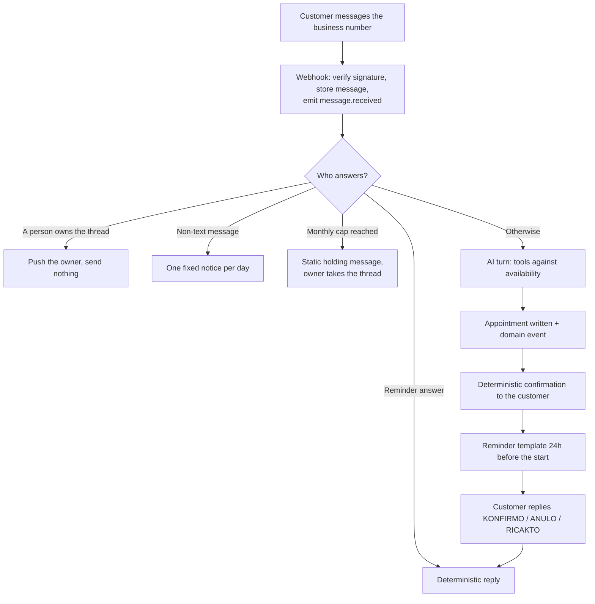

# Product overview

Medium lets a small service business run its bookings on WhatsApp without a receptionist. The business connects its own WhatsApp Business number, an AI **assistant** answers customers in Albanian and books, reschedules, and cancels against the business's own availability, and the owner supervises everything from a mobile-first PWA. When a request falls outside what it handles, it passes the thread to a person rather than answering.

This document explains what the product is, who the three actors are, and how one conversation travels from a customer's message to a booked appointment. Mechanism detail — state machines, jobs, schemas — lives in the feature docs listed under [Where to read next](#where-to-read-next).

## Who it's for

Medium targets small service businesses that already take bookings by message: one person or a small team, one phone number, no front desk. Physiotherapy is the pilot vertical, but nothing in the product model depends on it — the same loop fits a barber, a nail salon, or a personal trainer, and no customer-facing sentence names a discipline (`lib/conversation/customer-copy.ts`).

Two boundaries are deliberate and shape everything else: the assistant speaks one language, formal Albanian, and works on one channel, WhatsApp.

## The three actors

Every row, message, and event in the system belongs to one of three actors. The `message_role` enum names them exactly (`lib/db/schema.ts:50`).

| Actor                                                 | Who it is                                                                        | Where it lives in code                                     |
| ----------------------------------------------------- | -------------------------------------------------------------------------------- | ---------------------------------------------------------- |
| **account** (the business, operated by its **owner**) | The tenant. One login is one `accounts` row is one business.                     | table `accounts`, column `account_id`, role `account`      |
| **customer**                                          | The person being booked. Identified by their WhatsApp id, scoped to one account. | table `customers`, role `customer`                         |
| **assistant**                                         | The AI that replies on WhatsApp on the account's behalf.                         | role `ai`, `accounts.assistant_paused`, `accounts.ai_name` |

An account is a tenant boundary as well as a business: every table is keyed on `account_id`, and the tenant database role can only read its own rows. See [the data model](../features/data-model.md) for how that is enforced.

## Vocabulary

These terms mean one thing across the code and the docs. Use them literally; the code identifiers are the ground truth.

| Term                 | Meaning                                                                                        | Code identifier                                                      |
| -------------------- | ---------------------------------------------------------------------------------------------- | -------------------------------------------------------------------- |
| **conversation**     | One customer's WhatsApp thread with one account.                                               | table `conversations`, unique on `(customer_id, channel)`            |
| **conversation-day** | The billing unit: one customer active on one local day.                                        | table `conversation_days`                                            |
| **connection**       | A WhatsApp Business number linked to an account.                                               | table `whatsapp_connections`                                         |
| **escalation**       | The assistant switching a conversation to human handling.                                      | `escalateConversationToHuman`, event `conversation.escalated`        |
| **handoff offer**    | The assistant's one fixed question offering to pass a request to a person. The model reads the answer. | tool `offer_human_handoff`, then `escalate_to_human`          |
| **cap notice**       | The fixed reply sent when the monthly conversation cap is hit. Notifies; the assistant keeps the thread. | `lib/billing/cap-handoff.ts`                                 |
| **takeover**         | The owner switching a conversation to themselves.                                              | `setTakeover`, event `conversation.taken_over`                       |
| **echo pause**       | The two-hour assistant pause that follows the owner replying from the WhatsApp Business app.   | `conversations.ai_pause_reason = 'whatsapp_business_app_echo'`       |
| **resume offer**     | The push asking the owner to hand a thread back after an hour of silence.                      | event `conversation.resume_offered`                                  |
| **reminder**         | The template message sent 24 hours before an appointment.                                      | tables `reminder_jobs`, `reminder_deliveries`                        |
| **notification**     | A bell entry or Web Push sent to the owner.                                                    | `NOTIFICATION_TYPES`, table `push_subscriptions`                     |
| **event**            | A domain event row in `events`, written with its outbox row in the same transaction.           | `appendAppointmentEvent`, `appendBackgroundEvent`                    |
| **job**              | One Inngest function run.                                                                      | `lib/inngest/functions.ts`                                           |
| **plan**             | Free or Solo.                                                                                  | enum `plan`                                                          |
| **environment**      | development, preview, or production.                                                           | `appEnv()`                                                           |

Two vocabularies predate this one and still appear in the product. Albanian UI copy, the help pages, and the assistant persona prompt use physiotherapy words (_pacient_, _fizioterapist_), and migrations before `0031_rename_pts_to_accounts.sql` name the tables `pts` and `patients`. Read both as **account** and **customer**.

## How a customer conversation works

One inbound WhatsApp message produces exactly one reply, and a fixed ladder settles which subsystem writes it. The path below is the common case: a customer asks for an appointment and gets one.

1. **The customer writes.** Meta posts the message to the inbound webhook, which verifies the request signature, upserts the customer, conversation, and message rows, bumps the 24-hour service window, and appends a `message.received` event. See [WhatsApp connection](../features/whatsapp-connection.md).
2. **One job selects who answers.** `handle-inbound-message` runs once per message, one run at a time per conversation, and walks the ladder in the table below. See [the assistant and conversation engine](../features/assistant-conversation-engine.md).
3. **The assistant takes its turn.** The engine loads the last 20 messages, the account's services and business context, and a system prompt that locks the reply to formal Albanian and to four jobs: booking, rescheduling, cancelling, and answering about the services, prices, and availability the account configured. Anything else produces a handoff offer rather than an improvised answer.
4. **Tools do the work, not prose.** The assistant reads availability and writes appointments only through tools (`get_availability`, `list_upcoming_appointments`, `book_appointment`, `reschedule_appointment`, `cancel_appointment`, `escalate_to_human`, `offer_human_handoff`). Slots come from the account's weekday rules minus blocked periods minus existing appointments, computed in the account's timezone. See [appointments and availability](../features/appointments-availability.md).
5. **The confirmation is written by the system.** A successful booking, reschedule, or cancellation ends the model's turn; fixed Albanian text confirms the change, so the customer never reads a model's account of what it just did.
6. **A reminder goes out 24 hours ahead.** Reminders are approved WhatsApp templates, which is what lets them arrive outside the 24-hour customer-service window. A reminder counts against the plan only when Meta confirms delivery. See [reminders](../features/reminders.md).
7. **The customer answers the reminder in keywords.** `KONFIRMO`, `ANULO`, `RICAKTO`, plus `NDAL` and `AKTIVIZO` for opting out and back in, are parsed by a small Albanian grammar before the model is involved, and they move the appointment directly.
8. **The owner watches it happen.** Today, Calendar, and Chats refresh over Supabase Realtime, and the events that matter reach the owner as a Web Push and a bell entry. See [the owner app](./owner-app.md) and [notifications](../features/notifications.md).

### Who answers an inbound message

The ladder is fixed and ordered. The first matching row wins, and the run ends there.

| Order | Condition                                                       | What the customer gets                                                        |
| ----- | --------------------------------------------------------------- | ----------------------------------------------------------------------------- |
| 1     | The message answers an outstanding reminder                     | A deterministic reply: confirmation, cancellation, or five reschedule options |
| 2     | A person already owns the thread (takeover or escalation)       | Nothing automatic; the owner gets a `conversation.needs_reply` push           |
| 3     | The message is not text (voice note, image, document, location) | One fixed notice per conversation per local day, carrying a handoff offer     |
| 4     | The account has hit its monthly conversation cap                | One static holding message per day; the thread becomes human-owned            |
| 5     | Anything else                                                   | An AI turn                                                                    |

A reminder answer and an outstanding handoff offer can both claim the same "po". Whichever question was asked most recently wins, and an exact tie goes to the reminder.

## When a person takes over

The assistant stops rather than improvising, so several paths move a conversation to the owner. Each one turns the assistant off for that thread and tells the owner why.

| Path                | What triggers it                                                   | Effect on the thread                                                                                |
| ------------------- | ------------------------------------------------------------------ | --------------------------------------------------------------------------------------------------- |
| **Handoff offer**   | The assistant meets a request outside its four jobs                | One fixed question; if the very next customer message is affirmative, the thread escalates          |
| **Escalation**      | The customer asks for a person, or two clarification attempts fail | `ai_active = false`, `escalation_state = 'requested'`, `conversation.escalated` push and bell entry |
| **Takeover**        | The owner flips the handling switch in a chat thread               | The owner owns the thread until they hand it back                                                   |
| **Echo pause**      | The owner replies from the WhatsApp Business app on their phone    | The assistant pauses for two hours, then resumes on its own                                         |
| **Cap handoff**     | The account's monthly conversation cap is reached                  | The thread is human-owned for the rest of the month; the customer gets one holding message per day  |
| **Failure handoff** | A turn changed an appointment and then failed, or retries ran out  | The thread escalates and the customer is told the booking is unconfirmed                            |
| **Resume offer**    | An owner-held thread sits idle for an hour                         | A push suggesting the owner hand the thread back to the assistant                                   |

## What the owner does

An owner signs up with email and password or Google, then works through five onboarding steps before the dashboard opens. Every step is derived from data rather than a stored flag, so it completes the moment the underlying rows exist (`lib/onboarding/state.ts`).

| Step         | Done when                                                                          |
| ------------ | ---------------------------------------------------------------------------------- |
| Profile      | The account has a name                                                             |
| WhatsApp     | An active `whatsapp_connections` row exists                                        |
| Availability | At least one weekday availability rule exists                                      |
| Services     | At least one active service exists and the account marked its catalogue configured |
| Test message | Any message row exists for the account                                             |

A sixth card asks the owner to pick a plan. It's soft: it never blocks the dashboard, and skipping it is recorded rather than penalised. See [accounts, auth, and onboarding](../features/accounts-auth-onboarding.md).

After onboarding, the app is five tabs — **Today**, **Calendar**, **Chats**, **Clients**, and **You** (Settings) — installable as a PWA that opens on `/today` and keeps working through a lost connection: messages sent and appointment changes made offline queue locally and replay against a server ledger that makes each one exactly-once. See [the owner app](./owner-app.md) and [PWA and offline](../features/pwa-offline.md).

## What Medium deliberately doesn't do

Several absences are design decisions, not gaps, and the code comments say so.

- **It gives no medical or emergency guidance.** The handoff sentence promises no response time and offers no advice, because the product schedules appointments and is not a medical one.
- **It takes no money from customers.** The assistant quotes a configured service price and refuses every other money question — bills, refunds, discounts, disputes — with a handoff.
- **It asks for no personal data beyond a booking.** No payment details, no identification numbers, and never the customer's name, which the channel already supplies.
- **It answers in one language.** A request to switch languages is declined once, in Albanian, and the scheduling request is answered anyway.
- **It works on one channel.** A conversation is a WhatsApp thread; there is no email, SMS, or web-widget path.
- **It never invents an outcome.** Bookings, cancellations, and reschedules exist only behind a successful tool call, and the confirmation text is generated by the system rather than the model.

## Plans

Two plans exist, Free and Solo, and there is no subscription state machine behind them: Solo is prepaid time recorded on `accounts.plan_expires_at` and bought as one-off orders. Usage is metered as conversation-days and as reminders Meta confirmed it delivered, and both are capped per month.

|                                    | Free    | Solo                                 |
| ---------------------------------- | ------- | ------------------------------------ |
| Conversations per month            | 30      | 400                                  |
| Reminders per month                | 10      | 250                                  |
| Active services                    | 1       | Unlimited                            |
| Message retention ceiling          | 30 days | 365 days                             |
| Custom assistant name and greeting | No      | Yes                                  |
| Price                              | Free    | 2,500 ALL monthly, 25,000 ALL yearly |

Warnings fire at 80% of a cap, Solo entitlements survive three days past expiry, and a lapsed account falls back to Free rather than locking. For metering rules, checkout, renewals, and downgrades, see [billing and plans](../features/billing-and-plans.md).

## Public surfaces

Three surfaces are reachable without signing in, all served in Albanian.

- **The landing page** at `/` explains the product and renders its prices straight from the plan table (`app/_landing/landing-page.tsx`).
- **Help guides** at `/help` cover connecting WhatsApp, setting working hours, how the assistant books, and plans and payments (`app/(legal)/help/**`).
- **Privacy policy and terms** at `/privacy` and `/terms`, with English copies at `/en/privacy` and `/en/terms`.

## Where to read next

[The docs hub](../README.md) indexes every document and suggests a reading path for a new engineer, a founder, and an on-call responder.

For the shape of the system rather than the product, read [tech stack and architecture](../tech-stack-and-architecture.md) and [environments](../environments.md); for how the pieces fit together at runtime, read [events and background jobs](../features/events-and-background-jobs.md), then [privacy and GDPR](../features/privacy-and-gdpr.md) and [observability and admin](../features/observability-and-admin.md).
